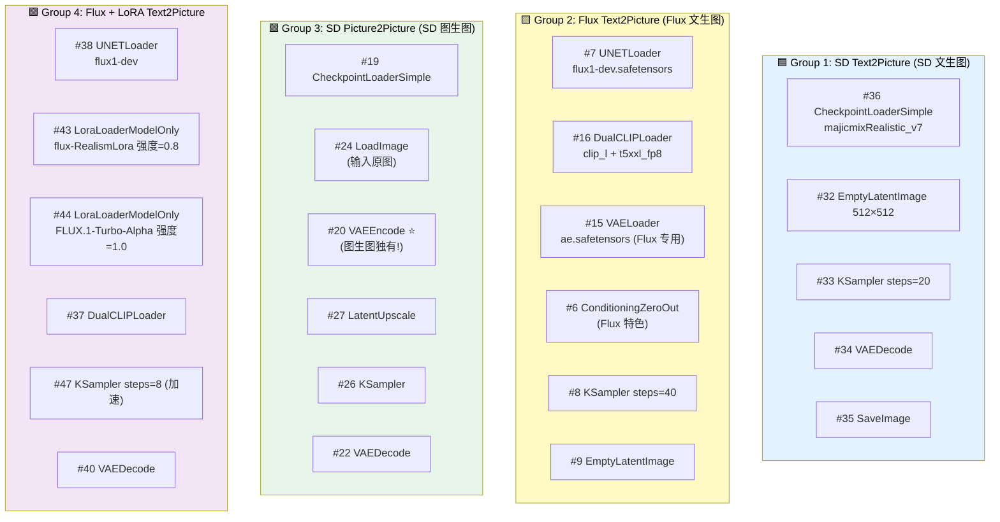
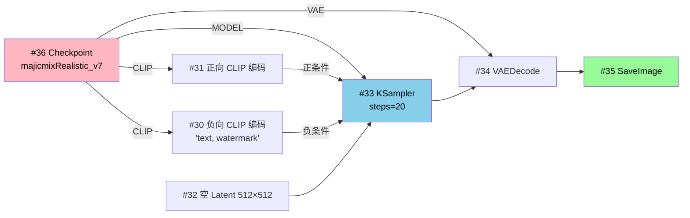
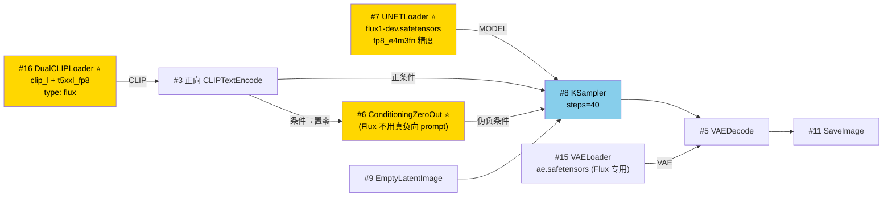
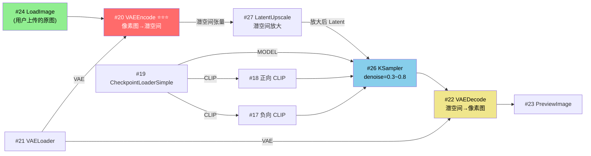
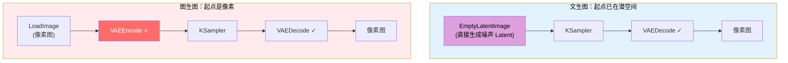
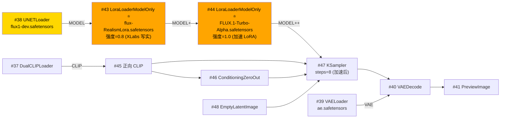
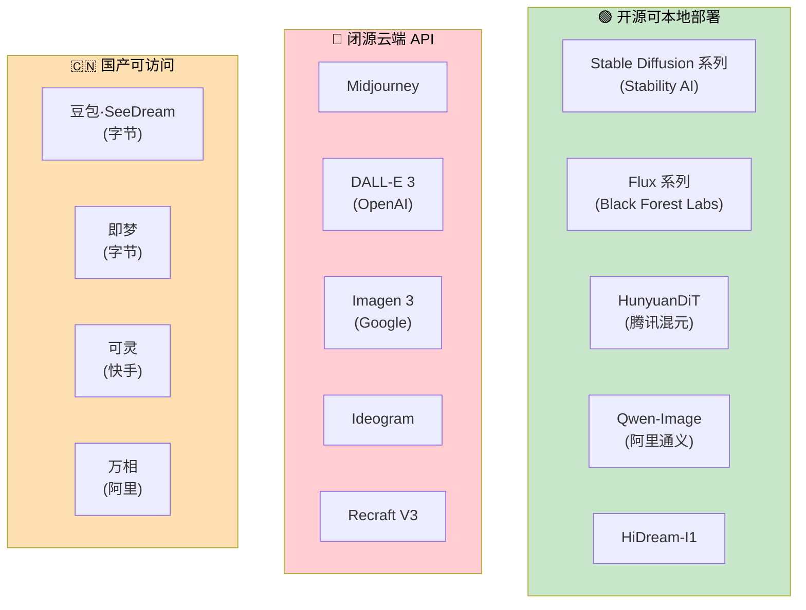
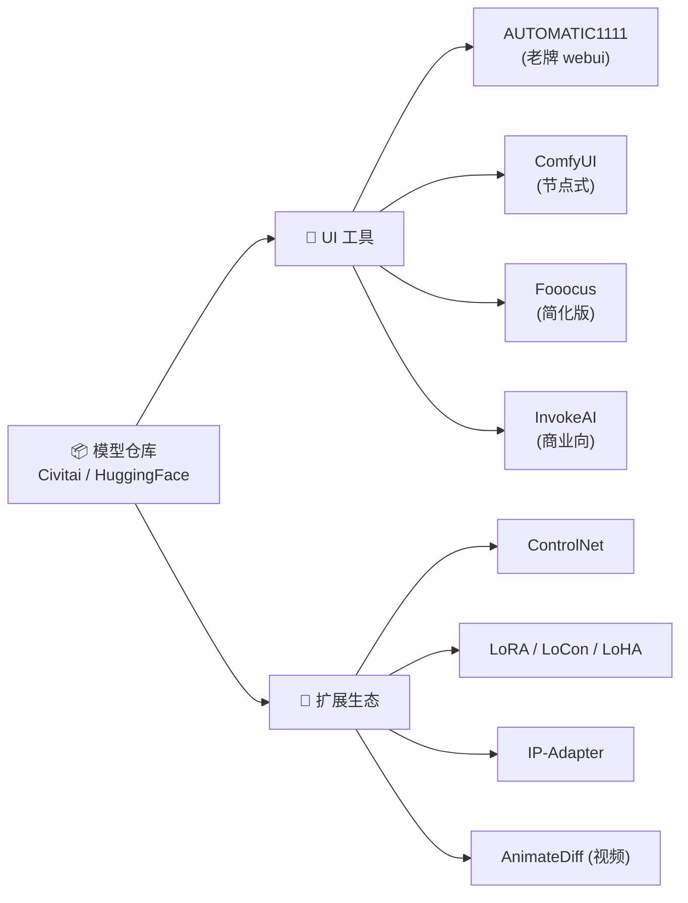

# ComfyUI 工作流深度解析 · 生态、节点、种子与 LoRA

> 基于你的 `Pic_Generation_Demo.json`（包含 4 个工作流子分组），逐一拆解 SD/Flux 文生图/图生图/LoRA 流程，并系统讲清楚 SD 生态、Flux 生态、UNet、VAE Encode/Decode、Seed、LoRA 的本质。

---

## 一、你 JSON 文件的总览

通过解析，文件里有 **4 个独立工作流分组**（按位置自上而下排列）：



下面挨个拆解。

---

## 二、Group 1：SD 文生图工作流

最经典、最简单的流程，和你之前学的那个一模一样。



### 关键节点配置说明

| 节点 | 配置 | 为什么这样配 |
|---|---|---|
| #36 Checkpoint | `majicmixRealistic_v7` | SD 1.5 写实人像专精模型 |
| #32 EmptyLatent | 512×512, batch=1 | SD 1.5 原生分辨率 |
| #33 KSampler | seed=91760342212312, steps=20 | 标准配置 |

> 这个流程就是上一份文档讲过的"最小骨架"，不再展开。

---

## 三、Group 2：Flux 文生图工作流 ⭐ 重要差异点

Flux 和 SD 看起来类似，但**架构上完全不同**，节点也不一样。



### Flux 和 SD 的 4 个关键差异

| 差异点 | SD 1.5 | Flux |
|---|---|---|
| **模型加载节点** | `CheckpointLoaderSimple`（一个文件搞定） | `UNETLoader` + `DualCLIPLoader` + `VAELoader`（**三件套分开加载**）|
| **文本编码器** | 单 CLIP（仅 CLIP_L） | **双 CLIP**：CLIP_L + T5-XXL（Text-to-Text Transfer Transformer XXL，文本到文本迁移大模型超大版） |
| **VAE** | 4 通道，`vae-ft-mse-840000` | **16 通道**，`ae.safetensors` |
| **负向 prompt** | 直接用 CLIPTextEncode 写 | **用 `ConditioningZeroOut` 把正向条件置零**（Flux 不支持传统负向）|

### 为什么 Flux 要拆三个文件？

Flux 的模型太大了（**完整 dev 版本 23GB**），拆开有几个好处：
1. **节省显存**：你可以只换 UNet，复用同一份 CLIP 和 VAE
2. **量化灵活**：UNet 可以单独量化成 fp8（`flux1-dev.safetensors` + `fp8_e4m3fn`），CLIP 也可以独立量化（`t5xxl_fp8_e4m3fn`）
3. **混搭**：可以把 Flux 的 UNet 配不同社区微调的 CLIP

### #6 ConditioningZeroOut 为什么是 Flux 的标配？

**Flux 在训练时就没有"负向条件"的概念**。SD 的 CFG (Classifier-Free Guidance, 无分类器引导) 公式是：

```
最终预测 = uncond + CFG × (cond - uncond)
```

Flux 用的是 **Guidance Distillation（引导蒸馏）**，把 CFG 蒸馏进模型本体了，所以：
- 不需要再传统意义上的负向 prompt
- 但 KSampler 节点强制要"negative"输入端
- 解决方案：把正向 prompt 复制一份，用 `ConditioningZeroOut` 节点把它"清零"，喂给负向端（相当于告诉模型"没有负向"）

### 参数配置说明

| 节点 | 配置 | 含义 |
|---|---|---|
| #7 UNETLoader | `flux1-dev.safetensors` + `fp8_e4m3fn` | dev 版本 + 8 位浮点量化（4070 12G 必须量化） |
| #16 DualCLIPLoader | `clip_l` + `t5xxl_fp8_e4m3fn` + `flux` type | T5 量化版省显存 |
| #15 VAELoader | `ae.safetensors` | Flux 专用 16 通道 VAE，**不能用 SD 的 840000 VAE** |
| #8 KSampler | steps=40 | Flux 推荐 20-50 步，比 SD 略多 |

---

## 四、Group 3：SD 图生图工作流 ⭐ 回答"为什么有时要 VAE Encode"

这是回答你那个核心问题的关键工作流。



### 🎯 核心问题：为什么有时不需要 VAE Encode，却需要 VAE Decode？

这是一个本质问题，必须先理解一句话：

> **K 采样器（U-Net）只能在潜空间工作，永远不接触像素**

所以：
- 输入端如果是**像素图**（图生图）→ 必须先 **VAE Encode** 压成潜空间
- 输入端如果是**噪声 Latent**（文生图）→ 已经在潜空间了，**不用 Encode**
- 输出端不管哪种情况，K 采样器吐的都是**潜空间张量**，人眼看不懂 → 必须 **VAE Decode** 解压成像素



**对称记忆法**：
- 进入潜空间 = Encode（压缩）
- 离开潜空间 = Decode（解压）
- 文生图省略了 Encode 是因为起点（噪声）**直接在潜空间生成**，不需要从像素来

### 图生图的关键参数：denoise（降噪强度）

| denoise 值 | 效果 | 用途 |
|---|---|---|
| 0.0 | 完全不动原图 | 测试用 |
| 0.2-0.4 | 微调，保留原图大部分 | 修小细节、调色 |
| **0.5-0.7** | **平衡，明显改但保留构图** ✅ | **常用区间** |
| 0.8-0.9 | 大改，仅保留大轮廓 | 风格转换 |
| 1.0 | 等于文生图，原图无效 | ❌ 错配 |

### 你这个工作流里 #27 LatentUpscale 是什么？

在潜空间里直接放大尺寸（不解码）。比如原图 512 → 放大到 768，**省一次 Encode/Decode 的来回**，比像素空间放大快得多。

---

## 五、Group 4：Flux + LoRA 文生图 ⭐ 回答 LoRA 问题



### LoRA 是什么？

**LoRA = Low-Rank Adaptation（低秩适配）**，2021 年微软提出的高效微调方法。

**原理类比**：
- 完整 Flux 模型 = 一本 23GB 的"百科全书"
- LoRA = 一张几十 MB 的"贴纸"，贴在百科全书上，让某些章节有了新的"标注"
- 不动原书，只加贴纸，所以**轻量**

**数学本质**：把"权重的更新增量"分解成两个低秩矩阵的乘积。原本要训 7B 参数，用 LoRA 可能只要训 0.1B（**1/70 的训练量**），效果还不差。

### LoRA 在工作流中的位置

```
UNETLoader → LoRA1 → LoRA2 → KSampler
              ↑       ↑
         插在模型和采样器之间
```

LoRA 节点**修改了 MODEL 这条线**，让原本的 UNet 行为发生改变（学会画特定风格、人物、物体）。

### 这个工作流推荐的 LoRA 搭配

| LoRA | 推荐强度 | 作用 | 来源 |
|---|---|---|---|
| `flux-RealismLora.safetensors` | **0.8** | 大幅增强皮肤质感、毛发、布料细节，"去 AI 味儿" | XLabs-AI 出品 |
| `FLUX.1-Turbo-Alpha.safetensors` | **1.0** | 加速 LoRA，让 Flux 在 8 步出图（原本 30 步） | alimama-creative 出品 |

> 这是 Flux 圈最经典的"**风格 LoRA + 加速 LoRA**"组合：用 Realism 让画面更真实，用 Turbo-Alpha 把出图时间压缩到 1/4。

### 其他主流 Flux LoRA 推荐（按用途分）

#### 🎨 风格类（XLabs-AI 系列最权威）

| LoRA | 强度 | 效果 |
|---|---|---|
| `flux-RealismLora` | 0.7-1.0 | 增强写实感 |
| `flux-anime-lora` | 0.8-1.0 | 动漫风格 |
| `flux-disney-lora` | 0.8-1.0 | 迪士尼/皮克斯 3D 风 |
| `flux-art-lora` | 0.6-1.0 | 艺术插画感 |
| `flux-mjv6-lora` | 0.7-1.0 | 模拟 Midjourney v6 风格 |
| `flux-scenery-lora` | 0.8-1.0 | 风景增强 |

#### ⚡ 加速 / 蒸馏类（关键技术品类）

| LoRA | 步数 | CFG | 效果 |
|---|---|---|---|
| `FLUX.1-Turbo-Alpha` | 8 | 1.0 | alimama 出品，质量最稳 ✅ |
| `Hyper-FLUX.1-dev-8steps` | 8 | 1.0 | ByteDance 出品 |
| `Hyper-FLUX.1-dev-16steps` | 16 | 1.0 | 更慢但质量更高 |
| `FLUX.1-dev-4-step-lora` | 4 | 1.0 | 极速，质量略降 |

> ⚠️ 用加速 LoRA 时，**KSampler 的 steps 要相应改成 4/8/16**，CFG 要设为 1.0 左右，否则白用。

#### 🖼️ 概念 / 增强类

| LoRA | 强度 | 效果 |
|---|---|---|
| `flux-detailer` | 0.3-0.5 | 增加细节量 |
| `aidmaFLUXpro1.1` | 0.5-0.8 | 模拟 Flux Pro 1.1 质感 |
| `flux-amateur-photography` | 0.8-1.0 | 业余摄影风（更真实，去工业感） |
| `araminta_k-flux-koda` | 0.8-1.0 | 柯达胶片色调 |

#### 👤 角色类
通常在 Civitai、HuggingFace 上下载，命名一般是 `flux-character-XXX` 或 `XXX-flux-lora`。

### LoRA 兼容性自检 —— 避免选错

下载 LoRA 时**一定要看模型卡说明**，关键标识：

| 关键词 | 含义 |
|---|---|
| `for Flux.1` / `Flux dev` | ✅ 适配 Flux |
| `SDXL` / `XL` | ❌ 不适配 Flux |
| `SD1.5` / `1.5` | ❌ 不适配 Flux |
| `Pony` | ❌ Pony 是基于 SDXL 的，不适配 Flux |
| `Qwen-Image` | ❌ 是给阿里 Qwen-Image 用的 |

**Civitai 上筛选**：进 LoRA 页面 → 左侧 Filters → Base Model 选 `Flux.1 D` 或 `Flux.1 S`。

### 配合 LoRA 调整的其他参数

用了加速 LoRA 后，KSampler 也要相应改：

```
原始 Flux dev 配置：
  steps:    20-30
  CFG:      3.5-5.0
  sampler:  euler
  
加 Turbo-Alpha 后：
  steps:    8       ← 降低
  CFG:      1.0     ← 必须降到 1
  sampler:  euler   ← 保持
```

⚠️ **CFG 不降到 1 的话，加速 LoRA 会产生焦灼伪影**。

### LoRA 属于哪个生态？

**所有生态都有 LoRA**，但**互不通用**：
- SD 1.5 的 LoRA → 只能给 SD 1.5 用
- SDXL 的 LoRA → 只能给 SDXL 用
- Flux 的 LoRA → 只能给 Flux 用

### LoRA 的几种用途

| 类型 | 例子 |
|---|---|
| **角色 LoRA** | 训练特定人物（自己、明星、动漫角色）|
| **风格 LoRA** | 油画、水彩、赛博朋克、吉卜力 |
| **服饰 LoRA** | 汉服、Lolita、特定品牌 |
| **概念 LoRA** | "更好的手"、"更好的解剖" |
| **物体 LoRA** | 训练特定产品（手表、汽车）|

### LoRA 强度（weight）怎么调

```
0.0     完全不生效
0.3-0.6 轻微影响
0.7-1.0 ✅ 标准范围
1.0-1.5 强力（可能破坏原画风）
>1.5    崩坏概率大
```

**多 LoRA 叠加**：强度和建议 ≤ 2.0，否则会冲突。

---

## 六、Seed（种子）深度解析

### 什么是 Seed

Seed = **生成初始噪声的随机数种子**。

```
固定的 seed + 固定的参数 = 完全相同的初始噪声 = 完全相同的输出图
```

技术上：seed 喂给伪随机数生成器（PRNG, Pseudo-Random Number Generator），生成一组"看起来随机但其实确定"的浮点数，填进 Latent 张量作为去噪起点。

### Seed 的取值范围

- 0 到 2^64 - 1 ≈ 1844 京 ⚠️ 几乎不会撞
- ComfyUI 显示成大整数，如 `952016452317245`

### 4 种"运行后操作"模式

| 模式 | 行为 | 用途 |
|---|---|---|
| **fixed**（固定）| 每次都用同一个 seed | **复现固定结果** ✅ |
| **increment**（递增）| 每次 seed+1 | 微调实验、相邻探索 |
| **decrement**（递减）| 每次 seed-1 | 同上 |
| **randomize**（随机）| 每次生成新 seed | **批量探索新图** ✅ |

> 你的工作流里所有 KSampler 都设了 `randomize`，所以每次跑结果都不一样。

### Seed 能做什么 —— 4 个实战场景

#### 场景 1：复现别人的图

朋友发来一张满意的图 + 全套参数 + seed = `123456789`
你按同样的参数 + seed 跑 → **几乎一模一样的图**（前提：模型版本、采样器版本完全一致）

#### 场景 2：A/B 测试参数

```
固定 seed = 42
测试 CFG=5、7、9 三档
对比"同一张图在不同 CFG 下的差异"
```
这是排除随机性、专注比较参数的标准做法。

#### 场景 3：批量探索新构图

```
seed = randomize
batch = 4
一次跑出 4 张完全不同的构图，挑最满意的
```

#### 场景 4：在某张图基础上微调

```
找到满意的图，记下 seed = 87803...
锁定 seed
微调 prompt（如加 "smiling"、"sunset background"）
得到"基本就是那张图但有微调"的结果
```

### Seed 配置实战示例

**目标**：先随机找好图，再固定 seed 做精修

```
第一阶段（探索）:
  seed: randomize
  steps: 20
  CFG: 7
  → 跑 20 次找到喜欢的 #15 张，记下它的 seed: 6824019
  
第二阶段（精修）:
  seed: 6824019  ← 固定
  steps: 30  ← 提高质量
  CFG: 7
  → 加细节、调小幅度 prompt
  
第三阶段（高清）:
  seed: 6824019  ← 保持
  接 LatentUpscale 或高清修复
  denoise: 0.4
  → 出大图
```

### ⚠️ Seed 的局限

| 限制 | 说明 |
|---|---|
| 跨模型不可比 | seed 123 在 SD1.5 和 SDXL 上是完全不同的图 |
| 跨设备可能略有差异 | 不同 GPU 的浮点运算细节不同（如 RTX 30 vs 40 系）|
| 采样器版本变了会变 | ComfyUI / PyTorch 升级后同 seed 可能微微不同 |

---

## 七、AI 绘图生态全景 ⭐ 重点

### 生态总览图



---

### 7.1 SD（Stable Diffusion）生态 — 老大哥

**出品方**：Stability AI（英国）  
**首发**：2022 年 8 月  
**核心特点**：**第一个真正"民用"的开源扩散模型**，引爆了整个 AI 绘图浪潮

#### SD 的版本演进

| 版本 | 发布时间 | 参数量 | 原生分辨率 | 潜空间通道 | 特点 |
|---|---|---|---|---|---|
| **SD 1.4** | 2022.08 | 860M | 512 | 4 | 开山之作 |
| **SD 1.5** | 2022.10 | 860M | 512 | 4 | **生态最繁荣，社区微调最多** ✅ |
| **SD 2.0/2.1** | 2022.12/2023.06 | 865M | 512/768 | 4 | 改用 OpenCLIP，社区不买账 |
| **SDXL** | 2023.07 | 2.6B+0.8B | 1024 | 4 | 双模型架构（base+refiner），质量飞跃 |
| **SDXL Turbo** | 2023.11 | 蒸馏版 | 512 | 4 | 1-4 步出图 |
| **SD 3 / 3.5** | 2024.06/10 | 800M-8B | 1024 | 16 | MMDiT 架构，转向 Transformer |

#### SD 生态的核心优势 = 微调社区

SD 1.5 之所以至今仍是最常用版本（你这个 majicmixRealistic 就是 1.5），是因为：

1. **C 站（Civitai）有 30 万+ 模型**，各种垂类微调齐全
2. **训练成本低**：消费级 GPU 就能做完整微调
3. **LoRA 生态最完善**：成千上万的 LoRA 任选
4. **ControlNet 等扩展插件最早最全**

#### SD 生态的工具链



---

### 7.2 Flux 生态 — 新王

**出品方**：Black Forest Labs（黑森林实验室，由原 Stability AI 核心团队出走创立，SD 主要作者 Robin Rombach 在内）  
**首发**：2024 年 8 月  
**核心定位**：**质量碾压 SDXL，逼近 Midjourney v6**

#### Flux 的三个版本

| 版本 | 协议 | 用途 | 模型大小 |
|---|---|---|---|
| **Flux.1 Pro** | 闭源 API | 商用，质量最高 | — |
| **Flux.1 Dev** | 非商用许可 | 开源权重，研究 / 个人使用 | 23 GB |
| **Flux.1 Schnell** | Apache 2.0 完全开源 | 商用，蒸馏快速版 | 23 GB（1-4 步出图）|

#### 与 SD 的架构差异

| 维度 | SD（1.5/SDXL）| Flux |
|---|---|---|
| **U-Net 架构** | 经典 U-Net + Transformer 块 | **MMDiT**（Multi-Modal Diffusion Transformer，多模态扩散 Transformer）|
| **文本编码器** | 单 CLIP（SDXL 双 CLIP）| CLIP_L + **T5-XXL**（带语义理解）|
| **潜空间** | 4 通道 | **16 通道**（更细腻）|
| **CFG** | 推理时计算 | **训练时蒸馏进模型** |
| **参数量** | 0.86B - 2.6B | **12B**（大约 5-10 倍）|

#### Flux 的"杀手锏"
- **文字渲染**：能在图里写出清晰、正确的文字（SD 一直做不好）
- **手指**：终于不画 6 根手指了
- **遵循 prompt**：T5 编码器让长 prompt 理解更准
- **写实感**：皮肤、布料质感比 SDXL 强一档

#### Flux 生态的劣势
- **显存要求高**：12B 参数，4070 12G 必须量化到 fp8 才能跑
- **LoRA 生态没 SD 成熟**（但增长很快）
- **微调成本高**：完整微调要 A100 级显卡
- **dev 版商用受限**

---

### 7.3 其他开源生态

#### HunyuanDiT（腾讯混元）
- 2024 年 5 月开源
- **中文原生**（CLIP 训练时直接吃中文 prompt）
- 1.5B 参数
- 适合中文场景

#### Qwen-Image（阿里通义）
- 2025 年开源
- 阿里第一个图像生成大模型
- 有独立的 LoRA 生态（如 `illustration-1.0-qwen-image`），**与 Flux LoRA 不通用**

#### HiDream-I1
- 2025 年开源
- 17B 参数，号称"开源天花板"
- MIT 协议，可商用

#### Stable Cascade
- Stability AI 的另一条线（已停更）
- 三阶段架构（A→B→C），效率高

---

### 7.4 闭源 API 生态

| 产品 | 出品方 | 特点 | 价格 |
|---|---|---|---|
| **Midjourney** | Midjourney Inc | 风格化最强，社区氛围好 | $10-60/月 |
| **DALL-E 3** | OpenAI | 集成在 ChatGPT，理解最好 | ChatGPT Plus 自带 |
| **Imagen 3** | Google | 写实、文字渲染顶级 | Gemini Advanced |
| **Ideogram** | Ideogram | 文字渲染最强（专攻这点）| 免费档+付费 |
| **Recraft V3** | Recraft | 矢量风格、品牌设计 | 付费 |

#### 关键认知

> **闭源 API 模型不存在"工作流"和"LoRA"概念**——它们是黑盒，你只能调 API，给 prompt 收图。  
> **只有开源生态（SD、Flux 等）才能用 ComfyUI 这种工具搭建复杂工作流**。

---

### 7.5 国产可访问产品

| 产品 | 出品方 | 特点 |
|---|---|---|
| **豆包 SeeDream** | 字节 | 中文理解强，集成在豆包 |
| **即梦** | 字节 | 国内最大 AI 创作社区 |
| **可灵** | 快手 | 视频生成强项 |
| **万相** | 阿里 | 通义系列，电商场景 |

---

## 八、UNet 与 Flux 的关系 ⭐ 概念厘清

**很多人误以为 UNet = Flux 专用，其实不是**。

### UNet 是什么

**U-Net = U-shaped Network（U 形神经网络）**，2015 年发明的图像分割架构，因为模型结构画出来像字母 U 而得名：

```
输入 →↓ 下采样
       ↓ 下采样
       ↓ 下采样 → 瓶颈 → ↑ 上采样
                          ↑ 上采样 (+ 跳跃连接)
                          ↑ 上采样 (+ 跳跃连接) → 输出
```

### UNet 在扩散模型里的角色

**所有扩散模型的"去噪核心"都叫 UNet**（或类 UNet 结构）。包括：
- SD 1.5 用 UNet ✓
- SDXL 用 UNet ✓
- **Flux 用 MMDiT（不是传统 UNet，但 ComfyUI 节点名字还是叫 UNETLoader）** ⚠️
- SD 3 用 MMDiT
- HunyuanDiT 用 DiT

### 为什么 ComfyUI 里 Flux 用 `UNETLoader` 节点？

**这是命名历史遗留问题**。ComfyUI 早期只支持 SD（用 UNet），节点叫 `UNETLoader`。Flux 出来后，虽然内部是 MMDiT 不是 UNet，但 ComfyUI 还是复用了同一个加载节点（因为加载逻辑类似），所以名字没改。

**简单理解**：
- `CheckpointLoaderSimple` = 加载"整个三合一打包文件"（SD 用）
- `UNETLoader` = 加载"单独的扩散模型权重文件"（Flux/SD 3 用）

### 总结一句话

> UNet 是**架构名**（一类神经网络结构），Flux 是**模型名**（具体的产品）。它们不在一个维度。Flux 用的其实是 MMDiT，但加载它的 ComfyUI 节点叫 `UNETLoader`。

---

## 九、回顾老师那张图（LDM 架构）

```mermaid
flowchart LR
    subgraph Pixel["像素空间"]
        X["输入图 x"]
        XT["输出图 x̃"]
    end
    subgraph Latent["潜空间（重点：所有计算在此）"]
        Z["潜变量 z"]
        UNET["U-Net / MMDiT<br/>去噪核心"]
    end
    subgraph Cond["条件"]
        TEXT["文字/图像/Map"]
        TENC["编码器 τ_θ<br/>(CLIP / T5)"]
    end
    
    X -.->|VAE Encode<br/>(图生图)| Z
    Z --> UNET
    UNET -->|×T 次循环| Z
    Z -->|VAE Decode| XT
    TEXT --> TENC -->|Cross-Attention| UNET

    style Latent fill:#90EE90,color:#000
    style UNET fill:#87CEEB,color:#000
```

### 这张图涵盖的全部本节内容

| 概念 | 对应位置 |
|---|---|
| VAE Encode | 左侧虚线箭头（图生图才走）|
| VAE Decode | 左下到 x̃ 的实线箭头（永远要走）|
| UNet / MMDiT | 绿色潜空间里的去噪器 |
| ×T 循环 | KSampler 的 steps 参数 |
| τ_θ | CLIP/T5 文本编码器 |
| Cross-Attention | 文字注入 U-Net 的方式 |
| LoRA | 修改 UNet 权重（图中没画，是"贴在" U-Net 上的）|

---

## 十、你避坑文档的核心要点回顾

你的避坑文档非常实战，关键提炼：

| 坑 | 本质原因 | 文档里答案 |
|---|---|---|
| SD 和 Flux 节点混用报错 | **4 通道 vs 16 通道潜空间不兼容** | 拆成两套独立工作流 |
| VAE 不匹配出图发灰 | SD 用了 Flux 的 ae.safetensors | SD 配 `840000` VAE，Flux 配 `ae.safetensors` |
| 1024+ 出图崩坏 | SD 1.5 原生 512 训练 | 先 512 生成，再 LatentUpscale 放大 |
| 节点变灰不运行 | 连线漏接 | 顺数据流从加载节点逐线检查 |
| 多开 ComfyUI 报锁 | SQLite 数据库被独占 | 只开一个主进程 |

### 给你 JSON 文件的两个操作建议

1. **目前所有节点都是 mode=4（禁用状态）** —— 你之前可能把它整体禁用了。**真正使用时要把目标工作流的所有节点设为 mode=0（启用）**。框架本身搭得完整，套上正确的模型就能跑。
2. **第 4 个工作流（Flux + LoRA）推荐填入的模型**：
   - **#43 LoRA 1** → `flux-RealismLora.safetensors`，强度 **0.8**（XLabs 出品，增强真实感）
   - **#44 LoRA 2** → `FLUX.1-Turbo-Alpha.safetensors`，强度 **1.0**（alimama 加速 LoRA）
   - **#47 KSampler** → 配套修改：steps=**8**，CFG=**1.0**，sampler=**euler**
   - 从 [Civitai](https://civitai.com/) 或 [HuggingFace](https://huggingface.co/) 下载时确认 Base Model 标的是 `Flux.1 D`

---

## 附录：术语速查（含全称）

| 缩写 | 全称 | 中文 |
|---|---|---|
| **SD** | Stable Diffusion | 稳定扩散 |
| **LDM** | Latent Diffusion Model | 潜在扩散模型 |
| **VAE** | Variational Autoencoder | 变分自编码器 |
| **CLIP** | Contrastive Language-Image Pre-training | 对比语言-图像预训练 |
| **T5** | Text-to-Text Transfer Transformer | 文本到文本迁移 Transformer |
| **CFG** | Classifier-Free Guidance | 无分类器引导 |
| **U-Net** | U-shaped Network | U 形神经网络 |
| **MMDiT** | Multi-Modal Diffusion Transformer | 多模态扩散 Transformer |
| **DiT** | Diffusion Transformer | 扩散 Transformer |
| **LoRA** | Low-Rank Adaptation | 低秩适配 |
| **LoCon** | LoRA for Convolution | 卷积层 LoRA 变体 |
| **PRNG** | Pseudo-Random Number Generator | 伪随机数生成器 |
| **fp8** | 8-bit Floating Point | 8 位浮点（量化精度） |
| **MMDiT** | Multi-Modal Diffusion Transformer | 多模态扩散 Transformer |
| **OOM** | Out of Memory | 显存溢出 |
| **VRAM** | Video Random Access Memory | 显存 |
| **API** | Application Programming Interface | 应用程序接口 |

---

> **核心认知总结**：
> - **生态层面**：SD、Flux、Midjourney、DALL-E 等是不同生态，**模型、VAE、LoRA、ControlNet 都不能跨生态使用**
> - **架构层面**：所有现代图像生成模型都基于 LDM 思想（在潜空间扩散），区别只在 UNet/MMDiT、VAE 通道数、文本编码器是否多个
> - **工作流层面**：文生图省略 VAE Encode，图生图必加，VAE Decode 永远要
> - **微调层面**：LoRA 是低成本微调方案，**必须与基础模型同生态**，强度 0.7-1.0 是甜区
> - **种子层面**：fixed 复现 + randomize 探索，是绘图工作流的两大节奏
