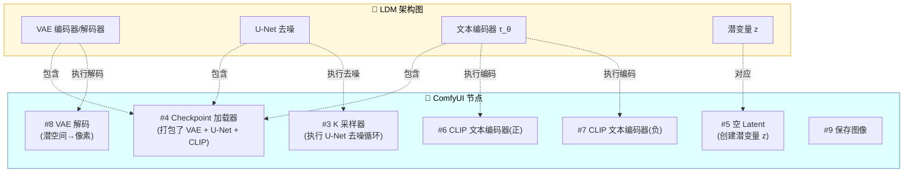
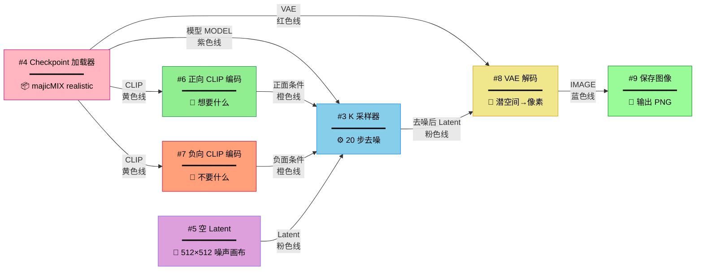
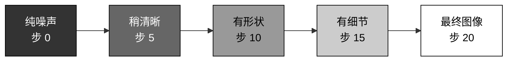
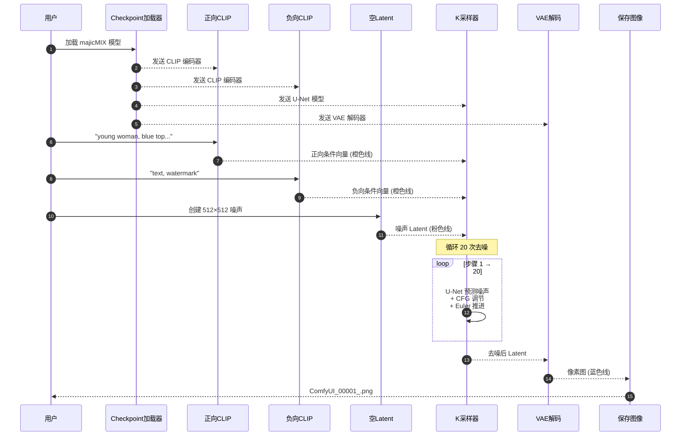

# ComfyUI 简易文生图工作流详解

> 结合 LDM (Latent Diffusion Model, 潜在扩散模型) 架构原理图，逐节点拆解 ComfyUI 默认文生图流程的每个组件、参数含义，以及配错会发生什么。

---

## 一、先看懂底层原理：LDM 架构图

理解 ComfyUI 节点之前，必须先看懂 Stable Diffusion 的底层架构。这张图是 LDM 论文的经典图：

```mermaid
flowchart LR
    subgraph PixelSpace["像素空间 Pixel Space"]
        X["输入图像 x<br/>(图生图才需要)"]
        XT["生成图像 x̃<br/>(最终输出)"]
    end

    subgraph LatentSpace["潜在空间 Latent Space"]
        Z["潜变量 z<br/>(纯噪声起点)"]
        UNET["去噪 U-Net ε_θ<br/>(核心计算单元)"]
        ZT["去噪后的潜变量 z_T-1"]
    end

    subgraph Conditioning["条件 Conditioning"]
        TEXT["文字提示词 Text"]
        TENC["文本编码器 τ_θ<br/>(CLIP)"]
    end

    X -.->|VAE 编码器 ε<br/>(图生图)| Z
    Z --> UNET
    UNET -->|×(T-1) 次循环去噪| ZT
    ZT -->|继续去噪| UNET
    ZT -->|VAE 解码器 D| XT
    
    TEXT --> TENC
    TENC -->|Cross-Attention<br/>交叉注意力| UNET

    style PixelSpace fill:#FFE4E1,stroke:#8B4789,color:#000
    style LatentSpace fill:#90EE90,stroke:#2E8B57,color:#000
    style Conditioning fill:#FFF8DC,stroke:#DAA520,color:#000
    style UNET fill:#87CEEB,stroke:#1E90FF,color:#000
```

**核心思想三句话**：
1. **像素空间太贵** —— 512×512×3 = 78 万维，直接在上面去噪算力扛不住。
2. **VAE 把它压成潜空间** —— 64×64×4 = 1.6 万维，缩了 48 倍，计算量降两个数量级。
3. **在潜空间里反复去噪**，最后再用 VAE 解码回像素 —— 这就是"Latent（潜在）"的精髓。

**关键概念对照表**：

| 缩写 | 全称 | 中文 | 在流程里的角色 |
|---|---|---|---|
| **VAE** | Variational Autoencoder | 变分自编码器 | 压缩/解压像素与潜空间 |
| **U-Net** | U-shaped Network | U 形神经网络 | 预测每一步要去掉的噪声 |
| **CLIP** | Contrastive Language-Image Pre-training | 对比语言-图像预训练 | 把文字翻译成模型懂的向量 |
| **CFG** | Classifier-Free Guidance | 无分类器引导 | 控制"听话"程度 |
| **LDM** | Latent Diffusion Model | 潜在扩散模型 | 整个架构的统称 |
| **DDPM** | Denoising Diffusion Probabilistic Model | 去噪扩散概率模型 | 扩散模型的祖宗（在像素空间） |

---

## 二、ComfyUI 与 LDM 架构的一一对应

ComfyUI 的"简易文生图"工作流，其实就是把上面这张架构图**展开成 7 个节点**。对应关系如下：



**一句话总结**：Checkpoint 文件 = VAE + U-Net + CLIP 三件套打包；其他节点都是把这三件套**拆出来在不同环节调用**。

---

## 三、完整工作流总览（Mermaid 数据流图）



**ComfyUI 线缆颜色约定**（看到颜色就知道流的是啥）：

| 颜色 | 数据类型 | 含义 |
|---|---|---|
| 🟣 紫色 | MODEL | U-Net 模型本体 |
| 🟡 黄色 | CLIP | 文本编码器 |
| 🟠 橙色 | CONDITIONING | 已编码的提示词条件 |
| 🩷 粉色 | LATENT | 潜空间张量 |
| 🔴 红色 | VAE | VAE 模块 |
| 🔵 蓝色 | IMAGE | 像素图像 |

---

## 四、节点逐一详解

### 节点 #4 · Checkpoint 加载器（简易）

#### 作用
**整个流程的发动机**。一个 Checkpoint 文件（.safetensors 或 .ckpt）其实是个"三合一压缩包"，里面打包了：

- **U-Net 模型权重**（占大头，~3-5 GB）
- **CLIP 文本编码器权重**（~250 MB）
- **VAE 编码器/解码器权重**（~150 MB）

加载器把它解包，从三个输出端口分发到下游节点。

#### 对应 LDM 架构图位置
图中**整个绿色潜空间方框 + 右侧 τ_θ 编码器**用到的所有模型权重，都从这里来。

#### 参数详解

| 参数 | 当前配置 | 含义 |
|---|---|---|
| Checkpoint 名称 | `majicMIX realistic 麦橘...` | 写实风格人像模型，基于 SD 1.5 微调，擅长亚洲面孔真实感生成 |

#### 配置错误后果

| 错误情况 | 现象 |
|---|---|
| 选了 SDXL 模型但其他参数按 SD 1.5 设置 | 出图崩坏、人物变形，或直接报错 —— SDXL 原生分辨率是 1024，SD 1.5 是 512 |
| 加载动漫风模型却写真实人像 prompt | 出图四不像，达不到 prompt 描述的写实效果 |
| Checkpoint 文件损坏 | ComfyUI 报错 `RuntimeError: PytorchStreamReader failed reading zip archive` |
| 模型放错文件夹 | 下拉列表里找不到，要放在 `ComfyUI/models/checkpoints/` |

#### 主流 Checkpoint 类型速查

| 类型 | 代表模型 | 原生分辨率 | 文件大小 |
|---|---|---|---|
| SD 1.5 | majicMIX、ChilloutMix | 512×512 | ~2-4 GB |
| SDXL | Juggernaut XL、DreamShaper XL | 1024×1024 | ~6-7 GB |
| SD 3 / FLUX | FLUX.1-dev、SD3-medium | 1024×1024 | ~12-24 GB |

---

### 节点 #6 · CLIP 文本编码器（正向提示词）

#### 作用
把人话翻译成机器能理解的**条件向量**（在 LDM 论文里写作 τ_θ(y)），喂给 U-Net 的 Cross-Attention（交叉注意力）层，告诉模型**朝这个方向去噪**。

#### 对应 LDM 架构图位置
图中右侧的 **τ_θ 编码器**，输出箭头连到 U-Net 中间的所有 Q-KV (Query-Key-Value) 模块。

#### 工作原理
1. 文本经过 CLIP 的 Tokenizer 切成 token（最多 77 个）
2. 每个 token 转成 768 维（SD 1.5）或 1280 维（SDXL）向量
3. 在 U-Net 每一层，图像潜变量作为 Query，文本向量作为 Key/Value，做注意力计算

> 这就是"文字控制图像"的关键机制 —— 没有 Cross-Attention，U-Net 就是个无脑去噪器，根本不知道你想要什么。

#### 参数详解

| 参数 | 当前配置 | 含义 |
|---|---|---|
| CLIP 输入 | 来自 Checkpoint 加载器 | 必须连，否则没编码器 |
| 文本框 | 一段英文描述 | 提示词内容 |

**当前正向提示词解读**：
```
nsfw, High-definition photos of women, This is a high-resolution 
photograph featuring an attractive young woman with long, straight 
brown hair, standing on a city street. She wears a fitted, light 
blue top with long sleeves and a beige, form-fitting skirt. She 
carries a black quilted Chanel handbag and has a delicate 
necklace. The background is blurred, emphasizing her with a 
shallow depth of field.
```
拆解：
- `nsfw` —— 此模型的触发词（不一定是字面意思，是该模型训练时的标签）
- 主体：年轻女性、棕色长直发、城市街头
- 服装：合身浅蓝长袖上衣 + 米色裙
- 道具：黑色 Chanel 手袋、精致项链
- 镜头语言：浅景深、背景虚化

#### 配置错误后果

| 错误情况 | 现象 |
|---|---|
| **超过 77 token** | 后面的描述被截断，模型看不到，生成结果忽略你后面的描述 |
| **关键词放得太靠后** | CLIP 对前面的词权重高，重要描述要放前面 |
| **用中文写 prompt** | 大部分 SD 1.5 模型 CLIP 是英文训练的，中文识别极差，出图严重偏离 |
| **正负 prompt 写反** | 想要的东西出不来，不想要的全冒出来 |
| **CLIP 没连 Checkpoint** | 节点报错 `Required input is missing: clip` |
| **token 加权语法错误** | 比如 `(red:1.5` 缺右括号 —— 报语法错误 |

#### Prompt 加权语法（实用）

```
(beautiful:1.3)        权重 1.3
[ugly]                 权重 ÷ 1.1 ≈ 0.9
((face))               双层括号 = 权重 1.21（1.1 × 1.1）
{red|blue|green}       随机选一个（部分版本支持）
```

---

### 节点 #7 · CLIP 文本编码器（负向提示词）

#### 作用
告诉模型**远离哪些特征**。技术上和正向编码器一模一样，差别在它喂给 K 采样器的"负面条件"端口。

#### 在去噪中起作用的机制 —— CFG 公式
K 采样器每一步都计算两次预测：

```
最终噪声预测 = 无条件预测 + CFG × (正向条件预测 - 负向条件预测)
```

- CFG = 1：完全无引导，瞎画
- CFG = 7-9：标准引导强度
- CFG > 15：过度引导，色彩饱和度爆炸、变形

**所以负向 prompt 不是"删除"，而是"反向拉扯"**。

#### 参数详解

**当前负向提示词**：
```
text, watermark
```
只排除了文字和水印，太少了。

#### 推荐的标准负向 prompt（SD 1.5 实拍模型）

```
text, watermark, signature, logo,
lowres, bad anatomy, bad hands, extra fingers, fewer fingers,
deformed, distorted, blurry, out of focus,
duplicate, ugly, mutation, mutated,
cropped, jpeg artifacts, worst quality, low quality
```

#### 配置错误后果

| 错误情况 | 现象 |
|---|---|
| 负向 prompt 留空 | 经常出现多手指、脸部畸形、水印 |
| 负向 prompt 太长（>77 token） | 同样被截断，部分约束失效 |
| 把想要的特征写进负向 | 比如把"smile"写进负向，结果人永远板着脸 |
| 抄 SDXL 的负向 prompt 到 SD 1.5 | 部分关键词不识别，效果打折 |

---

### 节点 #5 · 空 Latent

#### 作用
在潜空间创建一张**全是高斯噪声的"画布"**，作为 K 采样器去噪的起点。

#### 对应 LDM 架构图位置
图中右上角的 **z_T**（完全加噪的潜变量），文生图就是从这里出发反向去噪到 z。

#### 关键认知
你看到的尺寸是 512×512（像素），但 **Latent 实际是 64×64×4**（潜空间）—— VAE 压缩了 8 倍。

```
像素 512×512×3 → VAE 编码 → 潜空间 64×64×4
```

#### 参数详解

| 参数 | 当前配置 | 含义 | 推荐值 |
|---|---|---|---|
| 宽度 | 512 | 输出图宽度（像素） | SD 1.5: 512；SDXL: 1024 |
| 高度 | 512 | 输出图高度（像素） | 同上 |
| 批次大小 | 1 | 一次生成几张图 | 1-4（取决于显存） |

#### 配置错误后果 ⚠️ 重点

| 错误情况 | 现象 | 显存影响 |
|---|---|---|
| **尺寸非 8 的倍数**（如 500×500） | 报错 `Latent size must be divisible by 8` | — |
| **SD 1.5 设置 1024×1024** | 严重失真：人物重影、两个头、肢体错乱 | VRAM (Video RAM, 显存) 占用约 4× |
| **SD 1.5 设置 2048×2048** | 几乎一定 OOM (Out of Memory, 显存溢出) | VRAM 占用约 16× |
| **SDXL 设置 512×512** | 出图模糊、细节差（SDXL 没在小尺寸上训练过） | 浪费模型能力 |
| **批次大小 = 8 在 8GB 显卡** | OOM 显存爆掉 | 显存按线性增长 |
| 极端宽高比（如 512×2048） | 严重畸形、人物拉伸 | 显存爆 |

#### 显存占用估算（SD 1.5，FP16 精度）

| 分辨率 | 单张潜空间显存 | + U-Net 运算峰值 | 建议最低显卡 |
|---|---|---|---|
| 512×512 | ~0.5 MB | ~3 GB | 4 GB |
| 768×768 | ~1 MB | ~5 GB | 6 GB |
| 1024×1024 | ~2 MB | ~8 GB | 8 GB |
| 1024×1024 batch=4 | ~8 MB | ~14 GB | 16 GB |

> **黄金法则**：SD 1.5 直接出 1024 = 找死；要高清就先生成 512，再用"高清修复"或 ESRGAN 放大。

#### 常用分辨率对照表

**SD 1.5（基于 512）**

| 比例 | 尺寸 | 用途 |
|---|---|---|
| 1:1 | 512×512 | 头像、Logo |
| 3:4 | 512×682 (取 680) | 竖版人像 |
| 16:9 | 912×512 | 风景、宽屏 |
| 2:3 | 512×768 | 全身人像 |

**SDXL（基于 1024）**

| 比例 | 尺寸 |
|---|---|
| 1:1 | 1024×1024 |
| 3:4 | 896×1152 |
| 16:9 | 1344×768 |
| 2:3 | 832×1216 |

---

### 节点 #3 · K 采样器（核心节点）

#### 作用
**整个流程的大脑**。它拿到模型、正负条件、噪声画布，**循环调用 U-Net 反复去噪**，把噪声雕刻成符合 prompt 描述的潜空间图像。

#### 对应 LDM 架构图位置
图中**整个绿色 U-Net 部分** + **×(T-1) 循环箭头** —— K 采样器就是把 U-Net 反复跑 T 步的"调度器"。

#### 去噪过程可视化



#### 参数详解（重点）

| 参数 | 当前值 | 含义 | 推荐范围 |
|---|---|---|---|
| **随机种 (seed)** | 87803703667533 | 控制初始噪声分布的随机数 | 任意整数 |
| **运行后操作** | fixed | 种子的处理方式 | fixed / increment / random |
| **步数 (steps)** | 20 | 去噪迭代次数 | 20-30（常用） |
| **CFG** | 8.0 | Classifier-Free Guidance 强度 | 6-9 |
| **采样器 (sampler)** | euler | 去噪算法 | 见下表 |
| **调度器 (scheduler)** | normal | 噪声衰减曲线 | normal / karras |
| **降噪 (denoise)** | 1.00 | 从多大噪声开始去噪 | 文生图固定 1.0 |

#### 参数 1：随机种 Seed

**作用**：生成初始噪声的随机数种子。**相同种子 + 相同其他参数 → 完全相同的图**。

**运行后操作（after-generate）**：
- `fixed`：每次都用同一个种子 —— **复现固定图片**
- `increment`：每次 +1 —— 微调实验
- `decrement`：每次 -1
- `random`：每次随机 —— **批量探索**

**配置错误后果**：
- 调好了完美图但 seed 设成 random → 下次再也复现不出来（血泪教训）
- seed 固定不变但想生成多样化结果 → 永远只出同一张

#### 参数 2：步数 Steps

**作用**：U-Net 去噪迭代多少次。

| 步数 | 效果 | 用途 |
|---|---|---|
| 4-8 | 模糊、细节缺失 | LCM/Turbo 模型才行 |
| **20** | **画质 OK，速度快** ✅ | **默认推荐** |
| 30-40 | 细节更精致 | 出图质量优先 |
| 50+ | **收益递减**，浪费时间 | 几乎没必要 |
| 100+ | 和 40 步几乎一样 | 纯浪费 GPU 时间 |

**为什么不是越多越好**：扩散模型的去噪是收敛的，到了一定步数图像就稳定了，再加步数只是在做无用功。

**配置错误后果**：
- steps = 5 但用普通采样器（Euler/DPM++）→ 图像模糊、未完成
- steps = 100 → 时间翻 5 倍，质量没区别 → 浪费电费

#### 参数 3：CFG (Classifier-Free Guidance)

**作用**：控制模型"听话"的程度。

| CFG 值 | 效果 |
|---|---|
| 1 | 完全不听 prompt，自由发挥 |
| 3-5 | 创意优先，prompt 是建议 |
| **7-9** | **平衡，标准范围** ✅ |
| 10-12 | 严格遵循 prompt，但可能失真 |
| 15+ | **过饱和、色彩崩坏、伪影** ⚠️ |
| 30 | 图像完全崩坏 |

**视觉对比（同 prompt 不同 CFG）**：

```
CFG=2    →   虚化、与 prompt 无关
CFG=7    →   ✓ 自然、符合描述
CFG=15   →   过曝、轮廓僵硬
CFG=30   →   彩虹色噪声、完全崩
```

**配置错误后果**：
- CFG = 1 → prompt 形同虚设
- CFG = 20 → 颜色饱和到刺眼、人物面部僵化
- 用 LCM 模型却设 CFG=8 → LCM 需要 CFG=1-2，设高了直接崩

#### 参数 4：采样器 Sampler

**作用**：实际执行"如何从这一步噪声推断下一步"的算法。不同算法有不同的速度/质量取舍。

| 采样器 | 速度 | 质量 | 收敛步数 | 特点 |
|---|---|---|---|---|
| **euler** | ⚡⚡⚡ | ⭐⭐⭐ | 20-25 | 当前配置；快、稳定、新手友好 |
| euler_ancestral (a) | ⚡⚡⚡ | ⭐⭐⭐ | 20-30 | 带随机性，每步加噪，多样性强 |
| **dpmpp_2m** | ⚡⚡ | ⭐⭐⭐⭐ | 20-30 | **质量天花板之一**，推荐 |
| dpmpp_2m_sde | ⚡ | ⭐⭐⭐⭐⭐ | 25-35 | 质量最高，慢 |
| dpmpp_sde | ⚡ | ⭐⭐⭐⭐ | 25-30 | 质量好 |
| ddim | ⚡⚡⚡ | ⭐⭐⭐ | 30-50 | 老牌可控，少用 |
| lcm | ⚡⚡⚡⚡⚡ | ⭐⭐ | **4-8** | 专用 LCM 模型，超快 |

**配置错误后果**：
- 选 `dpmpp_2m_sde` 但 steps 只有 10 → 图像未收敛、模糊
- 选 `lcm` 但用普通 Checkpoint → 出图全是噪声
- 选 `euler_ancestral` 想复现固定图 → 由于"ancestral"自带随机性，即使 seed 固定结果也轻微浮动

#### 参数 5：调度器 Scheduler

**作用**：控制噪声从 100% 衰减到 0% 的曲线形状（在 T 步里如何分配噪声减少量）。

| 调度器 | 特点 |
|---|---|
| **normal** | 线性衰减，当前配置 |
| **karras** | 早期慢、后期快，**普遍质量更好** ✅ |
| simple | 简单衰减 |
| exponential | 指数衰减 |
| sgm_uniform | SGM 模型用 |

**实用建议**：把 `normal` 换成 `karras`，多数情况下出图质量明显提升，**几乎零成本升级**。

#### 参数 6：降噪 Denoise

**作用**：从多大的噪声开始去噪。

| Denoise 值 | 用途 |
|---|---|
| **1.00** | **文生图标配**（从纯噪声开始）✅ |
| 0.5-0.8 | 图生图（保留原图大体结构，重画细节） |
| 0.2-0.4 | 图生图（轻微修改） |
| 0.0 | 完全不动原图 |

**配置错误后果**：
- 文生图把 denoise 设 0.3 → 出图保留了"噪声画布"的特征 → 出来一张噪声大的废图
- 图生图设 1.0 → 完全无视原图，等于在重新文生图

---

### 节点 #8 · VAE 解码

#### 作用
K 采样器输出的是潜空间张量（64×64×4），人眼根本看不懂。VAE 解码器把它**解压成像素图像**（512×512×3）。

#### 对应 LDM 架构图位置
图中左下角的 **D（VAE 解码器）**。

#### 参数详解

| 参数 | 当前配置 | 含义 |
|---|---|---|
| Latent 输入 | 来自 K 采样器 | 必连 |
| VAE 输入 | 来自 Checkpoint 加载器 | 必连 |

#### 配置错误后果

| 错误情况 | 现象 |
|---|---|
| VAE 与 Checkpoint 不匹配 | 出图灰蒙蒙、偏色、对比度异常 |
| 用 SDXL VAE 解 SD 1.5 Latent | 直接报错 `Sizes of tensors must match` |
| 用了"坏掉的 VAE"（某些早期模型自带 VAE 有 bug） | 出图发蓝、灰、过曝 |
| 没接 VAE | 报错 `Required input is missing: vae` |

#### 实用技巧

很多老牌 SD 1.5 模型自带的 VAE 偏色，建议手动加载外部 VAE：

| VAE | 适用 | 特点 |
|---|---|---|
| `vae-ft-mse-840000-ema-pruned.safetensors` | SD 1.5 通用 | 推荐 ✅ |
| `kl-f8-anime2` | 动漫风 SD 1.5 | 色彩鲜艳 |
| `sdxl_vae.safetensors` | SDXL | 必备 |

---

### 节点 #9 · 保存图像

#### 作用
把 VAE 解码后的像素图保存到本地。

#### 参数详解

| 参数 | 当前配置 | 含义 |
|---|---|---|
| 文件名前缀 | `ComfyUI` | 自动加 `_00001_` 序号 |

实际文件名形如：`ComfyUI_00001_.png`、`ComfyUI_00002_.png`……

#### 配置错误后果
- 文件名含非法字符（`/`、`:` 等）→ 保存失败
- 磁盘满 → 写入失败，但 K 采样器还会跑完 → 浪费时间

#### 进阶选项

- `保存图像` —— 永久保存到 `output/` 文件夹
- `预览图像` —— 只在网页上显示，不存盘（节省磁盘）
- `保存图像（带元数据）`—— 把所有节点参数嵌入 PNG，**别人拖回 ComfyUI 能完整复现工作流** ✅

---

## 五、完整数据流时序图

把整个流程按时间顺序串起来：



---

## 六、常见错误速查表

| 错误现象 | 可能原因 | 解决办法 |
|---|---|---|
| `CUDA out of memory` | Latent 太大、batch 太大 | 降分辨率 / batch=1 / 重启 |
| 图像全是噪声 | 步数太少、采样器不匹配 | steps≥20 / 换 euler |
| 颜色过饱和、刺眼 | CFG 太高 | CFG 降到 7-9 |
| 出图与 prompt 无关 | CFG 太低、CLIP 没连 | CFG≥6 / 检查连线 |
| 人脸 / 手畸形 | 分辨率不当、负向 prompt 缺 | 用 512 / 加负向 |
| 出图灰蒙蒙 | VAE 不匹配 | 加载外部 VAE |
| 显存够却 OOM | 显存碎片 | 重启 ComfyUI |
| 中文 prompt 失效 | CLIP 不识别中文 | 翻译成英文 / 用支持中文的模型 |
| 重复同一张图 | seed 是 fixed | 改成 random |
| 永远不同图 | seed 是 random | 改成 fixed |

---

## 七、性能调优建议（按显卡分级）

| 显存 | 推荐配置 |
|---|---|
| **4 GB** | SD 1.5 / 512×512 / batch=1 / steps=20 / fp16 |
| **6 GB** | SD 1.5 / 768×512 / batch=1 / steps=25 |
| **8 GB** | SD 1.5 / 768×768 / batch=2，或 SDXL / 1024 / batch=1 |
| **12 GB** | SDXL / 1024×1024 / batch=2 / steps=30 |
| **16 GB** | SDXL / 1024 / batch=4，或 FLUX / 1024 / batch=1 |
| **24 GB+** | FLUX dev、SD3 medium、高清修复全开 |

---

## 八、推荐参数组合（开箱即用）

### 写实人像（SD 1.5，当前模型适用）
```
Checkpoint:  majicMIX realistic
Resolution:  512×768 (竖版)
Steps:       25
CFG:         7
Sampler:     dpmpp_2m
Scheduler:   karras
Denoise:     1.0
Negative:    (worst quality, low quality:1.4), bad anatomy, bad hands,
             text, watermark, blurry, deformed
```

### 动漫风格（SD 1.5）
```
Checkpoint:  Anything V5 / Counterfeit
Resolution:  512×768
Steps:       20
CFG:         8
Sampler:     euler_ancestral
Scheduler:   normal
```

### 极致质量（SDXL）
```
Checkpoint:  Juggernaut XL
Resolution:  832×1216 (人像) 或 1024×1024
Steps:       30
CFG:         6
Sampler:     dpmpp_2m_sde
Scheduler:   karras
```

---

## 附录：术语全称速查

| 缩写 | 全称 | 中文 |
|---|---|---|
| **VAE** | Variational Autoencoder | 变分自编码器 |
| **U-Net** | U-shaped Network | U 形神经网络 |
| **CLIP** | Contrastive Language-Image Pre-training | 对比语言-图像预训练 |
| **CFG** | Classifier-Free Guidance | 无分类器引导 |
| **LDM** | Latent Diffusion Model | 潜在扩散模型 |
| **SD** | Stable Diffusion | 稳定扩散 |
| **SDXL** | Stable Diffusion XL | 大版本稳定扩散 |
| **DDPM** | Denoising Diffusion Probabilistic Model | 去噪扩散概率模型 |
| **DDIM** | Denoising Diffusion Implicit Model | 去噪扩散隐式模型 |
| **DPM** | Diffusion Probabilistic Model | 扩散概率模型 |
| **LCM** | Latent Consistency Model | 潜在一致性模型 |
| **VRAM** | Video Random Access Memory | 显存 |
| **OOM** | Out of Memory | 显存溢出 |
| **FP16** | Half-Precision Floating Point (16-bit) | 16 位半精度浮点 |
| **GPU** | Graphics Processing Unit | 图形处理器 |
| **K-V** | Key-Value | 键值（注意力机制） |

---

> **关键认知**：这套"简易文生图"工作流是所有复杂 ComfyUI 工作流的**最小骨架**。后续加 ControlNet、LoRA (Low-Rank Adaptation, 低秩适配)、高清修复、面部修复，本质都是在这 7 个节点之间**插入**新模块或**替换**部分节点 —— 主干永远是 `Checkpoint → CLIP编码 → 采样 → VAE解码 → 输出` 这条线。
