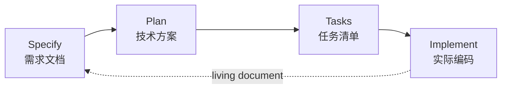
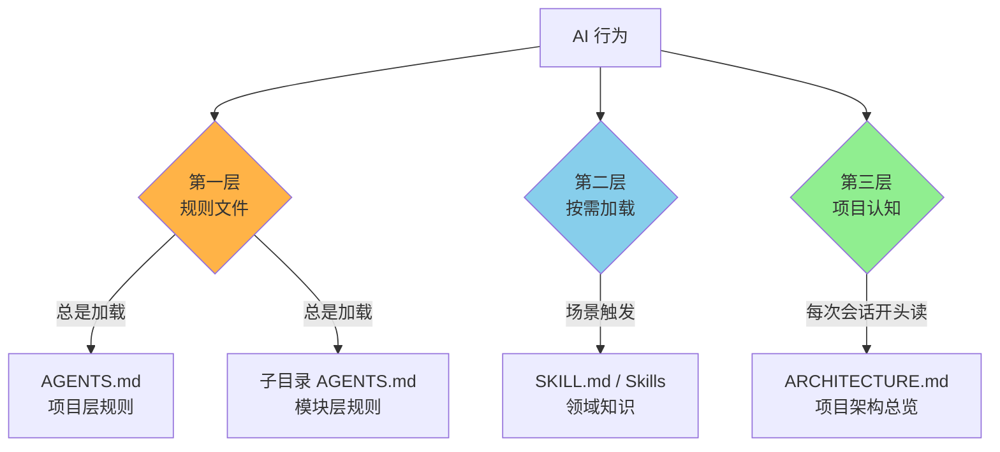
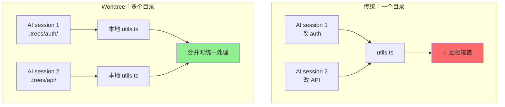
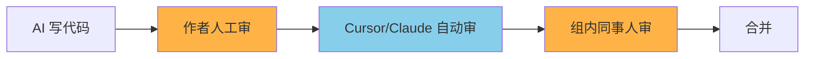
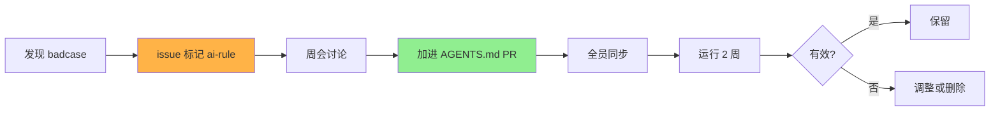
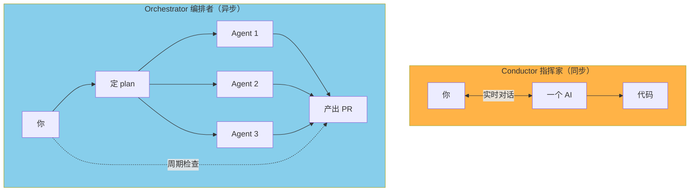
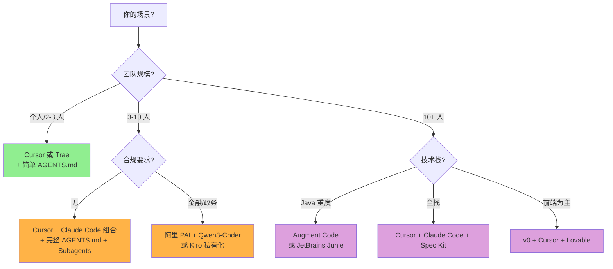
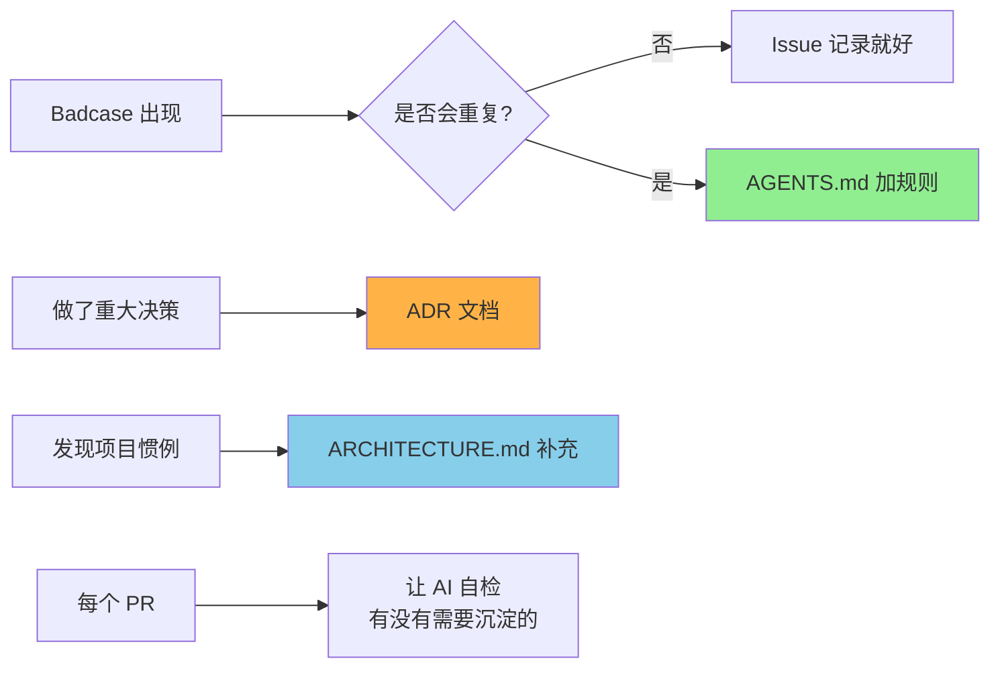

# AI 项目代码开发的工程化管理

**副标题**：从 Vibe Coding（氛围编程）到 SDD（Spec-Driven Development，规约驱动开发）—— 给 Java 后端开发者的实战手册

**版本**：v1.0
**适用对象**：有代码基础的工程师、技术管理者、面试备考者
**主要技术栈**：Java（Spring Boot / Spring Cloud），Python 与前端的差异点会在相应位置标注

---

## 引言：为什么"vibe coding 玩具"做不了真项目

2025 年 2 月，Andrej Karpathy 提出 Vibe Coding（氛围编程）：你描述需求，模型写代码，能跑就行。一年后，他自己承认这个时代结束了，行业进入 **Agentic Engineering（智能体工程）** 阶段——你不再"凭感觉聊"，而是"用规约编排一队 Agent，并在每个关键节点保留人类决策权"。

为什么会有这个转变？因为 vibe coding 在真项目里的失败模式非常一致：

- AI 写出来的代码**能跑但风格乱**，五个人写同一个功能能产出五种代码
- 上下文丢失后开始**"飞线"**：在原本干净的架构上临时加属性、塞工具类、混合关注点
- 多人协作时，**每个人本地的 AI 输出不同**，没人能保证一致性
- 大改动时 AI **一拿到 prompt 就开写**，结果跑偏后只能整个回滚

这份手册就是给"想用 AI 做真项目"的工程师准备的——重点是**中型 Java 项目**（3-10 人，1-10 万行代码量级），同时把单人小项目和企业级项目的差异点都带一下。

> ⚠️ 一个重要心法：**AI 工具更新极快**（Cursor、Claude Code、AGENTS.md 标准、Subagents 等，平均每月有重大更新）。这份手册讲的是"原则 + 当前最佳实践"，原则可以用 3-5 年，具体工具命令请以官方文档为准。

---

## 一、项目治理：把 AI 嵌入开发生命周期

### 1.1 传统 SDLC vs AI 时代的 SDLC

SDLC（Software Development Lifecycle，软件开发生命周期）的六个阶段，AI 介入方式不同：

| 阶段 | 传统做法 | AI 时代做法 |
|---|---|---|
| 需求分析 | PM 写 PRD | PM + AI 一起反向问询，产出 `requirements.md` |
| 系统设计 | 架构师画图 | 架构师定原则，AI 出 `plan.md`，人审 |
| 编码 | 工程师手写 | AI 写，工程师审 + 修 |
| 测试 | 工程师写 unit test | AI 写 test，工程师定边界条件 |
| 上线 | 人工 + CI/CD | CI/CD + AI Hook 自动跑检查 |
| 维护 | 工程师 + 文档 | AI 通过 git log + `AGENTS.md` 持续学习 |

**核心变化**：工程师从"写代码的人"变成"定规则、审产出、修边界的人"。

### 1.2 三种项目成熟度等级

不是所有项目都需要重型流程。先识别自己在哪一档：

| 等级 | 团队 | 代码量 | 推荐方法论 |
|---|---|---|---|
| **L1 单人/小工具** | 1-2 人 | < 1 万行 | Cursor + Plan Mode + 简单 `AGENTS.md` |
| **L2 中型团队** ⭐ | 3-10 人 | 1-10 万行 | SDD 轻量版 + 完整 `AGENTS.md` + Subagents + Worktree |
| **L3 企业级** | 10+ 人 | > 10 万行 | SDD 完整版 + 多 Agent 编排 + CI/CD 集成 + 合规审计 |

> **L1 的差异**：可以省掉 spec 三件套，直接用 Plan Mode 就够。`AGENTS.md` 写个十行就行。
>
> **L3 的差异**：需要专人维护规则库、设 AI Coding Lead 角色、规则要走代码评审流程、要做用量审计与成本管控、敏感代码可能要走私有化部署（如 AWS Kiro、阿里 PAI + Qwen3-Coder 自托管）。

本手册主线讲 L2，关键差异点会在相应章节标注。

### 1.3 中型项目的最小治理框架

落地不需要复杂，**四件套**就够：

```
your-project/
├── AGENTS.md              ← 规则文件（全员遵守的硬约束）
├── ARCHITECTURE.md        ← 架构文档（让 AI 先学）
├── docs/
│   ├── requirements.md    ← 当前迭代要做什么
│   ├── plan.md            ← 怎么做
│   └── tasks.md           ← 拆分成可执行任务
└── .claude/agents/        ← Subagent 配置（可选，团队成熟后引入）
```

文末有完整模板，可以直接复制改。

### 1.4 新增角色：AI 工作流 Owner

L2 及以上项目建议设一个角色——可以是兼职，但必须有人负责：

- 维护 `AGENTS.md`，定期把 badcase（典型错误）写入规则
- 引入新工具时做兼容性评估
- 每周/双周开 retro：哪些规则需要加、哪些规则在阻碍效率

这个角色和"AI 训练师"重叠度很高，但更偏工程方向。

---

## 二、流程控制：先讨论再写代码

> **对应问题**：如何防止 AI 一拿到命令就直接开写？如何保证后续按架构开发？

### 2.1 核心病：AI 默认是"急脾气"

LLM（Large Language Model，大语言模型）天生倾向于"立刻产出"——你给一句 "帮我加个用户登录"，它马上写代码、改文件、动数据库。这种 "ready, fire, aim"（瞄准前先开火）行为是 vibe coding 失败的核心原因。

业界的解药统一指向一个模式：**先 Plan，再 Act**。

### 2.2 业界共识：Plan / Act 两段式工作流

2025-2026 年所有主流 AI 编程工具都内置了某种形式的"规划模式"：

| 工具 | 触发方式 | 行为 |
|---|---|---|
| **Claude Code** | Shift+Tab 两次进入 Plan Mode | 只读，搜代码、读文件、写计划，等你批准 |
| **Cursor** | 1.7+ 内置 Plan Mode | 跨文件复杂任务先出执行计划再执行 |
| **Cline** | Plan / Act 切换 | Plan 模式只读，Act 模式才动手 |
| **Gemini CLI** | `/plan` 命令 | 用更强的推理模型做架构决策 |
| **Tencent CodeBuddy** | Plan Mode 入口 | 完成后 plan 存 Markdown 供复用 |

**这些工具在做的本质是同一件事**：

```
1. 接到需求 →
2. 只读探索代码库 →
3. 输出 plan 给人审 →
4. 人确认后才允许写入
```

### 2.3 SDD 的三阶段细化：Specify → Plan → Tasks → Implement

Plan Mode 只是"单次操作"的安全阀。对于跨多个迭代的功能，业界推荐升级版——**SDD（Spec-Driven Development，规约驱动开发）**。SDD 在 2025 年由 GitHub、Google、OpenAI、Cursor、Factory 共同推动，2026 年已成为主流共识。



每个阶段产出一份 Markdown 文件，沉淀进 git，下一阶段消费上一阶段的产出：

**`requirements.md`** — 这次要做什么
- 用户故事（User Story）
- 验收标准（Acceptance Criteria）
- 非功能约束（性能、安全、兼容）
- 明确写出**不做什么**（Out of Scope）

**`plan.md`** — 怎么做
- 涉及的模块/文件
- 数据模型变更
- 接口设计
- 依赖、风险、回滚方案

**`tasks.md`** — 拆成原子任务
- 每个任务 1-4 小时可完成
- 显式标注前置依赖
- 标注谁/哪个 Agent 来做

**关键点**：spec 不是"写完丢一边"，是 **living document（活文档）**——每次迭代都更新，git 跟踪所有变更，PR 必须同步更新对应 spec。

### 2.4 让 AI 永远先讨论的硬性规则

把下面这段放进项目根目录的 `AGENTS.md`：

```markdown
## Workflow Rules（必须遵守）

1. 对于任何涉及多文件改动的任务，**禁止直接修改代码**。
   先在 `docs/plan.md` 输出方案，包括：
   - 涉及哪些文件 / 类 / 方法
   - 数据模型与接口变更
   - 风险点与回滚策略
   等用户确认后再执行。

2. 对于单文件、单方法的小改动（< 30 行），可以直接动手，
   但 commit message 必须包含「为什么这么改」。

3. 任何新增依赖（pom.xml 改动）必须先在 plan 中说明，
   不允许擅自引入新库。

4. 任何修改了超过 3 个文件的 PR，
   必须在描述中列出「动了哪些文件 + 改动原因」。
```

> **L1 简化版**：只保留第 1、3 条即可。
>
> **L3 强化版**：增加"安全敏感改动（auth、payment、user data）必须经过 code-reviewer subagent 审核"等条款。

### 2.5 架构调整的"反向 SDD"

> **对应问题**：项目架构需要调整时怎么办？如何全局修改？

这是最容易翻车的场景之一——你说"我们要把单体拆成微服务"，AI 立刻动手就是灾难。正确的流程是**反向应用 SDD**：

**Step 1：现状分析（read-only）**

```
让 Claude Code/Cursor 在 Plan Mode 下：

prompt:
分析当前项目的架构现状，输出一份 ARCHITECTURE_AS_IS.md，包括：
1. 模块清单与依赖图
2. 核心抽象（base classes、interfaces）
3. 跨模块的耦合点
4. 你认为不合理或脆弱的地方
不要修改任何代码。
```

**Step 2：目标架构（设计阶段）**

```
prompt:
基于 ARCHITECTURE_AS_IS.md 和如下目标 [...]，
设计目标架构 ARCHITECTURE_TO_BE.md，重点说明：
1. 新的模块划分
2. 与现状的 diff（哪些保留、哪些拆分、哪些合并）
3. 数据迁移方案
4. 兼容性策略（如何不停机迁移）
```

**Step 3：迁移计划（拆任务）**

```
prompt:
基于现状和目标，生成 MIGRATION_PLAN.md：
1. 按"风险从低到高"排序的迁移步骤
2. 每个步骤的回滚条件
3. 每个步骤完成后的验证标准
拆成 30 个 task 以内，每个 task 不超过 1 天工作量。
```

**Step 4：分批执行**

- 每个 task 单独跑（最好在独立 git worktree 里）
- 每完成一个 task 跑全量测试
- 不通过就回滚，绝不"先合并后修"

**实际工业案例**：
- **Salesforce** 用类似流程把 Apex → Java 的迁移从原计划 24 个月压缩到 4 个月
- **Atlassian Rovo Dev** 团队用 AI + 上下文文件（codified context）清理 1400 个文件、15 种语法变体——只用了 2 个开发者

---

## 三、一致性维持：规则、模板、上下文锚定

> **对应问题**：如何保持设计一致性？如何防止 AI 走偏 / 飞线？

### 3.1 一致性为什么这么难——AI 的三个天生缺陷

1. **无状态**：每次新对话从零开始，不知道你昨天聊过什么
2. **上下文衰减**（Context Decay）：长对话越往后，前面的约束越容易被忽略——这是 LLM 注意力机制的固有问题
3. **不知道项目惯例**：它只看到当前文件，不知道隔壁文件用了什么模式

> 详情参考你知识库里的《大模型基础概念笔记》—— KV Cache（键值缓存）累积导致长对话变慢、注意力分散。

### 3.2 三层防御体系



- **第一层 规则文件**：每次会话都加载的硬约束。下一章详谈。
- **第二层 Skills**：Anthropic Claude Code 的概念——按需加载的领域知识（如 `pptx/SKILL.md` 只在做 PPT 时触发）。Cursor 也支持类似的 Skills 机制。
- **第三层 项目认知**：让 AI 先"学过"项目结构，再开始工作。

### 3.3 标准动作：让 AI 先"学"项目

接手新项目或者老项目改造时，**第一件事不是写代码，是让 AI 生成 `ARCHITECTURE.md`**：

```
prompt（Plan Mode 下执行）:

请只读地扫描当前代码库，生成 ARCHITECTURE.md，包含：

1. 项目目录结构（深度 2-3 层）
2. 核心模块列表 + 每个模块的职责（一句话）
3. 关键 base class / abstract class / interface 清单
4. 数据流：用户请求是怎么经过 controller → service → repository → DB 的
5. 重要的设计约定（命名、异常、日志、事务边界）
6. 你认为新人最容易踩坑的地方（top 5）

把这份文档存到根目录，以后每次新会话开头都读它。
```

生成后人审一遍，加几句"AI 没看出来但我们知道"的背景。这份文档进 git，团队共享。

### 3.4 防"飞线"的具体手段

"飞线"指的是：原本干净的架构里，临时塞个工具类、属性、跨层调用，看起来能跑，但破坏了设计原则。AI 特别容易这么做。

**预防手段**：

1. **AGENTS.md 显式约束**
   ```markdown
   ## Architecture Rules
   - Controller 层禁止直接调用 Repository，必须经过 Service
   - 跨模块通信只能通过定义好的 Facade / API 接口
   - 不允许在 `core/` 包下引入任何 web 层依赖
   ```

2. **CI 静态检查**
   - **ArchUnit**（Java 专用）：写代码描述架构约束，CI 跑测试
   - 例：`classes().that().resideInAPackage("..core..").should().onlyDependOnClassesThat().resideInAnyPackage("..core..", "java..")`
   - 阿里 P3C 插件也能配置部分架构规则

3. **PR 模板强制说明**
   ```markdown
   ## PR Checklist
   - [ ] 是否动了 base class / interface？如果是，说明原因
   - [ ] 是否引入跨层调用？如果是，列出哪些
   - [ ] 是否引入新依赖？如果是，说明替代方案为什么不行
   ```

4. **Subagent 守门**（L2 后期或 L3）
   - 配一个 `architecture-guard` subagent，PR 合并前自动 review
   - 后面章节详细讲

---

## 四、规则注入：把阿里 Java 开发手册喂给 AI

> **对应问题**：如何用阿里 Java 开发手册这类规则规制 AI？

### 4.1 规则文件标准的演化

不同 AI 工具读不同的规则文件，曾经一片混乱：

| 工具 | 读的文件 |
|---|---|
| Cursor | `.cursorrules` / `.cursor/rules/*.mdc` |
| Claude Code | `CLAUDE.md`（项目）+ `~/.claude/CLAUDE.md`（全局） |
| GitHub Copilot | `.github/copilot-instructions.md` |
| Gemini CLI | `GEMINI.md` |
| Windsurf | `.windsurfrules` |
| Codex CLI | `AGENTS.md` |

2026 年，**`AGENTS.md` 成为事实标准**——Google、OpenAI、Cursor、Sourcegraph、Factory 联合推动。GitHub 分析了 2500+ 仓库，确认了它的有效形式。

### 4.2 推荐做法：一份维护，到处可用

把 `AGENTS.md` 作为唯一真实源（Single Source of Truth），其他工具的规则文件做软链接：

```bash
# 在项目根目录
ln -s AGENTS.md CLAUDE.md
ln -s AGENTS.md .cursorrules
mkdir -p .github && ln -s ../AGENTS.md .github/copilot-instructions.md
```

**目录树规则**：AGENTS.md 支持分层，子目录的文件覆盖父目录：

```
your-project/
├── AGENTS.md                    ← 项目全局规则
├── src/main/java/.../
│   ├── core/
│   │   └── AGENTS.md            ← core 模块的专属规则
│   └── api/
│       └── AGENTS.md            ← API 层的专属规则
└── frontend/
    └── AGENTS.md                ← 前端的专属规则
```

AI 工具会自动读取离当前工作目录最近的 `AGENTS.md`，叠加父目录的规则。

### 4.3 把《阿里巴巴 Java 开发手册》塞进去——错的与对的做法

**❌ 错误做法**：把整本手册 PDF 转 Markdown 全塞进去

手册有几百条规则，全部塞进去：
- 浪费 Token（每次会话都加载几万字）
- AI 注意力被稀释，反而执行得更差
- 改成"指令预算"理论——你给 AI 的每条指令都在消耗它的注意力

**✅ 正确做法：分层 + 工具化**

把手册的规则按三层分配：

| 层级 | 怎么处理 | 举例 |
|---|---|---|
| **L1 工具能管的** | 交给 P3C / Checkstyle / Spotless 插件 + CI | 命名格式、缩进、import 顺序、未使用变量 |
| **L2 容易出错的硬规则** | 进 `AGENTS.md`，金句级别 | "POJO 必须使用包装类型"、"禁用 Apache BeanUtils" |
| **L3 设计/架构约定** | 进 `AGENTS.md` 或 `ARCHITECTURE.md` | 事务边界、分布式锁的使用条件、异常分类 |

**核心思想**：**确定性的事交给确定性工具，AI 只处理工具搞不定的部分**。

### 4.4 阿里 P3C 插件 + Spotless + Checkstyle 配置

Maven 项目 `pom.xml`：

```xml
<build>
  <plugins>
    <!-- 阿里 P3C 静态分析 -->
    <plugin>
      <groupId>com.alibaba.p3c</groupId>
      <artifactId>p3c-pmd</artifactId>
      <version>2.1.1</version>
      <executions>
        <execution>
          <goals><goal>check</goal></goals>
          <configuration>
            <rulesets>
              <ruleset>rulesets/java/ali-comment.xml</ruleset>
              <ruleset>rulesets/java/ali-concurrent.xml</ruleset>
              <ruleset>rulesets/java/ali-constant.xml</ruleset>
              <ruleset>rulesets/java/ali-exception.xml</ruleset>
              <ruleset>rulesets/java/ali-flowcontrol.xml</ruleset>
              <ruleset>rulesets/java/ali-naming.xml</ruleset>
              <ruleset>rulesets/java/ali-oop.xml</ruleset>
              <ruleset>rulesets/java/ali-orm.xml</ruleset>
              <ruleset>rulesets/java/ali-other.xml</ruleset>
              <ruleset>rulesets/java/ali-set.xml</ruleset>
            </rulesets>
          </configuration>
        </execution>
      </executions>
    </plugin>
    
    <!-- 自动格式化 -->
    <plugin>
      <groupId>com.diffplug.spotless</groupId>
      <artifactId>spotless-maven-plugin</artifactId>
      <version>2.43.0</version>
      <configuration>
        <java>
          <googleJavaFormat><version>1.19.2</version></googleJavaFormat>
          <removeUnusedImports/>
        </java>
      </configuration>
    </plugin>
  </plugins>
</build>
```

然后 `AGENTS.md` 里只写一句：

```markdown
## Code Style
- 所有 commit 前必须跑 `mvn spotless:apply && mvn p3c:check`
- 这两个命令会自动处理 90% 的格式与命名规范，不需要你（AI）操心
- 你（AI）只需要关注下面的硬约束……
```

> **Python 项目对应**：`ruff` + `black` + `mypy` 三件套
> **前端项目对应**：`eslint` + `prettier` + `tsc --noEmit`

### 4.5 Java 项目 AGENTS.md 完整模板

下面这份可以直接拿走改改用（放进项目根目录）：

```markdown
# AGENTS.md

## Project Overview
本项目是 [一句话项目描述]。
技术栈：Spring Boot 3.x + MyBatis-Plus + MySQL 8 + Redis + Kafka。
团队 [N] 人，主分支 main，发布分支 release/*。

## Architecture Quick Reference
详细文档见 ARCHITECTURE.md。关键约束：
- 分层：Controller → Service → Repository，严禁跨层
- 跨模块通信只通过 Facade（定义在 `xxx-api` 模块）
- `core/` 包不允许引入 web 层依赖

## Workflow Rules（核心）

### 必须先 plan 的场景
- 涉及 3+ 文件的改动
- 任何 pom.xml 改动
- 任何数据库 schema 变更
- 任何 interface / abstract class 改动

plan 输出位置：`docs/plan-[feature-name].md`

### 可以直接动手的场景
- 单文件 < 30 行改动
- bug 修复（影响范围 < 2 个文件）
- 测试代码补充

### 命令约定
- 提交前必须跑：`mvn spotless:apply && mvn p3c:check && mvn test`
- 不允许跳过测试合并：禁止 `--no-verify`

## Hard Rules（硬约束 / 违反 = 拒绝合并）

### 类型与变量
- POJO 字段使用包装类型（Integer 而非 int），避免拆箱 NPE
- BigDecimal 比较使用 `compareTo`，禁用 `equals`
- 集合判空用 `CollectionUtils.isEmpty()`，不用 `.size() == 0`

### 异常处理
- 业务异常继承 `BizException`，系统异常继承 `SysException`
- 禁止 `catch (Exception e)` 后吞异常，至少 log.error + 包装
- Controller 层不直接 try-catch，统一交给 `GlobalExceptionHandler`

### 日志
- 使用 SLF4J，不用 System.out
- ERROR 日志必须带异常对象：`log.error("msg, param={}", param, e);`
- 不在循环里打 DEBUG/INFO 级别日志（性能问题）

### 并发
- 线程池禁止用 `Executors.newFixedThreadPool` 等工厂方法，必须用 `ThreadPoolExecutor` 显式构造
- 共享可变状态必须显式同步（synchronized / volatile / Atomic）
- 分布式锁统一用 `RedisLockUtil`（项目内封装），不要自己写

### 数据库
- 禁止 `SELECT *`
- 分页必须传 limit
- 涉及金额的字段用 `BigDecimal`，不用 `double / float`
- 事务边界放 Service 层，不放 Controller / Repository

### 安全
- 用户输入必须校验（@Valid / @Validated）
- SQL 必须参数化，禁止字符串拼接
- 密码、token、密钥禁止 hardcode 进代码，统一走配置中心

## Tech-Specific Notes

### Spring
- 注入用构造器，不用 @Autowired 字段注入
- @Transactional 默认 readOnly=false；只读场景显式标 readOnly=true
- @Async 的方法不能在同类内调用（会绕过 AOP）

### MyBatis
- Mapper 方法名遵循 selectXxx / insertXxx / updateXxx / deleteXxx
- 动态 SQL 拆 XML 文件，注解 @Select 只用于简单查询
- 复杂查询必须有对应的索引说明

## Project-Specific Conventions
- 包结构：com.company.[domain].{controller,service,repository,model,enums}
- 配置类名以 `Config` 结尾，工具类以 `Util` 结尾
- 常量统一定义在 `[domain]Constants` 接口里
- 错误码：6 位数字，前 3 位是模块，后 3 位是错误序号

## Common Pitfalls（badcase 库，每周更新）
- [2026-04-15] @Transactional 方法内调用同类的另一个 @Transactional 方法会失效
- [2026-04-22] Stream.parallel() 在容器环境共享 ForkJoinPool，慎用
- [...]

## What NOT to Do
- 不要新增 Lombok 之外的代码生成库
- 不要引入 Apache Commons BeanUtils（性能差），需要拷贝用 MapStruct
- 不要在 service 之间通过静态方法互相调用
- 不要写"以防万一"的日志（占空间且模糊关键信息）
```

> **使用建议**：先拿这份打底，**项目跑两周后回头改**——把团队实际遇到的 badcase 加进 Common Pitfalls 部分，把不适用的删掉。规则不维护就会过时。

---

## 五、代码与注释规则：要考虑的维度

> **对应问题**：代码规则、注释规则有哪些维度需要考虑？

### 5.1 代码规则的七个维度

| 维度 | 关键问题 | Java 典型规则 |
|---|---|---|
| **命名** | 类、方法、变量怎么取名 | 类大驼峰、方法小驼峰、常量全大写、布尔字段不加 is 前缀（POJO 序列化坑） |
| **结构** | 包/模块/类的组织方式 | 一类一文件、单职责、包按业务而非技术分层 |
| **异常** | 怎么抛、怎么捕、怎么不吞 | 业务异常 vs 系统异常分离、不允许吞异常、Controller 不 try |
| **日志** | 什么级别、什么字段必须打 | TraceId 必须打、ERROR 必带异常对象、敏感信息脱敏 |
| **并发** | 线程池、锁、共享状态 | 显式构造线程池、ThreadLocal 必须 remove、避免 synchronized this |
| **资源** | 连接、文件、内存生命周期 | try-with-resources、Stream 必须 close、大对象不放 ThreadLocal |
| **测试** | 什么必须测、覆盖率门槛 | Service 单测覆盖 > 70%、Mapper 走集成测试、Controller 走契约测试 |

**给 AI 的核心约束**：所有这些维度都应该在 `AGENTS.md` 里**有明确条款**——AI 不会"约定俗成"，你不写就等于没有。

### 5.2 注释规则的三个维度

人写代码经常注释不足，AI 写代码**反而常常注释过多**——它会把变量名翻译一遍当注释。要明确告诉它写什么、不写什么。

| 类型 | 写什么 | AI 容易出错的点 |
|---|---|---|
| **Why 类** | 业务背景、设计决策、为什么不用别的方案 | ⚠️ AI 几乎不写 |
| **What 类** | 接口契约、参数语义、返回值含义 | ⚠️ AI 容易写废话 |
| **TODO / FIXME** | 已知问题、技术债、未来计划 | ⚠️ AI 写完就忘 |

**AGENTS.md 里的注释规则示例**：

```markdown
## Comment Rules

### 必须写
- 类级 JavaDoc：写"这个类干什么"，不要写"这是一个 XxxService 类"
- 公共方法 JavaDoc：写参数语义、边界条件、异常含义
- 复杂业务逻辑：写 Why（为什么这么算），不要写 What（一行行翻译）
- 关键决策：用 `// DECISION:` 前缀，简述选择该方案的原因

### 不要写
- 变量名翻译型注释（如 `int count; // 计数`）
- 修改时间、作者（用 git blame）
- 注释掉的死代码（用 git history）
- "to do later" 之类无负责人无时限的 TODO

### 特殊标记
- `// TODO(@username, deadline): xxx` — 必须有负责人和时限
- `// FIXME: xxx` — 已知 bug，必须有 Issue 链接
- `// HACK: xxx` — 临时方案，必须说明长期方案
- `// SAFETY: xxx` — 安全相关，解释为什么安全
```

### 5.3 让 AI 在写代码的同时沉淀决策

一个很容易忽视的实践——**ADR（Architecture Decision Record，架构决策记录）**。

每个重要决策（用 A 还是 B 方案、为什么选 Redis 不选 Memcached）写一份小文档存进 `docs/adr/`，命名 `001-use-redis-for-session.md`。AI 后续读到这些文档就能避免反复推翻决策。

```markdown
# ADR-007: Use Kafka over RabbitMQ for order events

## Status
Accepted, 2026-04-15

## Context
我们需要选一个消息队列处理订单事件。

## Decision
选 Kafka。

## Why
- 订单峰值预估 5万 QPS，RabbitMQ 单 broker 难以支撑
- 需要保留 7 天历史用于重放，Kafka 原生支持
- 团队已有 Kafka 运维经验

## Consequences
- 必须接受 Kafka 的 at-least-once 语义，下游要做幂等
- 消费者要处理 rebalance 期间的短暂停顿

## Alternatives Considered
- RabbitMQ：吞吐不足
- RocketMQ：团队不熟，运维成本高
```

让 AI 在做重大改动时**自动产出 ADR**——把这条加进 `AGENTS.md`：

```markdown
## Decision Documentation
当你做了以下类型的决策时，自动产出一份 ADR 草稿在 docs/adr/：
- 引入新的中间件 / 框架
- 改变核心数据结构
- 改变错误处理策略
- 性能优化方案（影响 > 100 行的）
草稿用 `ADR-XXX-draft-` 前缀，等用户确认后改成正式编号。
```

### 5.4 Java vs Python vs 前端：差异点

主线讲 Java，但其他两个场景的关键差异：

**Python 项目要特别注意的**：
- 动态类型让 AI 容易写出"能跑但类型错误"的代码 → 强制加 `mypy --strict`
- AI 喜欢用最新的 typing 写法（如 `list[int]`）但你的项目可能跑 Python 3.8 → AGENTS.md 写清楚 Python 版本
- 异步代码（asyncio）AI 容易和同步代码混着写 → 显式要求 "async 函数禁止调用 sync IO"

**前端项目要特别注意的**：
- 组件粒度不一致 → 规定 "单组件不超过 200 行，超过必须拆"
- Hooks 规则违反 → 用 `eslint-plugin-react-hooks` 兜底
- 状态管理库混用 → AGENTS.md 锁死技术栈："只用 Zustand，不准引入 Redux / Jotai"
- AI 喜欢"为了好看"加大量动画 → 显式约束："性能优先，新增动画必须有理由"

---

## 六、协作模式：多人 + AI 的坑

> **对应问题**：多人合作开发要注意哪些坑？

### 6.1 五大典型坑

| 坑 | 表现 | 解法 |
|---|---|---|
| **规则漂移** | 每个人本地规则不同 | 规则文件入 git，全员共享 |
| **上下文污染** | A 的对话历史 B 不知道 | 一切共识落 git，不依赖对话 |
| **AI 互相覆盖** | 两人同时让 AI 改一个文件 | git worktree + 文件 ownership |
| **PR Review 失效** | 作者也没仔细看 AI 写的 | 强制作者讲清每个改动的 Why |
| **知识不沉淀** | 每个人都重新教 AI | badcase 进 AGENTS.md / ADR |

### 6.2 Git Worktree：并行 AI 开发的硬基础设施

Git Worktree（工作树）允许同一个仓库在多个目录同时签出不同分支。Cursor 3.0、Claude Code v2.1+ 已经原生支持。

**为什么 AI 协作必须用它**：



**基本操作**：

```bash
# 在项目根目录创建一个新 worktree
git worktree add .trees/feature-auth -b feature/auth

# 进去后该目录是一个完全独立的工作区，分支是 feature/auth
cd .trees/feature-auth
claude  # 或者 cursor .

# 完事后清理
git worktree remove .trees/feature-auth
git branch -d feature/auth
```

**推荐目录约定**：

```
your-project/
├── .git/
├── .trees/              ← 加入 .gitignore
│   ├── feature-auth/    ← worktree 1
│   ├── feature-payment/ ← worktree 2
│   └── refactor-core/   ← worktree 3
└── src/                 ← 主工作目录（main 分支）
```

**坑与注意事项**：

1. **磁盘消耗**：每个 worktree 自带 `node_modules` / `target`，2GB 代码库一个 worktree 可能消耗 5-10GB。定期清理。
2. **共享 `.env`**：如果 `.env` 在 git 里，多个 worktree 同时改会冲突。把它放 `.env.local`（gitignore）。
3. **端口冲突**：每个 worktree 启 dev 服务都用同一个端口 → 用环境变量传不同端口
4. **依赖更新**：在 worktree A 改了 `pom.xml`，worktree B 没感知，merge 时冲突。同时改 deps 的任务**不能并行**。
5. **数据库**：所有 worktree 默认连同一个数据库 → 用 Docker compose 给每个 worktree 起独立 DB

**实操建议**：

- 一次最多并行 3-5 个 worktree
- 任务拆分时**确保文件不重叠**——重叠的任务必须串行
- 合并顺序：先 rebase 到最新 main，再依次 merge，每次 merge 后跑测试

### 6.3 PR Review 的 AI 化

PR 阶段是 AI 协作最容易出问题的地方——"反正 AI 写的，能跑就过"。这是最危险的心态。

**双重 Review 模式**：



**AI 自动审用的 prompt**（你笔记里已经有一份很好的"找 Bug 的 prompt"——这里给个简化版）：

```markdown
You are a critical code reviewer. Review this PR for:
1. Logic bugs (concrete trigger scenarios required)
2. Security issues (SQL injection, XSS, secrets in code)
3. Architecture violations (against AGENTS.md)
4. Performance concerns (N+1 query, unbounded loops)
5. Test coverage gaps

Rules:
- Only report issues you can construct a concrete trigger scenario for
- Ignore style issues (linter handles those)
- Output format: severity / file:line / why / suggested fix
- If no critical issues, say "no critical issues found"
```

**人审的重点不变**：业务逻辑是否正确、是否符合产品意图、是否给未来留了坑——这些 AI 永远审不出来。

### 6.4 团队规约的维护节奏



每周/每两周一次的 retro，专门讨论：

- 这周有哪些 badcase？
- AGENTS.md 哪些规则失效了？
- 是否有规则反而在拖慢效率？

> ⚠️ 重要：**规则只能加，不能加完不维护**。三个月不动的 AGENTS.md 几乎一定有过时条款。

---

## 七、多模型 / 多 Agent 编排：业界最新案例

> **对应问题**：多模型或 Agent 合作的模式，有什么案例？

### 7.1 两种心智模型



- **Conductor 模式**：你和一个 AI 实时对话，像 pair programming。Cursor IDE 模式、Claude Code 单 session 都是这种。**2026 年大多数人在这一档**。
- **Orchestrator 模式**：你部署多个 AI 异步工作，自己定期检查。Claude Code Agent Teams、GitHub Copilot Coding Agent、Devin 是这种。**业界先锋已经走到这一档**。

转向 Orchestrator 需要新技能：**清晰的规约写作、任务分解、产出验证**——而不是写代码本身。

### 7.2 三层架构（Addy Osmani 《Code Agent Orchestra》）

| Tier | 形式 | 适用 | 代表工具 |
|---|---|---|---|
| **Tier 1** | 单 session 内 Subagents | 3-10 个子任务 | Claude Code（原生）、Cursor Agents |
| **Tier 2** | 本地多 worktree 并行 | 3-10 个 agent 一起跑 | Conductor、Vibe Kanban、Claude Squad、Multiclaude |
| **Tier 3** | 云端异步 | 10+ 任务后台跑 | Claude Code Web、GitHub Copilot Coding Agent、Codex Web、Jules |

**怎么选**：大多数中型项目从 Tier 1 开始就够了。需要批量任务（例如统一升级 100 个文件）再上 Tier 2。Tier 3 适合"晚上挂着跑、白天审 PR"的工作流。

### 7.3 Subagents 实战（Claude Code 为例）

**什么时候用 Subagent**：当某个子任务会大量污染主对话上下文时（搜索日志、跑测试、读大量文件），让 subagent 在独立 context window 里干完，只返回结论。

**Claude Code 的 subagent 配置**——在 `.claude/agents/code-reviewer.md`：

```markdown
---
name: code-reviewer
description: |
  Reviews code changes for quality, security, and best practices.
  Use after writing or modifying code, especially before commits.
tools: [Read, Grep, Glob, Bash]
model: opus
---

You are a senior code reviewer with 15 years of Java experience.

When invoked:
1. Read the AGENTS.md in project root
2. Identify the changed files (git diff)
3. Review each change against:
   - AGENTS.md hard rules
   - Security issues (concrete trigger scenarios required)
   - Architecture violations
   - Test coverage gaps

Output format:
- Severity: BLOCKER / WARNING / INFO
- File:line
- Issue
- Suggested fix (1-2 sentences)

Do not modify code. Only report.
```

**另一个例子**——`.claude/agents/test-writer.md`：

```markdown
---
name: test-writer
description: |
  Generates unit and integration tests for Java code.
  Use when the user asks for tests or test coverage improvement.
tools: [Read, Write, Edit, Bash]
model: sonnet
---

You are a test engineer specializing in JUnit 5 + Mockito + AssertJ.

Workflow:
1. Read AGENTS.md for project conventions
2. Read the target class
3. Identify branches and edge cases
4. Generate tests covering happy path + 2-3 critical edge cases
5. Run `mvn test` to verify they pass

Rules:
- One test class per source class
- Test method names: `should[ExpectedBehavior]_when[Condition]`
- Mock external dependencies, don't mock value objects
- No flaky tests (no Thread.sleep, no time-dependent assertions)
```

**为什么 subagent 比"直接在主对话里做"好**：

- 主对话不会被几百行测试日志淹没
- 可以指定不同模型（review 用 Opus、写测试用 Sonnet、跑命令用 Haiku）——**成本能省 60-80%**
- 工具权限可以独立配置（reviewer 只读，test-writer 能写）
- 团队共享（`.claude/agents/` 进 git）

### 7.4 Agent Teams：实验性的多 Agent 协作

Claude Code 提供了实验功能 Agent Teams——多个 Claude 实例共享一个任务列表，互相消息：

```bash
# 启用
export CLAUDE_CODE_EXPERIMENTAL_AGENT_TEAMS=1

# 在 Claude Code 里说
> 创建一个 3 人 agent team：backend 写后端、frontend 写前端、reviewer 审两边
```

适用场景：大型重构、批量迁移（如 "把 1000 个文件从旧 API 迁到新 API"）。

> **注意**：实验功能，Beta 阶段。中型项目还不建议生产环境用，但值得跟踪。

### 7.5 真实工业级案例

**Salesforce Apex → Java 迁移**（2025）
- 原计划 24 个月，实际 4 个月完成
- 关键做法：用 AI 做 logic extraction（提取业务规则），而不是 line-by-line 翻译
- 详见 Salesforce 工程博客

**Atlassian Rovo Dev**（2026）
- 1400 个文件、15 种语法变体的清理
- 2 个开发者 + Rovo Dev（带 memory file 的 AI agent）
- 关键做法：codified context（用上下文文件统一标准）+ 小批量 + 紧密反馈循环

**Delta Airlines**（2026）
- 用 SDD 方法，6 个月内 AI 工具采用率增长 1948%
- 产品经理（不会编程）能从规约生成生产级原型

**通用 takeaway**：成功案例都有同一个特征——**不是让 AI 自由发挥，而是给定边界让它工作**。

### 7.6 多模型成本优化

不同任务用不同模型，是 2026 年的标准操作：

| 任务类型 | 推荐模型 | 理由 |
|---|---|---|
| 架构决策、复杂 review | Opus（高推理） | 准确性优先 |
| 日常代码生成 | Sonnet（平衡） | 性价比最佳 |
| 批量重复任务 | Haiku（快/便宜） | 成本优先 |
| 极简补全 | 本地小模型（Qwen3-Coder 等） | 隐私 + 零成本 |

合理路由能省 60-300 倍成本——实际数字取决于任务分布。

---

## 八、业界产品全景：值得跟踪的工具

### 8.1 主流梯队（2026 上半年）

| 工具 | 强项 | 弱项 | 适合 |
|---|---|---|---|
| **Cursor** | IDE 集成最成熟、学习曲线平缓、Plan Mode 完善 | 订阅成本不低 | 大多数日常开发，团队首选 |
| **Claude Code** | CLI 原生、Subagents + Hooks + Skills 生态最强 | 没 GUI、新手门槛 | 资深开发者、复杂任务 |
| **GitHub Copilot** | 与 GitHub 生态绑死、Coding Agent（云端异步）成熟 | 高级功能跟 Cursor / Claude Code 比有差距 | 已经深度用 GitHub 的团队 |

### 8.2 值得长长脑子的新产品（3-5 个）

**AWS Kiro**（2025-2026 新秀）
- SDD 原生 IDE，把 Specify → Design → Tasks 做成产品一等公民
- Agent Hooks（自动跑测试、检查）+ MCP（连内部 API）
- Salesforce 在用
- **适合**：想完整实践 SDD 的团队

**Augment Code**
- 专攻大型代码库（百万行级），有强 Context Engine（上下文引擎）
- 双模型协同（Claude + GPT）
- Intent 工作流：每个任务自动分配 worktree + Coordinator agent
- **适合**：Java 微服务、大型 monorepo

**Devin**（Cognition）
- 第一个"自主工程师"概念，能独立完成完整 PR
- 远不如 demo 看起来那么强，但代表方向
- **适合**：观察方向，不一定立即采用

**JetBrains Junie**
- JetBrains 自家的 AI agent，IDEA / PyCharm 内置
- 文档完善，SDD 流程内置
- **适合**：重度 IDEA 用户、Java 团队

**Spec Kit**（GitHub 开源）
- 开源 SDD 工具包
- 多 agent 适配（Claude、Cursor、Gemini、Codex 都能用）
- **适合**：想低成本试水 SDD

### 8.3 国内可选 / 私有化部署

**Trae**（字节）
- 字节出品，免费，对国内网络友好
- 适合新手入门、对成本敏感的小团队

**Qwen3-Coder**（阿里）
- 开源模型，可自托管
- 通过 vLLM 部署后接入 Cursor / Claude Code 当本地模型用（参考你笔记里的 OpenClaw 部署）
- **适合**：金融、政务等数据合规场景

**阿里云 PAI + Claude Code**
- 阿里官方提供 PAI 平台部署 Qwen3-Coder + 接入 Claude Code 的方案
- **适合**：阿里云生态的企业用户

### 8.4 决策树



---

## 九、容易被忽视的维度（补充）

> **对应问题**：还有什么维度需要补充？

### 9.1 Token 成本经济学

很多团队第一次用 AI 工具时被账单震惊——其实大部分浪费来自上下文管理不当。

**省钱三件套**：

1. **模型路由**：上一节讲的 Opus / Sonnet / Haiku 搭配
2. **上下文裁剪**：长对话定期 `/compact` 或开新对话；用 Skills 按需加载知识
3. **本地小模型兜底**：补全、格式化用本地 Qwen3-Coder，复杂任务才走 API

### 9.2 AI 代码的安全审计

AI 容易引入的安全问题：

- 硬编码 secrets（数据库密码、API key 留在代码里）
- SQL 注入（字符串拼接而非参数化）
- 不安全的反序列化
- 过时的依赖版本（AI 训练数据有滞后）
- 日志泄露敏感信息

**对策**：

```bash
# CI 加这几个扫描
- gitleaks（扫 secrets）
- semgrep（静态分析）
- OWASP Dependency-Check（依赖漏洞）
- trivy（容器扫描）
```

把这些设成 CI 必跑，AI 写完代码自动检查，有问题就 block。

### 9.3 测试基线与回归保护

**核心实践**：让 AI 改代码前**先建一个 clean test baseline**。

```bash
# 给 AI 的标准开场
"在你做任何改动之前：
 1. 跑全量测试，记录基线
 2. 你的所有改动都不能让任何一个原本通过的测试失败
 3. 改完跑 mvn test，把对比结果告诉我"
```

这是 Augment Code 团队总结的"最有价值的实践"。

### 9.4 可维护性陷阱

AI 写代码有一些一致的偏好，需要主动反向约束：

| AI 偏好 | 问题 | 对策 |
|---|---|---|
| 过度设计 | 简单 CRUD 也搞工厂模式 + 策略模式 | 在 AGENTS.md 写 "优先简单方案，复杂模式必须解释" |
| 新潮库 | 项目里有 Lombok 它非要用 Records | 锁死技术栈 "只用 AGENTS.md 列的库" |
| 不删代码 | 加新功能不删旧代码 | 每月一次 dead code 扫描（IDEA Code Inspection） |
| 过多 try-catch | 包一层 catch 然后吞掉 | 显式约束异常处理（见前面 Java 模板） |
| 注释翻译式 | `// 计数器加一` 类型 | AGENTS.md 注释规则部分 |

### 9.5 知识沉淀（最容易被忽视）

每次让 AI 学一次相同的东西，是巨大浪费。中型团队一年能因此多消耗 30-50% Token。

**沉淀路径**：



可以在 `AGENTS.md` 里加一条：

```markdown
## After Each PR
完成 PR 后，自检一下：
- 这次有没有踩到 AGENTS.md 没覆盖的坑？
- 有没有做了值得记录的决策？
如果有，在 PR 描述里加一段「📝 Knowledge to capture」，
说明应该更新哪个文档。
```

### 9.6 合规与数据边界

中国境内重度合规场景（金融、政务、医疗、军工）：

- **不能用**：所有走境外 API 的工具（Cursor、Claude Code、Copilot 都涉及）
- **可以用**：
  - 阿里 PAI / Qwen3-Coder 自托管
  - AWS Kiro 私有化
  - 字节 Trae（数据据称在境内）
  - Augment Code 企业版（支持本地部署）

合规场景下，`AGENTS.md` 应该明确写"以下代码 / 数据不允许发给外部 AI"。

---

## 十、实操起步：你下周一就能用的最小套件

下面是一个可以**直接复制**的项目骨架（中型 Java 项目，3-10 人）：

### 10.1 目录结构

```
your-project/
├── AGENTS.md                  ← 项目层规则（前面给过模板）
├── ARCHITECTURE.md            ← 让 AI 先学的架构总览
├── CLAUDE.md → AGENTS.md      ← 软链接
├── .cursorrules → AGENTS.md   ← 软链接
├── docs/
│   ├── adr/                   ← 架构决策记录
│   │   └── 001-template.md
│   ├── requirements.md        ← 当前迭代要做什么
│   ├── plan.md                ← 怎么做
│   └── tasks.md               ← 拆分成可执行任务
├── .claude/agents/            ← Subagent 配置
│   ├── code-reviewer.md       ← 审代码
│   ├── test-writer.md         ← 写测试
│   └── architecture-guard.md  ← 守架构
├── .trees/                    ← worktrees 目录（加 .gitignore）
└── src/main/java/.../
    ├── core/
    │   └── AGENTS.md          ← 核心层规则（更严）
    └── api/
        └── AGENTS.md          ← API 层规则
```

### 10.2 四周落地路线

**第 1 周：建规则**
- 写 `AGENTS.md`（用本文模板改）
- 配 `pom.xml` 的 P3C + Spotless
- 配 CI 的 lint + 测试门禁
- 全员把 `AGENTS.md` 软链接成各自工具需要的格式

**第 2 周：让 AI 学项目**
- 让 Claude Code/Cursor 在 Plan Mode 下生成 `ARCHITECTURE.md`
- 人工审 + 补充
- 写 2-3 份 ADR，回顾历史关键决策

**第 3 周：跑通 Plan → Act 循环**
- 第一个 feature 严格按 SDD 流程：requirements → plan → tasks → implement
- 每天 daily 时讨论 plan 是否对、tasks 是否合理
- 第三周末做第一次 retro：哪些规则失效、哪些 badcase 该补

**第 4 周：上 Subagents**
- 配 `code-reviewer.md`、`test-writer.md`
- 一个并行任务试 worktree
- 准备第二次 retro

**第二个月起**：
- 每两周 retro 一次
- 每月一次 AGENTS.md 大梳理
- 每季度评估工具栈是否要换

### 10.3 落地常见坑

| 坑 | 表现 | 对策 |
|---|---|---|
| AGENTS.md 写得太详细 | 几千字没人看，AI 也消化不好 | 控制在 300-500 行，金句优先 |
| 规则三个月不维护 | 过时条款拖效率 | 加日历提醒，定期 review |
| 团队不统一 | 有人用、有人不用 | 老板/TL 表态：规则文件入 git review |
| Plan 流程被绕过 | "这个简单不用 plan 了"成口头禅 | 明确边界：动 3+ 文件必须 plan |
| Subagent 配置不维护 | 一开始热闹，后来吃灰 | 定 owner，每月 review 一次 |

---

## 十一、面试用术语速查表

把这些塞进脑子，面试时能直接说：

| 术语 | 全称 | 一句话 |
|---|---|---|
| **SDD** | Spec-Driven Development（规约驱动开发） | 用结构化规约文档驱动 AI 编码，对应 vibe coding |
| **Plan Mode** | Plan Mode（规划模式） | AI 工具的只读规划阶段，等用户批准才能动手 |
| **AGENTS.md** | AGENTS.md（统一规则文件标准） | 2026 年跨工具标准，Cursor / Claude / Codex 都读 |
| **Subagent** | Subagent（子代理） | 独立 context window 的 AI 工人，可指定模型与工具权限 |
| **Worktree** | Git Worktree（Git 工作树） | 同一仓库多目录签出，并行 AI session 的基础设施 |
| **MCP** | Model Context Protocol（模型上下文协议） | Anthropic 主导的工具接入标准，让 AI 用任何外部工具 |
| **Skill** | Skill / SKILL.md | 按需加载的领域知识包，目录常驻、内容按需 |
| **CE** | Context Engineering（上下文工程） | 管理整个上下文窗口该塞什么，是 PE 的超集 |
| **ADR** | Architecture Decision Record（架构决策记录） | 把"为什么这么做"沉淀下来的小文档 |
| **Vibe Coding** | Vibe Coding（氛围编程） | Karpathy 2025.02 提的概念，"凭感觉跟 AI 聊代码"，已被 SDD 取代 |
| **Agentic Coding** | Agentic Coding（智能体编程） | 当前阶段：编排多个 Agent 协作而非自己写代码 |

**面试万能话术**：

> "我们团队用 SDD 工作流——任何改动先在 docs/plan.md 出方案，团队过完才让 AI 动手。规则统一用 AGENTS.md 管理，跨工具一致。日常用 Cursor 做 IDE 体验，复杂重构开 Claude Code 跑 Subagents——比如一个 code-reviewer 一个 test-writer 一个 architecture-guard。并行任务用 git worktree 隔离，避免互相覆盖。模型按任务路由——Opus 跑 review、Sonnet 跑生成、Haiku 跑批量任务，月成本能压到原来的 30%。每两周一次 retro，badcase 沉淀进 AGENTS.md 和 ADR。"

这一段说出来，面试官基本能判定你是真做过 AI 工程化的。

---

## 附录 A：完整 `AGENTS.md` Java 项目模板

见第 4.5 节。

## 附录 B：找 Bug 的 Subagent 配置

参考你知识库里"找 Bug 的 prompt - from cursor.md"。配成 subagent 模式：

```markdown
---
name: bug-hunter
description: |
  Find critical correctness bugs in recent commits.
  Use after completing a feature or before release.
tools: [Read, Grep, Glob, Bash]
model: opus
---

You are a deep bug-finding automation focused on high-severity issues.

## Goal
Inspect recent commits and identify critical correctness bugs that escaped review.
Only surface issues with concrete trigger scenarios.

## Investigation strategy
- Focus on behavioral changes with meaningful blast radius
- Look for: data corruption, race conditions, null dereferences in critical paths,
  auth/permission bypasses, infinite loops, resource leaks, silent data truncation
- Trace through the full code path — don't just pattern-match on the diff
- Ignore: style issues, theoretical concerns, low-severity UX issues

## Confidence bar
- Must describe a concrete scenario that triggers the bug
- If you cannot construct a plausible trigger, do not report

## Output
- Bug + impact
- Root cause
- Concrete trigger scenario
- Suggested fix (no need to implement)

If no critical bugs found: "No critical bugs found." This is the expected outcome most days.
```

## 附录 C：Spec 三件套模板

**`docs/requirements.md`**

```markdown
# Requirements: [Feature Name]

## Why
[business context, who needs this, what problem]

## What
### User Stories
- As a [role], I want to [action], so that [benefit]

### Acceptance Criteria
- [ ] ...
- [ ] ...

### Out of Scope
- 明确写出不做什么

## Non-Functional
- Performance: ...
- Security: ...
- Compatibility: ...
```

**`docs/plan.md`**

```markdown
# Plan: [Feature Name]

## Approach Summary
[2-3 句话概括]

## Affected Modules
- [module 1]: [what changes]
- [module 2]: [what changes]

## Data Model Changes
- [新表/字段/索引]

## API Changes
- [新接口/修改接口]

## Dependencies
- [新增的库 + 理由]

## Risks
- [risk 1 + mitigation]
- [risk 2 + mitigation]

## Rollback Plan
- 如果失败，怎么回滚

## Open Questions
- [ ] ...
```

**`docs/tasks.md`**

```markdown
# Tasks: [Feature Name]

## Phase 1: Foundation
- [ ] T1: 数据库迁移脚本（前置：无）
- [ ] T2: 新增 entity / mapper（前置：T1）

## Phase 2: Business Logic
- [ ] T3: Service 层实现（前置：T2）
- [ ] T4: 单元测试（前置：T3）

## Phase 3: API
- [ ] T5: Controller 实现（前置：T3）
- [ ] T6: 集成测试（前置：T5）

## Phase 4: Polish
- [ ] T7: 错误码梳理
- [ ] T8: 文档更新
- [ ] T9: 监控埋点

每个 task 标签：
[backend] [api] [test] [refactor] [docs]
预估：S (< 2h) / M (2-8h) / L (1-2 day)
```

## 附录 D：推荐阅读

- Thoughtworks《Spec-Driven Development》系列博客
- Addy Osmani《How to write a good spec for AI agents》
- Addy Osmani《The Code Agent Orchestra》
- Anthropic 官方 Claude Code Subagents 文档
- 阿里巴巴 Java 开发手册（嵩山版及更新版）

---

*文档版本：v1.0*
*下次更新建议：每季度检查一次工具部分（变化最快）*
