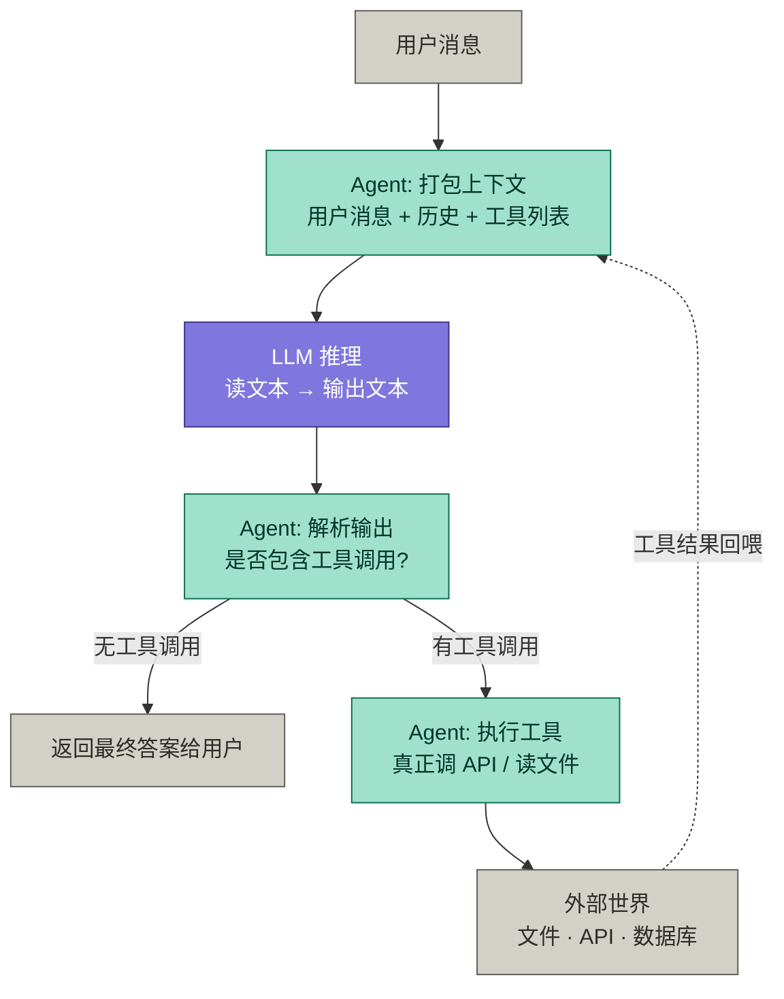
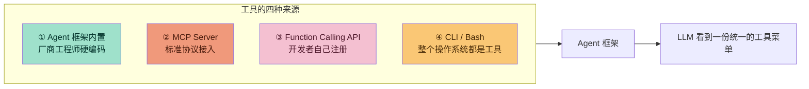
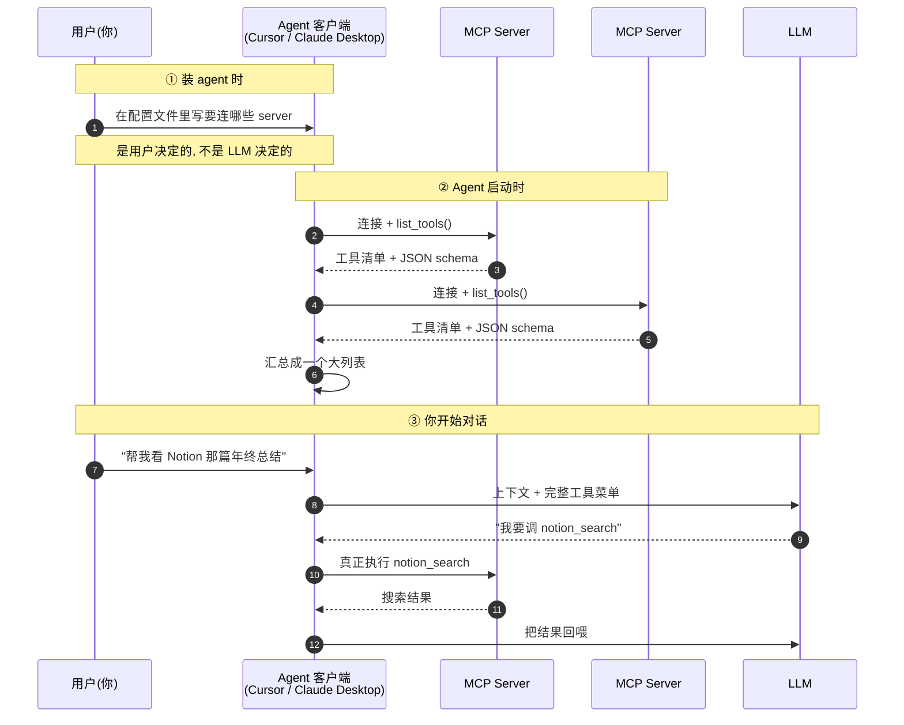
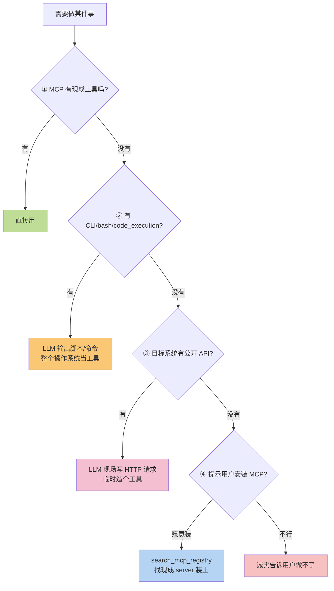
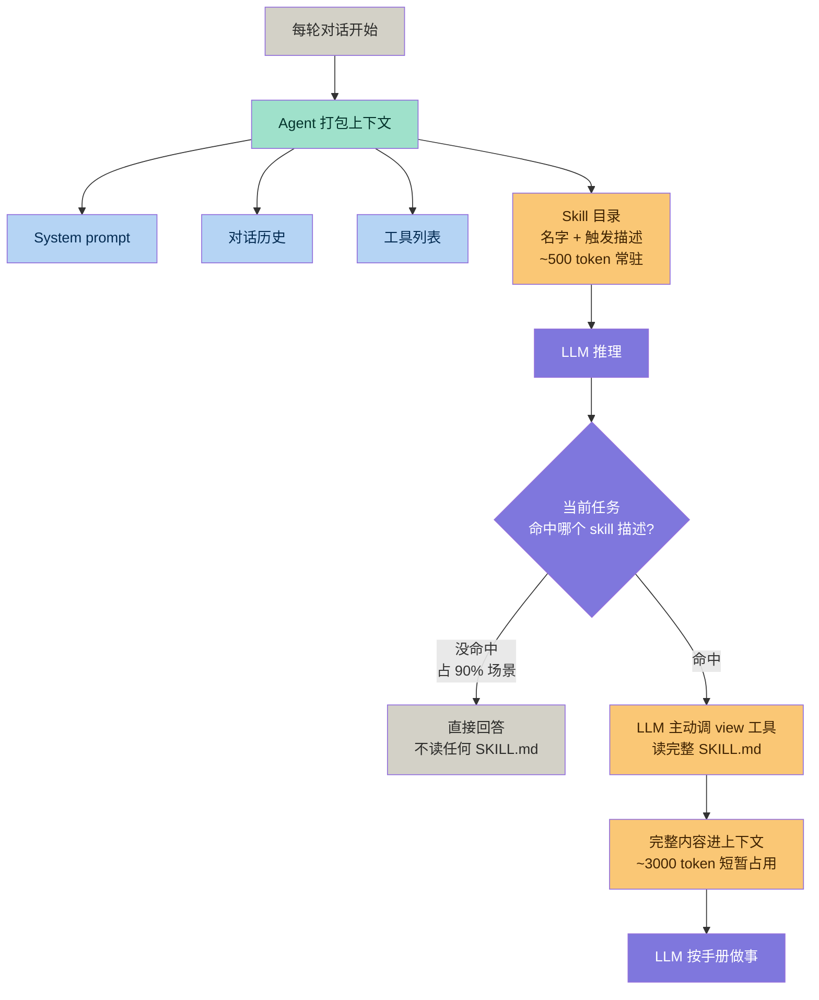
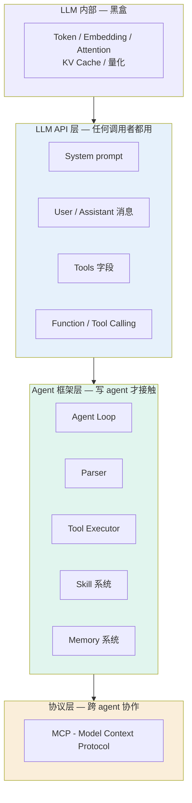
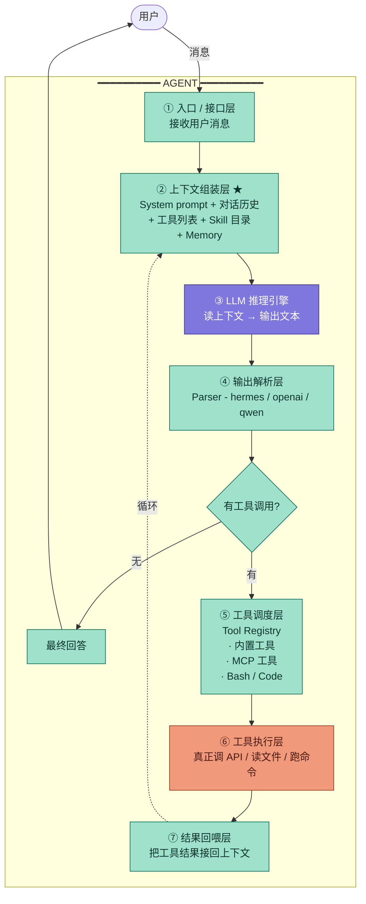

> 这份笔记从一个最朴素的问题出发: **"agent 和 LLM 的界限到底在哪?"**
> 一路追问下去, 顺手把工具、Skill、MCP、system prompt、上下文工程这一整圈概念全打通, 最后落到 **agent 的七层架构**。
>
> 适合: 已经在用 Cursor / Claude / OpenClaw 等 agent 产品, 但对底层概念还有一团迷雾的 AI 训练师 / 产品经理 / 半技术读者。

---

## 目录

1. [起点: 一个公式的两次切割](#1-起点-一个公式的两次切割)
2. [工具(Tools)从哪里来](#2-工具tools从哪里来)
3. [Skill 不是工具, 是给 LLM 看的"师父笔记"](#3-skill-不是工具-是给-llm-看的师父笔记)
4. [MCP 的发现机制: agent 怎么知道连谁](#4-mcp-的发现机制-agent-怎么知道连谁)
5. [搜不到工具怎么办: 四层兜底](#5-搜不到工具怎么办-四层兜底)
6. [工具不是驱动: parser/MCP 才是协议层](#6-工具不是驱动-parsermcp-才是协议层)
7. [Skill 的加载机制: 目录常驻, 内容按需](#7-skill-的加载机制-目录常驻-内容按需)
8. [Skill 什么时候触发: LLM 自己判断](#8-skill-什么时候触发-llm-自己判断)
9. [System prompt 是哪一层的概念](#9-system-prompt-是哪一层的概念)
10. [Agent 的完整七层架构](#10-agent-的完整七层架构)
11. [不同 agent 的差异化在哪一层](#11-不同-agent-的差异化在哪一层)
12. [补充概念速通](#12-补充概念速通)
13. [术语速查表](#13-术语速查表)

---

## 1. 起点: 一个公式的两次切割

AI 训练师课程笔记里那个公式是起点:

> **Agent = 大语言模型 + 工具调用**

这句话说得对, 但太粗。一刀切开变成:

> **Agent = LLM(大脑) + 工具(手脚) + 调度循环(神经)**

LLM 在 agent 里**只干一件事: 输入文本, 输出文本**。

它不会真的读文件、不会真的发 HTTP、不会真的改数据库——这些**全都是 agent 框架的"非 LLM 部分"在干**。

### 边界判断标准: 看有没有"副作用"

只要这一步会对**外部世界**产生任何变化(读硬盘、发请求、改文件、按键盘)→ 那就是 agent, 不是 LLM。

LLM 只负责一件事: **根据当前上下文, 生成下一段文字**。这段文字可能长这样:

```json
{
  "tool": "read_file",
  "args": { "path": "./readme.md" }
}
```

这**只是一段文本**。LLM 把这段 JSON 吐出来就结束了, 它从来没碰过你的文件系统。

### 第一张图: LLM 与 Agent 的分工边界



**紫色 = LLM 的工作, 青色 = Agent 框架的工作, 灰色 = 起点/终点/外部世界。**

紫色那一格只占整个流程的一格——LLM 在 agent 里就是这么"小"的一个组件。它读 Agent 精心打包好的文本(用户问题 + 历史 + 工具说明书), 吐一段文本出去就完事了。其他每一步都是 Agent 框架代码在干。

### 用 OpenClaw 那两个参数对照

```bash
--enable-auto-tool-choice
--tool-call-parser hermes
```

这两行其实就是 Agent 边界的官方声明:

- `--enable-auto-tool-choice`: 告诉 LLM "你**可以**输出工具调用文本"——这是 LLM 的工作范围
- `--tool-call-parser hermes`: 告诉 Agent "LLM 会用 hermes 这种格式输出工具调用, 你按这个格式去解析"——边界另一边

LLM 的活止于"输出符合 hermes 格式的字符串"。后面"识别这个字符串是个工具调用 → 真正执行 → 把结果接回来"全是 OpenClaw 这个 Agent 框架做的。

---

## 2. 工具(Tools)从哪里来

工具就是 agent 框架里实实在在写好的**函数代码**。它的来源主要有四种:



### ① Agent 框架内置

做 agent 的人直接硬编码进去的。Cursor 出厂自带的 `read_file`, `edit_file`, `run_terminal`, `search_codebase`——是 Cursor 自己的工程师写的 Python/TypeScript 函数, 固化在 Cursor 客户端里。

### ② MCP Server (Model Context Protocol)

笔记里那个 MCP 就是干这个用的。它是一个**标准协议**——任何人按这个协议写一个 server, 就能把工具暴露给所有支持 MCP 的 agent(Cursor、Claude Desktop、OpenClaw...)。

Notion 官方写了个 MCP server, 你 Cursor 接上之后就立刻有了"读 Notion 笔记"这个工具。**这是 2024–2026 这个工具生态爆发的关键。**

类比一下: **MCP 之于 agent ≈ HTTP 之于浏览器**。HTTP 让任何浏览器能访问任何网站, MCP 让任何 agent 能用任何工具。

### ③ Function Calling API

最朴素的方式——你自己写代码注册:

```python
tools = [{
    "name": "get_weather",
    "description": "获取某城市的当前天气",
    "parameters": {
        "type": "object",
        "properties": {"city": {"type": "string"}}
    }
}]
response = client.messages.create(model="...", tools=tools, ...)
```

这是开发者自己 DIY, 工具自己定义、自己执行。MCP 出现之前几乎所有 agent 都是这么干的, 又叫 **Tool Calling**(早期 OpenAI 叫 Function Calling, 后来统一叫 Tool Use)。

### ④ CLI(直接给 bash)

笔记里那句"CLI 比 MCP 更高权限"就是这意思。

Claude Code 这类 agent 不预定义工具——直接给 LLM 一个 `bash` 工具, LLM 想干啥就输出 `git status` / `npm install` / `ffmpeg ...`, agent 直接在你电脑执行。

**整个操作系统都变成了工具池**, 这就是为什么 CLI 比 MCP 权限大。

---

## 3. Skill 不是工具, 是给 LLM 看的"师父笔记"

工具和 Skill 是两个完全不同的东西, 很容易混。

### Skill 是什么

Skill 不是工具, 是**给 LLM 看的使用手册**。它本身不会执行, 只影响 LLM 的"思考路径"。

举例: Claude 用户说"做一个 PPT"。Claude 不会直接动手, 会先读一份叫 `pptx/SKILL.md` 的文档。这份文档自己不能做任何事, 它只是用文字告诉 Claude:

- 做 PPT 用 `python-pptx` 库
- 标题字号建议 36, 正文 18
- 图表先用占位符再填数据
- 导出前检查这几个常见 bug

Claude 读完这份"师父笔记", **再用真正的工具**(python 解释器、文件创建)按手册的步骤把 PPT 做出来。

### 工具 vs Skill vs LLM 的比喻

| 角色 | 比喻 | 实际作用 |
|---|---|---|
| **工具 (tools)** | 工具箱里的扳手、锤子、电钻 | 真能动手干活 |
| **Skill** | 师父留下的笔记本《如何修水管》 | 告诉你"怎么用工具" |
| **LLM** | 工人 | 看笔记 + 拿工具干活 |

只有 skill 没工具 = 光看菜谱没厨房。光有工具没 skill = 有厨房但不知道盐放几克。

### Skill 是 Anthropic 特有的术语吗

严格说: **是的**。Skill 作为一个具体的文件格式 + 加载机制, 是 Anthropic 在 Claude 体系里专门设计的。但**它代表的思路**(按需加载的指引文档), 几乎所有现代 agent 都有等价物:

| 平台 | 同类概念叫啥 | 形式特点 |
|---|---|---|
| **Claude (Anthropic)** | Skill | `SKILL.md`, 带触发描述, **按需加载** |
| **ChatGPT Custom GPTs** | Instructions | 单一文本框, 总是加载 |
| **Cursor** | Rules / `.cursorrules` | 项目根目录文件, 总是加载 |
| **Windsurf** | Memories / Rules | 类似 Cursor |
| **Cline** | `.clinerules` | 类似 |
| **OpenAI Assistants API** | Instructions | API 参数 |
| **LangChain** | (没标准化) | 自己用 `PromptTemplate` 拼 |

**Skill 作为思路**:就是上下文工程(Context Engineering)的一种工程化实现。这正是笔记里讲过的:

> 模型能力强了, 但上下文太多导致注意力分散、生成质量下降 → 给上下文"瘦身"

---

## 4. MCP 的发现机制: agent 怎么知道连谁

直觉上你会问: "LLM 又不知道有哪些 MCP server, 它怎么知道要连谁、要哪些工具?"

答案: **LLM 从来不需要"现场决定连谁"。Agent 启动时就把所有 MCP server 连好、把工具菜单准备好了。**



### 时间顺序的关键三步

1. **装 agent 时**(用户决定): 在配置文件写要连哪些 server
2. **Agent 启动时**(框架自动): 主动连接每个 server, 调用 `list_tools()` 拿到工具清单
3. **你开始对话时**(LLM 出场): LLM 一开口就能看到完整工具菜单

**LLM 始终是"看菜单点菜的食客", 菜单是 agent 启动时就备好的**, 不是它跑去厨房问的。

### 第二代: 懒加载(`tool_search`)

第一代设计有个明显问题: 你装 50 个 server × 每个 10 个工具 = 500 条工具描述, 每次对话开头就先吃掉几万 token。

所以新一代 agent 不再一开始就塞所有工具, 它只塞一个**元工具**叫 `tool_search`, 意思是: "你需要的时候自己搜。"

流程变成:

1. 你问"我邮箱有没有 X 公司的 offer?"
2. LLM 手上没邮件工具, 但有 `tool_search`, 调用它: `tool_search("email inbox")`
3. Agent 在已连的 server 里找匹配的工具, **只把匹配的那 1–3 个工具描述塞回去**
4. LLM 这才"看见" `gmail_search`, 然后调用

**能省 95% 的上下文。**

### 第三代: 连还没装的也能找

更狠的——你提到一个还没装的服务怎么办? 比如说"帮我在 HikeService 找路线", 但你压根没配过 HikeService 的 MCP server。

现代 agent 多了一个 `search_mcp_registry` 工具, 去**社区维护的 MCP 仓库**查"有没有人写过 hike 相关的 server", 找到就提示你点"连接"按钮装上。

---

## 5. 搜不到工具怎么办: 四层兜底

如果 MCP 仓库里都搜不到呢? 看起来 agent 是不是就废了?

实际上没有那么局限, 因为 agent 系统设计了好几层兜底:



### 第一层: CLI / 通用执行工具 (最关键)

笔记里说"**CLI 比 MCP 更高权限**"——这就是为什么。

Claude Code、Cursor 这类 agent 给 LLM 的工具里, 有几个**通用到爆炸**的:

- `bash` — 能跑任何命令行程序
- `python` / `code_execution` — 能写代码并立即执行
- `web_fetch` — 能拉任何 URL 的网页内容
- `create_file` / `str_replace` — 能读写本地任何文件

例子: 你说"帮我把这堆 wav 转 mp3", MCP 仓库里搜不到 audio converter server。但没关系——LLM 看到 `bash` 工具在, 直接输出:

```bash
for f in *.wav; do ffmpeg -i "$f" "${f%.wav}.mp3"; done
```

agent 一执行, 事情就办了。**"工具"瞬间从一个 MCP 函数变成了"整个操作系统能跑的所有程序"。**

### 第二层: 临时写代码调原始 API

如果连命令行工具都没有, LLM 还能现场写脚本调 HTTP API。比如查快递, 没有快递 MCP server, LLM 就让 agent 跑 Python 直接打公开 API。

### 第三层: 让用户自己装

`search_mcp_registry` → 让用户决策要不要装。

### 第四层: 真不行就告诉你

只能通过特定 API 完成、那个 API 又封闭/需要授权/没有 MCP server——agent 诚实回答"做不了"。这种情况其实很少。

### 不同 agent 的工具策略

| Agent 类型 | 工具策略 | 局限程度 |
|---|---|---|
| **纯 MCP**(早期 Claude Desktop) | 只能用配置过的 server | 最局限——搜不到就废 |
| **MCP + bash/code**(Claude Code、Cursor) | MCP 工具 + 通用执行 | **几乎无局限** |
| **浏览器 agent**(Claude in Chrome) | MCP + 浏览器操控 | 能干"网页上能干的所有事" |
| **办公套件 agent**(Claude in Excel) | MCP + 套件原生操作 | 受限于办公套件 API |

> 一个 agent 的能力上限 = 它能调度的工具的并集。
> 工具越通用 → 能力越强 → 但风险越大;
> 工具越专精 → 越安全 → 但覆盖面越窄。

---

## 6. 工具不是驱动: parser/MCP 才是协议层

很多人会把工具类比成"硬件驱动程序", 这个类比方向对了一半, 但有个关键偏差。

### 偏差在哪

驱动程序的本质是**翻译层**: 应用程序发"打印一页"的请求, 驱动把请求翻译成打印机能懂的电信号。它的角色是"通信协议适配器", 自己不打印东西, 只翻译。

而 agent 里的工具是: **LLM 输出文字"我想读 readme.md" → 工具(就是一段 Python 代码)真的去 `open("readme.md").read()`**。它本身**就是干活的人, 不是中介**。

### 那"驱动"在 agent 里对应什么

是 **`tool-call-parser` 和 MCP 协议**——它们才真正像"驱动":

- LLM 输出一段格式自由的文本(可能像 JSON、可能带前后缀解释)
- **Parser 负责把这段文本翻译成 agent 能识别的标准结构** `{tool_name: "...", args: {...}}`
- 然后 agent 才能调用对应的工具函数

### 修正版三层结构

```mermaid
flowchart TD
    A[LLM<br/>思考层]:::think -->|输出文本| B[Parser / MCP 协议<br/>翻译层 = 真正的驱动]:::driver
    B -->|结构化指令| C[工具函数<br/>执行层]:::exec
    C -->|操作| D[外部世界<br/>文件/API/数据库]:::world

    Skill[Skill 在这里影响:<br/>塑造 LLM 怎么想]:.->A

    classDef think fill:#7F77DD,color:#fff
    classDef driver fill:#FAC775,color:#412402
    classDef exec fill:#9FE1CB,color:#04342C
    classDef world fill:#D3D1C7,color:#2C2C2A
```

### 为什么这个区分很重要

实战里你会遇到下面的 bug:

| 现象 | 真实原因 | 在哪一层 |
|---|---|---|
| LLM 选错了工具 | 思路有问题或 skill 写得不好 | 思考层 |
| LLM 选对工具但参数格式错了 | parser 配置错或模型不熟悉那个格式 | 协议层 |
| 工具调用失败、报权限错误 | 工具函数本身出问题或外部服务挂了 | 执行层 |

**三种 bug 的修复办法完全不同**:

- 思考层 → 改 prompt 或加 skill
- 协议层 → 换 parser、改 schema、用更兼容的格式
- 执行层 → 修代码、检查权限、换 server

> **Skill 是怎么想, 工具是怎么干, 协议(parser/MCP)才是怎么把"想"翻译成"干"。**

---

## 7. Skill 的加载机制: 目录常驻, 内容按需

很多人以为 skill 是"每次都附加在 prompt 里"。**这是错的。**

如果每次都附加, 那就退化成 system prompt 了, skill 这个机制就没存在的意义。

### 实际的两阶段加载



### 阶段 1: Skill 目录(每轮都有, 常驻上下文)

LLM 看到的所有可用 skill 的**名字 + 一句话触发描述**:

```
<available_skills>
  <skill>
    <name>pptx</name>
    <description>Use this skill any time a .pptx file is involved...</description>
  </skill>
  <skill>
    <name>docx</name>
    <description>Use this skill whenever the user wants to create...</description>
  </skill>
  ...
</available_skills>
```

只是名字 + 描述, 一行字。10 个 skill 也就占几百 token——常驻成本。

### 阶段 2: 完整 SKILL.md (按需进, 大部分时候不进)

当 LLM 判断当前任务命中某个 skill 描述, 它才主动调 `view` 工具去**真正读那份 SKILL.md**(几千 token)。读完之后那份内容才进上下文。

### Token 账本对比

假设 10 份指引文档, 平均每份 3000 token:

| 模式 | 每轮上下文中的指引 | 100 轮累计 |
|---|---|---|
| **全塞 system prompt** | 30,000 token | **300 万 token** |
| **Skill 按需加载** | 多数轮 500, 少数轮 3500 | **8 万 token** |

**省下来的: 大概是 1/40。**

### 比 token 更重要: 注意力

token 是钱, **注意力是质量**。

LLM 在 30,000 token 上下文下回答, 跟在 500 token 下回答, 在某些刁钻问题上质量会下滑——这就是有论文证实的 **"Lost in the middle"** 现象: 上下文越长, 中间部分的信息越容易被忽略。

skill 模式下 LLM 桌面就这一份手册, 注意力是全压在当前任务上的。**这才是 skill 设计真正的核心 motivation, token 省钱只是顺带的。**

---

## 8. Skill 什么时候触发: LLM 自己判断

**触发的决策权全在 LLM**, 不是 agent 框架做关键词匹配。

### 触发的实际机制

LLM 在生成回答之前, 内部"思考"会先过一遍:

1. **用户想干啥** → 提取意图
2. **扫一遍 skill 描述** → 做语义匹配
3. **决定行动** → 调 `view` 工具去读对应的 SKILL.md
4. 读完手册再开始真正回答

第 2 步那个"扫描判断匹配"就是触发。它不是某段代码 if-else 决定的, 是 LLM 拿用户原话和 skill 描述做语义匹配, **判断像就触发, 不像就跳过**。

### Skill 描述写得好坏决定一切

这是为什么 SKILL.md 第一段必须是触发条件描述。看 pptx skill 的真实描述:

> Use this skill any time a .pptx file is involved in any way — as input, output, or both. This includes: creating slide decks, pitch decks, or presentations; reading, parsing, or extracting text from any .pptx file. Trigger whenever the user mentions "deck," "slides," "presentation," or references a .pptx filename...

写得多具体:

- 列举具体动作("creating", "reading", "extracting")
- 列举触发关键词("deck", "slides", "presentation")
- 明确边界("any time...is involved", 包括只是读它)

如果只写"做 PPT 时使用", LLM 听到"帮我读一下这个 pptx 提取文字"可能就不触发——因为字面上不是"做"。

**好的 skill 描述会穷举触发场景, 不留模糊地带。**

### 几种典型触发时机

1. **用户开第一句话时**(最常见) — 你说"帮我做份 PPT", LLM 第一步就触发 pptx
2. **对话中途任务转向时** — 聊代码聊到一半"对了帮我做 Excel", 触发 xlsx
3. **上传文件时**(关键词触发) — 你拖一个 .docx 进来, 触发 docx
4. **多个 skill 同时触发** — "读这份 PDF 然后做成 PPT", 触发 pdf 和 pptx 两份
5. **链式触发** — 一份 skill 内部指向另一份, 形成连锁加载

### 不会触发的反例

- "transformer 怎么工作" → 没命中, 不读任何 SKILL.md
- "今天天气" → 不触发
- 闲聊代码 bug → 不触发

**绝大多数日常对话其实根本不触发任何 skill**——这正是按需加载的精髓。

### 跟 MCP `tool_search` 是同一个套路

|  | "目录"(常驻) | "内容"(按需) |
|---|---|---|
| **工具体系** | `tool_search` 元工具 | 真正的工具 schema |
| **知识体系** | `<available_skills>` 索引 | 完整的 SKILL.md 内容 |

一个管"能干啥", 一个管"该怎么干"。两者是 agent 框架里的**平行子系统**, 服务于同一个目标: **让 LLM 在有限的上下文里看到最相关的东西**。

---

## 9. System prompt 是哪一层的概念

**System prompt 是 LLM 本身的概念, 不是 agent 概念**——它在 agent 出现之前就存在了。

### System prompt 属于 LLM 的 API 层

它是 LLM API 调用时的一个参数:

```python
client.messages.create(
  model="claude-opus-4-7",
  system="你是一个翻译助手...",     # ← 这就是 system prompt
  messages=[
    {"role": "user", "content": "把这段译成英文..."}
  ]
)
```

API 把对话分成三种角色:

| 角色 | 谁说的 | 作用 |
|---|---|---|
| **system** | 开发者 | 设定身份、规则、约束——只在最前面出现一次 |
| **user** | 终端用户 | 真正提问的人 |
| **assistant** | 模型 | 模型自己之前说过的话 |

**System prompt 就是 system 角色那条消息。** 你不写一行 agent 代码, 只调原始 API, system prompt 也照样存在。

### 概念分层全图



读这张图的关键: **越上面越底层、越普适, 越下面越上层、越特化。**

| 层 | 谁会接触 |
|---|---|
| LLM 内部 | 模型研究员 / 推理框架开发者 |
| LLM API 层 | **所有调 LLM 的人**(包括你写翻译 bot) |
| Agent 框架层 | 写 agent 的工程师 |
| 协议层(MCP) | 跨 agent 协作的开发者 |

### 为什么 system prompt "看起来"像 agent 概念

1. **Agent 几乎一定会用 system prompt** — agent 框架启动时会写一份长长的 system prompt 设定身份+工具+行为约束
2. **它是 agent 的"基石组件"** — agent 代码本质上就是: **拼 system prompt + 维护对话历史 + 解析输出 + 循环调用**
3. **但它不是 agent 发明的** — ChatGPT 刚出来时根本没 agent 概念, 但 system prompt 就有了

### 几个有意思的推论

- **没有 agent 的纯 LLM 应用照样能写 system prompt** — 翻译 bot 直接调 API, 没有任何 agent 在里头
- **System prompt 能干的事是有限的** — 静态文本, 写完不能改。**这就是为什么需要 skill** ——补上"动态加载指引"这件 system prompt 干不了的事
- **Agent 的"复杂"很大程度上就是在 system prompt 上做加法** — Cursor 的 system prompt 几千 token, Claude Code 上万 token

> 把 agent 想象成: **一段精心写好的 system prompt + 一个 tool 字段 + 一个 while 循环**, 仅此而已。真就这么简单。

---

## 10. Agent 的完整七层架构

到这里所有概念都有了, 把它们整合成一张完整架构图:



### 七层每层做什么

| 层 | 干啥 | 谁负责 |
|---|---|---|
| ① **入口** | 接收用户消息、做基本检查 | Agent 框架代码 |
| ② **上下文组装** ★ | 拼 system prompt + 历史 + 工具列表 + skill 目录 + memory | Agent 框架代码 |
| ③ **LLM 推理** | 读上下文, 输出文本(可能含工具调用) | **LLM 本身** |
| ④ **输出解析** | 把 LLM 文本翻译成结构化指令 | Agent 框架(parser) |
| ⑤ **工具调度** | 决定调哪个具体工具 | Agent 框架(tool registry) |
| ⑥ **工具执行** | 真正动手干活 | 工具函数本身(本地代码 / MCP server / bash) |
| ⑦ **结果回喂** | 拿到工具结果, 接回 LLM 上下文, 进入下一轮 | Agent 框架代码 |

★ 标的"上下文组装层"是 agent 智能的真正所在——大部分"调教 agent"的工作都是在这一层做文章。

### 回到最初那个问题: LLM 算 agent 的一部分吗?

**算, 是核心组件之一。** 但要分清:

| 说法 | 准确度 |
|---|---|
| "LLM 是 agent 的核心组件之一" | ✅ 完全准确 |
| "Agent 包含 LLM" | ✅ 准确 |
| "Agent = LLM + 工具" | ⚠️ 简化但不全错(笔记原始公式) |
| "LLM = agent" | ❌ 完全错 |
| "Agent = LLM 的高级版本" | ❌ 完全错 |

### 反直觉的事实: 同一个 LLM 可以驱动完全不同的 agent

把 Claude Opus 4.7 这个 LLM 拿出来, 它可以同时是:

- Cursor 这个编程 agent 的"大脑"
- Claude Desktop 这个聊天 agent 的"大脑"
- 你公司客服 agent 的"大脑"
- OpenClaw 自动化 agent 的"大脑"

**LLM 是模型权重, 是个文件——它本身没"身份"。** 身份是 agent 框架通过 system prompt + 工具集 + skill **当场赋予**的。

| 关系 | 类比 |
|---|---|
| LLM 之于 agent | **演员之于角色**——同一个演员能演不同角色, 是剧本(agent)塑造了角色 |
| Skill 之于 agent | 演员的**技能特训手册**——临时学会某个领域专业动作 |
| 工具之于 agent | 角色身上的**道具**——剑、手枪、扳手 |
| MCP 之于 agent | **演员工会的标准合同**——规范了演员怎么跟道具组对接 |

### 公式的演化路径

```
第 1 版(笔记原文):
  Agent = 大语言模型 + 工具调用

第 2 版(加上调度):
  Agent = LLM + 工具 + 调度循环

第 3 版(分清"思想 vs 执行"):
  Agent = LLM(思考)
        + Parser/MCP 协议(翻译)
        + 工具(执行)
        + 调度循环

第 4 版(完整结构):
  Agent = 入口
        + 上下文组装(system prompt + 历史 + 工具列表 + skill 目录 + memory)
        + LLM 推理
        + 输出解析(parser)
        + 工具调度(registry)
        + 工具执行
        + 结果回喂循环
```

**第 4 版就是工业级 agent 的真实架构。**

---

## 11. 不同 agent 的差异化在哪一层

理解七层架构后, 你能看穿不同 agent 产品的差异本质上是哪几层不一样:

| Agent 对比 | 主要差异在哪一层 |
|---|---|
| **Cursor vs Claude Code** | ⑤ 工具集不同(Cursor 偏 IDE 操作, CC 偏命令行) |
| **Claude Desktop vs Cursor** | ② 上下文组装(CD 普通对话, Cursor 注入大量代码上下文) |
| **基础 agent vs 带 skill 的 agent** | ② 多了 skill 目录 + 按需加载逻辑 |
| **不同基座的 agent** | ③ LLM 不同(GPT/Claude/Gemini), 推理质量差异 |
| **支持 MCP 的 agent vs 不支持** | ⑤ 多了 MCP 接入能力 |

### 评估 agent 的硬功夫: 分层定位

如果有人问"X agent 比 Y agent 强在哪", 真正有用的问题不是"哪个强", 而是:

- **强在 LLM?** → ③ 层差异(换基座)
- **强在工具集?** → ⑤ 层差异
- **强在上下文工程?** → ② 层差异(skill / memory / context engineering)
- **强在工具执行灵活性(有 bash)?** → ⑥ 层差异

**这种"分层定位"的能力, 是判断 agent 产品好坏的真正硬功夫。**

---

## 12. 补充概念速通

正文里点到了几个还没展开讲的概念, 这里集中补一下:

### Context Engineering (上下文工程)

笔记原文:

> Prompt Engineer: 早期模型能力差, 用结构化 prompt 精准定位能力
> Context Engineer: 模型能力强了, 但上下文太多导致注意力分散、生成质量下降 → 给上下文"瘦身"

它是 prompt 工程的演进版。**核心工作不是"写 prompt 写得多花哨", 而是决定每一轮该往 LLM 桌面塞哪些东西、扔掉哪些东西、怎么组织顺序**。Skill / `tool_search` / RAG 都是它的工程化产物。

### ReAct 循环 (Reasoning + Acting)

> 论文 "ReAct: Synergizing Reasoning and Acting in Language Models" (2022) 提出的范式。

让 LLM 用 **Thought → Action → Observation → Thought → ...** 的格式交替思考和行动。这就是我们前面说的"agent 调度循环"的学术名字。绝大多数现代 agent 都是 ReAct 的变体或扩展。

### Lost in the Middle 现象

> 论文 "Lost in the Middle: How Language Models Use Long Contexts" (2023)。

LLM 在长上下文里, **对开头和结尾的内容记得最清楚, 中间部分容易被忽略**。这是 skill 按需加载、context engineering 必须做的根本原因之一——上下文窗口大不等于能用上, 内容越长中间越糊。

### Memory (记忆系统)

七层架构图里 ② 上下文组装层提到了 memory, 没展开。它分两种:

- **短期记忆** = 当前对话历史(自动维护)
- **长期记忆** = 跨对话的事实存储, 比如"用户叫 Salim、爱玩 LLM 本地部署、用 RTX 4070"

长期 memory 通常用一个 vector database 存(这就是 RAG 的 R), 每轮对话开头检索相关记忆塞进上下文。Anthropic 的 "memory" feature、OpenAI 的 "memory" feature 都是这个思路。

### Function Calling vs Tool Calling

早期(2023)OpenAI 叫 **Function Calling**, 当时只支持单个函数调用。
后来(2024)进化为 **Tool Calling**, 支持并行多工具、流式调用。Anthropic 等家族用 Tool 这个词, OpenAI 后来也跟进了。

**两者现在基本是同义词**, 偶尔有人用 Function Calling 特指最朴素的"调一个 JSON schema 函数"的玩法。

### Few-shot

笔记里提过, 这里补一下完整画像。

在 prompt 里给几个**示范例子**让 LLM 照葫芦画瓢:

```
任务: 把句子改成礼貌版

例 1: "把门关上" → "麻烦你把门关上, 谢谢"
例 2: "拿杯水来" → "能帮我拿杯水吗?"

输入: "去买点东西"
输出:
```

跟 zero-shot(不给例子直接问)、one-shot(给一个例子)对应。
**结构化任务 few-shot 提升明显, 创意任务给例子反而会限制 LLM 的发挥**。

### KV Cache

这个概念在你那份《大模型推理资源占用》笔记里讲过, 这里只点一句它跟 agent 的关系: **agent 多轮对话每加一轮, KV cache 在显存里就累积一份**。这是为什么长对话推理变慢、显存吃紧——agent 系统设计要考虑定期截断历史或做对话摘要。

### Token

LLM 处理文本的最小单位。**1 个 token ≈ 1.5–2 个汉字 ≈ 4 个英文字符**。所有 agent 上下文成本本质都是按 token 算钱。

---

## 13. 术语速查表

| 术语 | 中文 | 属于哪一层 | 一句话解释 |
|---|---|---|---|
| **LLM** | 大语言模型 | 模型本身 | 输入文本→输出文本的函数 |
| **Token** | 词元 | LLM 内部 | 模型处理的最小文本单位 |
| **System prompt** | 系统提示词 | LLM API 层 | 设定 LLM 身份的初始消息 |
| **User / Assistant message** | 用户/助手消息 | LLM API 层 | 对话里的普通来回 |
| **Tools 字段** | 工具列表 | LLM API 层 | 告诉 LLM"你可以调这些函数" |
| **Function / Tool Calling** | 函数/工具调用 | LLM API 层 | LLM 输出"我想调工具 X"的能力 |
| **Agent** | 智能体 | Agent 层 | LLM + 工具 + 调度循环的整套系统 |
| **Agent Loop / ReAct** | 调度循环 | Agent 层 | Thought→Action→Observation 反复 |
| **Parser** | 解析器 | Agent 层 | 把 LLM 输出的文本翻译成结构化指令 |
| **Tool Registry** | 工具注册表 | Agent 层 | 管理 agent 能调用的所有工具 |
| **Skill** | 技能/手册 | Agent 层(Anthropic 系) | 按需加载的指引文档 |
| **Memory** | 记忆 | Agent 层 | 短期(对话历史) + 长期(跨会话事实) |
| **Context Engineering** | 上下文工程 | Agent 层 | 决定每轮该塞哪些东西给 LLM |
| **MCP** | 模型上下文协议 | 协议层 | 让任何 agent 能用任何工具的标准 |
| **MCP Server** | MCP 服务端 | 协议层 | 提供工具的程序, 实现 MCP 协议 |
| **CLI / Bash** | 命令行 | 工具(通用型) | 给 agent 整个操作系统当工具池 |
| **Lost in the Middle** | 中段遗忘 | LLM 行为现象 | 长上下文中段容易被忽略 |
| **Few-shot** | 少样本提示 | Prompt 技巧 | 在 prompt 里给几个示范 |
| **KV Cache** | 键值缓存 | LLM 推理 | 注意力计算的中间结果, 占显存 |

---

## 核心要点回顾

> 1. **LLM 在 agent 里只做一件事: 文本输入 → 文本输出。** 任何对外部世界的副作用(读文件、调 API)都是 agent 框架在干。
> 2. **工具有四种来源**: agent 内置 / MCP / Function Calling / CLI。CLI 权限最大, 整个操作系统都是工具。
> 3. **Skill ≠ 工具**: 工具是手脚, Skill 是给 LLM 看的师父笔记。Skill 是 Anthropic 特有术语, 但思路其他 agent 都有等价物。
> 4. **MCP 不是 LLM 现场发现的**——agent 启动时就连好所有 server 拿到工具菜单了。新一代 agent 用 `tool_search` 做懒加载, 省 95% 上下文。
> 5. **Skill 和工具菜单都是"目录常驻 + 内容按需"**, 这是 Anthropic 上下文管理的核心哲学。
> 6. **System prompt 是 LLM API 层的概念, 不是 agent 层**。Agent 只是重度使用它。
> 7. **Agent = 七层结构**: 入口 → 上下文组装 → LLM 推理 → 解析 → 工具调度 → 工具执行 → 结果回喂(再循环)。LLM 是第三层。
> 8. **看穿不同 agent 的差异**, 关键是问"差异在哪一层", 而不是"哪个强"。
> 9. **Token 省钱是顺带的, 真正的优化目标是 LLM 的注意力**——这是上下文工程的核心 motivation。
> 10. **学会用"分层定位"看 agent**: 思考层(LLM/skill)、协议层(parser/MCP)、执行层(工具/外部世界)——三层 bug 修法完全不同。

---

## 修订历史

| 版本 | 日期 | 修改内容 |
|---|---|---|
| v1.0 | 2026-05-03 | 首次整理: 由对话整合而成 |

---

*文档版本: v1.0 | 适用场景: 理解现代 agent 的底层架构, 作为后续学习 Cursor / Claude Code / OpenClaw / 自建 agent 的概念地图。*
