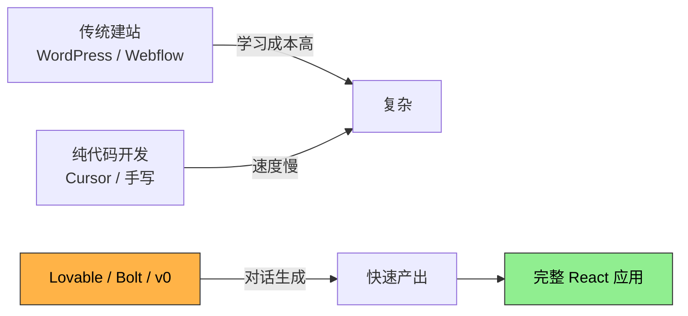
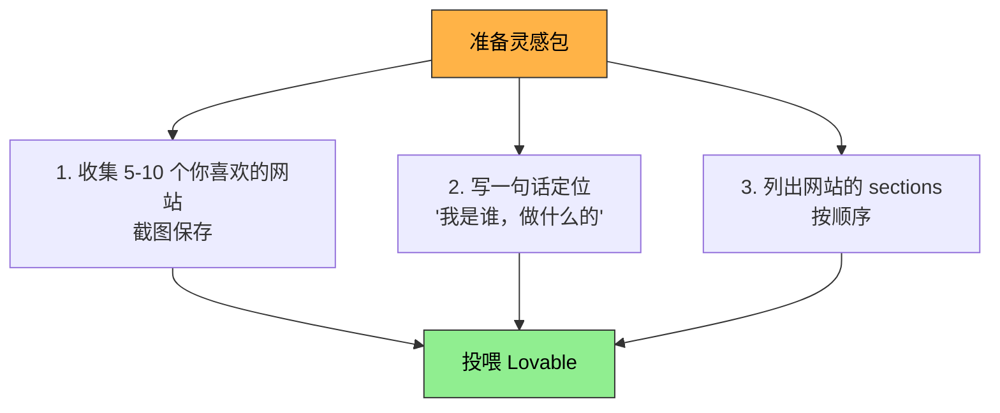
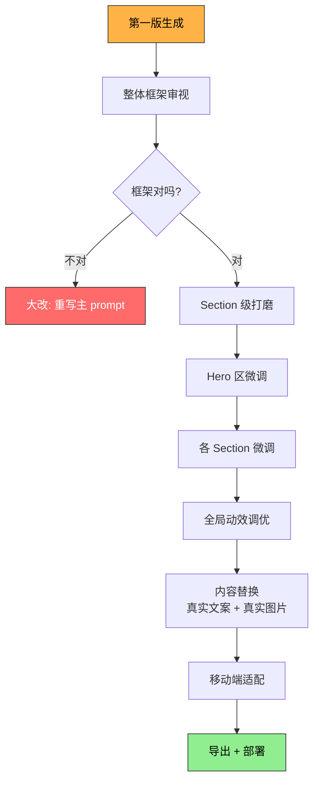
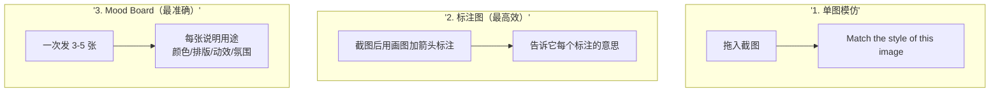
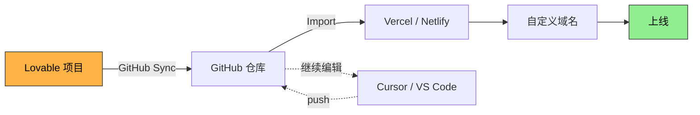
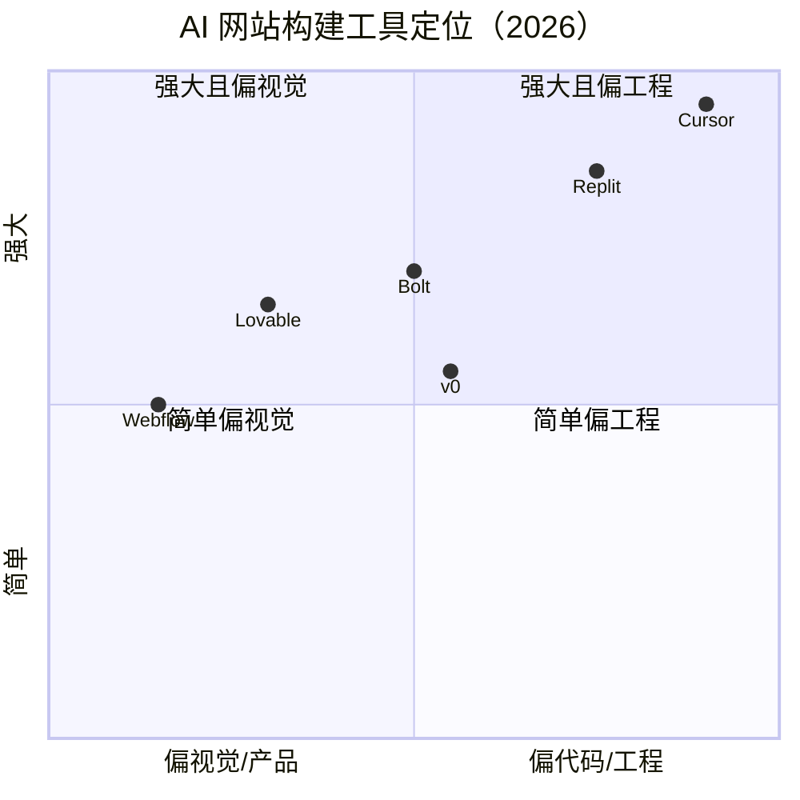
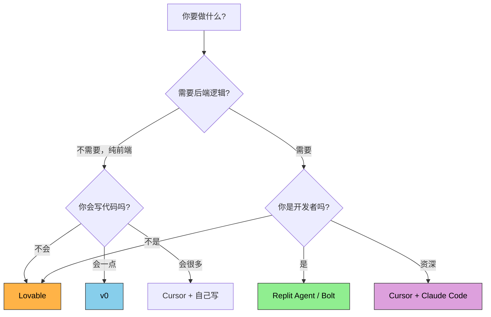
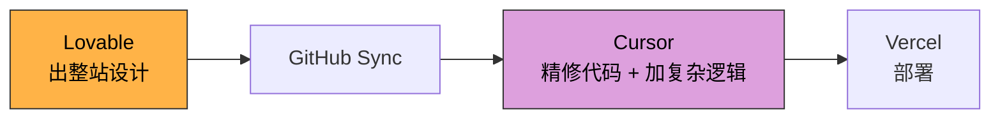

> 一份给程序员的 Lovable 实战手册。从第一次打开到部署上线，再到与同类工具的取舍。

---

## 目录

1. [Lovable 是什么](#一lovable-是什么)
2. [开始前的准备](#二开始前的准备)
3. [第一个 Prompt 怎么写](#三第一个-prompt-怎么写)
4. [迭代工作流](#四迭代工作流)
5. [图片与视觉参考的用法](#五图片与视觉参考的用法)
6. [常见坑与避坑指南](#六常见坑与避坑指南)
7. [导出代码与部署](#七导出代码与部署)
8. [Lovable vs 同类工具对比](#八lovable-vs-同类工具对比)
9. [推荐组合工作流](#九推荐组合工作流)

---

## 一、Lovable 是什么

**Lovable** 是 2024-2025 年崛起的"AI 网站生成器"代表，瑞典团队开发。核心能力：用自然语言对话生成可运行的 React 应用，附带 Supabase 后端、auth、文件存储等。

🔗 [lovable.dev](https://lovable.dev)

**它的定位**：



**它擅长什么**：
- 落地页、作品集、SaaS 仪表盘
- 视觉精致的前端界面
- 简单 CRUD 应用 + 用户认证

**它不擅长什么**：
- 复杂业务逻辑（订单系统、推荐算法）
- 重度 3D / WebGL 交互
- 大规模生产级后端

**生成的代码栈**：React 18 + TypeScript + Tailwind CSS + shadcn/ui + Vite + Supabase（可选）。**代码可以导出**，没有 vendor lock-in。

---

## 二、开始前的准备

### 1. 准备账号
- 注册 [lovable.dev](https://lovable.dev)，可用 Google 登录
- 免费档每天大约 5 条消息（够做一个小项目原型）
- Pro 档 $20/月，100 条消息/天，足够认真做一个站

### 2. 准备好"灵感包"

在开始之前，**花 30 分钟做这 3 件事**，能让你少走 5 倍弯路：



### 3. 推荐的灵感来源

| 站点                                          | 适合找什么   |
| ------------------------------------------- | ------- |
| [Awwwards](https://www.awwwards.com/)       | 最炫的获奖作品 |
| [godly.website](https://godly.website/)     | 高级感、克制风 |
| [siteinspire.com](https://siteinspire.com/) | 干净排版    |
| [land-book.com](https://land-book.com/)     | 商业落地页   |
| [Mobbin](https://mobbin.com/)               | 移动端 UI  |

---

## 三、第一个 Prompt 怎么写

第一个 prompt **决定 70% 的最终效果**。Lovable 不是 ChatGPT，太短的 prompt 会让它瞎猜。

### 黄金结构

```
[一句话定位] + [视觉风格] + [页面结构] + [技术与约束]
```

### 完整模板

```markdown
Build a [website type] for [your role/identity].

# Visual direction
- Style: [描述风格，如 "cinematic, like Linear and Stripe product pages"]
- Color palette: [主色 + 强调色]
- Typography: [字体偏好，含中文字体]
- Animation: [安静/中等/强烈，参考网站]

# Page structure (single-page scroll)
1. Hero — [大标题 + 一句定位]
2. [Section 名] — [内容]
3. [Section 名] — [内容]
4. ...

# Technical
- React + Tailwind + Framer Motion
- Mobile responsive
- Use placeholder text/images, I'll replace later

# Tone
[确认整体气质，如 "confident but understated"]
```

### 一个真实示例

```
Build a personal portfolio for an AI application engineer.

# Visual direction
- Cinematic "product launch reveal" aesthetic — think Linear, Stripe, Apple product pages
- Dark base (#0A0A0F) with deep space blues and warm amber accent (#FFB347)
- Headlines: Noto Serif SC bold for Chinese, Fraunces for English
- Body: Inter / Noto Sans SC
- Massive typography (8-12rem hero), generous whitespace
- Slow scroll-triggered reveals with Framer Motion
- Subtle film grain overlay

# Page structure
1. Hero — name + tagline "让大模型落地为产品"
2. Selected Work — 3 featured projects with cosmic background imagery
3. About — short narrative + travel photography accent
4. Tech Stack — visual grid: Java, Python, AI/LLM tools
5. Contact — minimal, big text, email + GitHub

# Technical
- React + Tailwind + Framer Motion
- Mobile responsive
- Use placeholder NASA imagery from images.nasa.gov

# Tone
Like a film teaser, not a resume. Less is more.
```

### 写 Prompt 的 5 条心法

1. **具体大于抽象**——"现代感"是空话，"像 Linear 那样的留白和渐变光晕"是有效信息
2. **给参考网站名**——AI 训练数据里有这些网站
3. **指定字体**——不指定的话默认很丑，特别是中文
4. **明确"不要什么"**——"no stock photos, no generic icons"
5. **一次只到首版**——别在第一个 prompt 里写完所有细节，留迭代空间

---

## 四、迭代工作流

第一版生成后，真正的工作才开始。Lovable 的核心使用模式是**"对话式微调"**。

### 推荐的迭代节奏



### 每一步的具体说法

| 阶段 | 示例 prompt |
|------|------------|
| 大改 | `Start over. The previous design doesn't match the cinematic feel I want. Use this reference image: [拖图]` |
| Hero 微调 | `In the hero, make the headline 30% larger, add 100ms delay between Chinese characters fading in` |
| 颜色调整 | `Replace the blue accent with warm amber (#FFB347). Apply globally.` |
| 加章节 | `Insert a new "Tech Stack" section between Work and About. Show technologies as a 4-column grid of cards.` |
| 动效 | `Add a slow parallax effect on hero background images — they should move 30% slower than scroll speed` |
| 修 bug | `The mobile layout breaks below 480px — the headline overflows. Fix by reducing font-size on small screens.` |

### "撤销 + 重说"是你的好朋友

每次输出都会自动版本化。改坏了 → 顶部 History → 回到上一版本 → 换种说法。

**比反复修补一个错误版本快得多。**

---

## 五、图片与视觉参考的用法

这是 Lovable 最被低估的能力。**图片输入 = AI 设计师的氛围板**。

### 三种喂图方式



### 标注图的示范

截一张电影画面 → 用任何画图工具加箭头：
- 箭头指向天空 → "Reproduce this gradient"
- 箭头指向角色 → "My name appears at this position"
- 圈出某个光晕 → "Add this lens flare effect on scroll"

然后告诉 Lovable："Implement the annotated requests."

### 多图参考的范本

```
[图1] [图2] [图3] [图4]

Image 1: overall color mood — these greens and teals
Image 2: typography size and weight reference
Image 3: this is the parallax depth feel I want
Image 4: this scene's silence/emptiness — that emotional tone

Synthesize these into my hero section.
```

### ⚠️ 关于电影截图的版权

| 用法 | 是否安全 |
|------|---------|
| 喂给 AI 当**视觉参考** | ✅ 安全 |
| 直接放上线作为**网站素材** | ❌ 侵权 |
| 用 AI 生成"那种感觉"的原创画面 | ✅ 安全 |
| 用 NASA / Unsplash 替换 | ✅ 推荐 |

替代素材源：
- [NASA Image Library](https://images.nasa.gov/) — 公共领域
- [ESA/Hubble](https://esahubble.org/images/)
- [JWST Gallery](https://webbtelescope.org/images)
- [Unsplash](https://unsplash.com/) — CC0
- Midjourney / Flux / Sora — 自己生成

---

## 六、常见坑与避坑指南

### 坑 1：让 AI 生成"真实"内容

❌ "Generate 5 realistic project descriptions for my portfolio"
✅ "Use placeholder Lorem Ipsum, I'll fill in real content myself"

**原因**：AI 写的项目描述都"很 AI"，HR 一眼看穿。**框架让 Lovable 做，内容自己写。**

### 坑 2：一次改太多

❌ "Change colors to dark mode, add a contact form, and switch the hero font"
✅ 拆成三次单独的 prompt

**原因**：复合指令容易出意外，而且无法精准回滚。

### 坑 3：忽视移动端

Lovable 默认会做响应式，但**实际效果常常不理想**。每完成一个 section 就告诉它：
> "Show me this on mobile (375px wide). Fix any overflow or readability issues."

### 坑 4：Credits 烧太快

Lovable 按消息数计费。省 credits 的方法：
- 一次 prompt 包含尽可能多的明确细节
- 用 GitHub 同步代码后，**简单改动直接在 Cursor / VS Code 里改**，不用回 Lovable
- Free 档不够时，**单月升 Pro 完成项目，然后降级**

### 坑 5：占位图永远不替换

Lovable 默认用 Unsplash 占位图。**上线前一定要全部替换成你自己的真实图片**——你的项目截图、你的旅行照片、NASA 公共素材等。

### 坑 6：SEO 与社交分享缺失

Lovable 生成的是 SPA（单页应用），分享到 LinkedIn / 微信会显示空白预览。
解决：导出代码后改用 Next.js（SSR）部署，或者手动加 meta og: 标签 + 静态预渲染。

---

## 七、导出代码与部署



### 步骤详细

1. **连接 GitHub**
   Lovable 项目 → Settings → GitHub → Authorize → Create Repo
2. **代码会双向同步**
   你在 Lovable 改 → 自动 push；你在本地 push → Lovable 也会更新
3. **部署到 Vercel**
   - 注册 [vercel.com](https://vercel.com) → New Project → 从 GitHub 导入
   - 默认配置一般直接成功
   - 一键拿到 `your-project.vercel.app` 链接
4. **绑定自定义域名**（推荐）
   - 买域名（Namecheap / Cloudflare Registrar 都便宜）
   - Vercel → Settings → Domains → 添加
   - 按提示改 DNS 记录，等 5 分钟生效
5. **后续维护**
   - 简单文案改动 → Cursor 里改 → push → Vercel 自动重新部署
   - 大改设计 → 回 Lovable 改 → 自动同步

---

## 八、Lovable vs 同类工具对比

2026 年这个市场已经成熟，主流玩家有 6-7 个，各有所长。

### 总览图



### 详细对比表

| 工具 | 强项 | 弱项 | 适合谁 | 起价 |
|------|------|------|--------|------|
| **Lovable** | 出图最美，shadcn/ui 代码干净，全栈（含 Supabase） | 复杂后端会卡，credits 烧得快 | 设计敏感的非技术/半技术用户 | $20/月 |
| **v0 by Vercel** | 组件级生成最强，与 Next.js 生态无缝，部署最方便 | 偏 UI 不偏整站逻辑 | Next.js / React 开发者 | $20/月起 |
| **Bolt.new** | 框架最灵活（支持 React/Vue/Svelte/Next），WebContainer 速度极快 | UI 不如 Lovable 精致，bug 略多 | 想快速试不同技术栈的人 | $20/月起 |
| **Replit Agent** | 最自主，能跑后端服务，集成最全（30+ 服务） | 学习曲线最陡，更像 IDE | 偏技术的 builder | $25/月起 |
| **Cursor** | 顶级 AI 辅助 IDE，多文件理解 | 不是"从零生成"工具，需要懂代码 | 真正的开发者 | $20/月 |
| **Webflow** | 视觉编辑最强，CMS 成熟 | 不是 AI 工具，学习曲线陡 | 设计师 / 内容站 | $14/月起 |
| **Claude Code** | 顶级代码 agent，CLI 工作流 | 没有可视化预览 | 资深开发者 | API 用量计费 |

### 各家"性格"

> 把它们当成不同性格的同事来理解，会比读规格表清楚得多。

**Lovable**：精致的设计师同事——出活漂亮，但深聊技术细节就有点心虚。

**v0**：Vercel 家的工程师——React/Next.js 写得无懈可击，但你得自己想清楚要什么组件。

**Bolt**：极速实习生——拿到需求 30 秒就给你跑起来，但代码质量参差。

**Replit Agent**：彻夜不睡的疯狂工程师——跑得最远最自主，给你的最终产出常常超预期，但过程有点失控。

**Cursor + Claude Code**：资深 senior 同事——你必须懂代码才能跟 ta 协作，但天花板最高。

**Webflow**：传统派老设计师——不会 AI 那一套，但视觉控制力依然顶级。

### 怎么选



---

## 九、推荐组合工作流

最高效的 builder 都不只用一个工具。这里给你三种典型组合：

### 组合 A：纯 Lovable（最简单）
适合：不太懂代码、想快速出活

```
Lovable 出全站 → GitHub Sync → Vercel 部署
```

### 组合 B：Lovable + Cursor（推荐给程序员）
适合：你是 Java/Python 程序员，会一点前端



**为什么推荐**：
- Lovable 处理"从无到有"和"视觉打磨"——它最擅长
- Cursor 处理"逻辑修改"和"性能优化"——比 Lovable 快也省钱
- Lovable 的 credits 留给"难想象的视觉决策"，文字微调在 Cursor 改

### 组合 C：v0 + Lovable + Claude Code（专业版）
适合：开发者做正式项目

```
v0 出独立组件 → Lovable 组合成应用 → Claude Code 做生产级清理
```

---

## 十、最后的一些话

1. **不要工具焦虑**——选一个，做完一个项目，再评估。三周"研究工具"等于三周什么都没做。
2. **AI 生成的代码上线前必须人工 review**——安全、性能、可维护性，AI 不会帮你想到。
3. **再好的工具也救不了没想清楚的设计**。先做好灵感板和 sitemap，再开 Lovable。
4. **你的内容才是网站的灵魂**。Lovable 给你的是漂亮的容器，里面装什么决定了你被记住的概率。

祝你建站顺利。📸

---

## 附录：实用资源

- 🔗 [Lovable 官方文档](https://docs.lovable.dev)
- 🔗 [shadcn/ui 组件库](https://ui.shadcn.com/)
- 🔗 [Tailwind CSS 文档](https://tailwindcss.com/docs)
- 🔗 [Framer Motion 文档](https://www.framer.com/motion/)
- 🔗 [Supabase 文档](https://supabase.com/docs)
