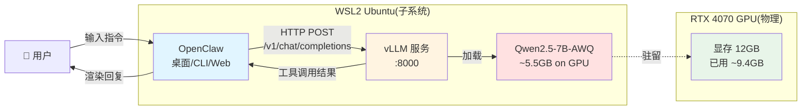
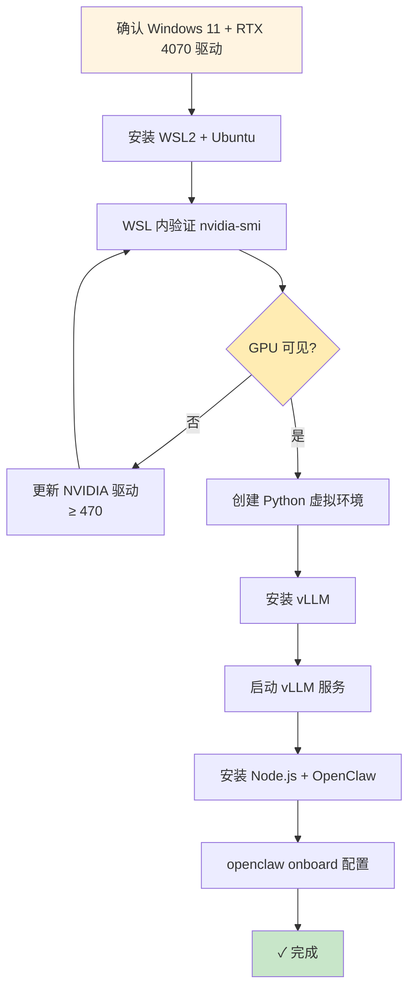
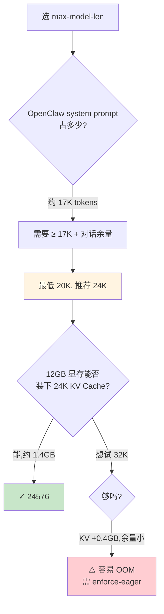
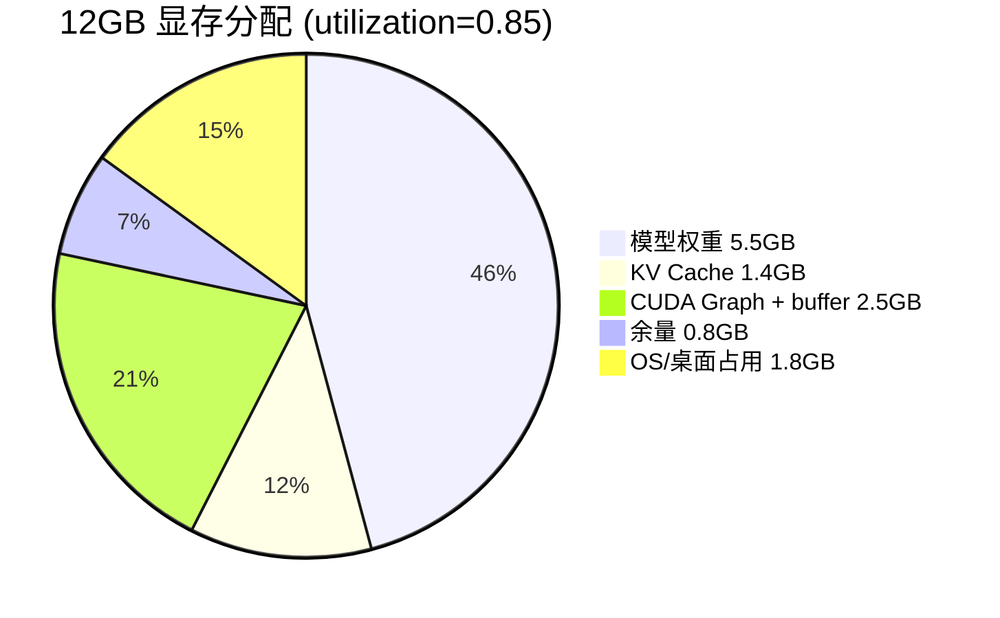
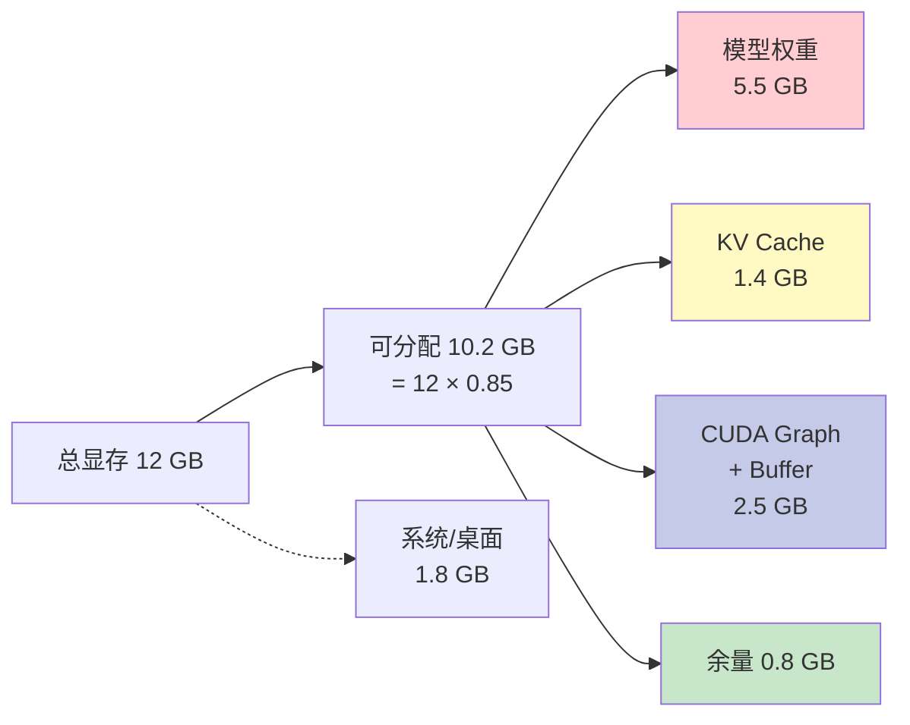

# OpenClaw 本地部署 · 完整图解版

**目标配置**:RTX 4070 (12GB) + 32GB RAM + WSL2 Ubuntu + Qwen2.5-7B-Instruct-AWQ
**文档版本**:3.0(纠错重写)
**适用范围**:本文所有命令、参数、显存数字都仅针对上述配置。其他硬件参考思路即可,具体数值需自行调整。

---

## 📋 目录

1. [整体部署架构](#一整体部署架构)
2. [环境准备](#二环境准备)
3. [安装 vLLM](#三安装-vllm)
4. [启动 vLLM 服务(核心)](#四启动-vllm-服务核心)
5. [安装并配置 OpenClaw](#五安装并配置-openclaw)
6. [显存预算与 KV Cache](#六显存预算与-kv-cache)
7. [故障排查决策树](#七故障排查决策树)
8. [日常使用脚本](#八日常使用脚本)

---

## 一、整体部署架构

整套系统的数据流和组件关系:



**几个关键点**:
- **OpenClaw 不带推理引擎**——它只是个网关,真正跑模型的是 vLLM
- **二者通过 OpenAI 兼容 API 通信**(`/v1/chat/completions`),所以理论上 vLLM 可以换成 LM Studio、Ollama 等
- **整套都跑在 WSL2 里**——Windows 主系统不参与,只是提供 GPU 直通

---

## 二、环境准备

### 部署流程总览



### 步骤 1:验证基础环境

打开 **PowerShell**(管理员):

```powershell
# 检查 Windows 版本(需 Windows 10 21H2+ 或 Windows 11)
winver

# 检查显卡
Get-CimInstance Win32_VideoController | Select Name, AdapterRAM
```

⚠️ **原文档用的 `wmic` 已被弃用**,Windows 11 22H2+ 起不再预装,改用上面的 `Get-CimInstance`。

```powershell
# 检查 NVIDIA 驱动(WSL CUDA 直通需 ≥ 470)
nvidia-smi
```

期望看到 `Driver Version: 5xx.xx` 和 RTX 4070,以及总显存 `12288MiB`。

### 步骤 2:安装 WSL2 + Ubuntu

```powershell
wsl --install
```

执行后**重启电脑**。重启完会自动启动 Ubuntu 让你设用户名密码。

### 步骤 3:WSL 内验证 GPU 直通

进 Ubuntu 后:

```bash
nvidia-smi
```

如果看到和 Windows 里一样的 RTX 4070 信息,说明 GPU 直通成功。**这一步必须过,否则后面 vLLM 跑不了**。

### 步骤 4:Python 虚拟环境

```bash
sudo apt update && sudo apt install -y python3-pip python3-venv

cd ~
python3 -m venv vllm-env
source vllm-env/bin/activate
```

激活后命令提示符前面会有 `(vllm-env)`,以后每次新开终端都要先 `source` 一下。

---

## 三、安装 vLLM

```bash
pip install --upgrade pip
pip install vllm

# 国内网络慢的话用清华镜像
# pip install vllm -i https://pypi.tuna.tsinghua.edu.cn/simple
```

下载量约 3-5GB,根据网速 5-30 分钟。

**验证安装**:

```bash
python -c "import vllm; print(vllm.__version__)"
```

---

## 四、启动 vLLM 服务(核心)

### 你这套配置的甜点参数

```bash
python -m vllm.entrypoints.openai.api_server \
  --model Qwen/Qwen2.5-7B-Instruct-AWQ \
  --quantization awq_marlin \
  --gpu-memory-utilization 0.85 \
  --max-model-len 24576 \
  --enable-auto-tool-choice \
  --tool-call-parser hermes \
  --dtype float16 \
  --host 127.0.0.1 \
  --port 8000
```

第一次启动会**自动从 Hugging Face 下载模型**(~5.5GB),网络慢的话加这个环境变量用国内镜像:

```bash
export HF_ENDPOINT=https://hf-mirror.com
```

### 参数选择决策图

为什么这几个数字是这样,逻辑可视化:



### 关键参数详解(只讲 4070 12GB 场景)

#### `--max-model-len 24576`

**这是最关键的参数,直接决定"能不能正常聊天"**。

| 值 | 后果 |
|----|------|
| `8192` (8K) | ❌ OpenClaw 自己 system prompt 都装不下,启动后第一条消息就报错 |
| `16384` (16K) | ⚠️ 勉强能装下 system prompt,几乎没有对话余量 |
| **`24576` (24K)** | **✅ 推荐。留 7K 给对话历史** |
| `32768` (32K) | ⚠️ 12GB 显存装不下 KV Cache,容易 OOM |

**原文档的"聊几句就聊不下去"就是因为这个**。

#### `--gpu-memory-utilization 0.85`

vLLM 启动时会**预先分配**这么多显存(不是按需用)。



提到 0.90 就只剩 0.4GB 余量,稍有波动就 OOM。

#### `--quantization awq_marlin`

模型已经是 AWQ 4-bit 量化的了(从 `Qwen/Qwen2.5-7B-Instruct-AWQ` 这个名字就能看出)。

- `awq_marlin`:RTX 30/40 系列专用 Marlin kernel,**比 awq 快 2-3 倍**
- `awq`:通用版本,所有 GPU 都能跑

你的 4070 用 `awq_marlin` 就对了。

#### `--enable-auto-tool-choice` + `--tool-call-parser hermes`

OpenClaw 的核心功能依赖工具调用,这两个参数**必填**,缺一个工具调用就废。

⚠️ **`--tool-call-parser` 的合法值**:`hermes`、`mistral`、`llama3_json`、`pythonic`、`granite`、`internlm`、`jamba`。**没有原文档里写的 `openai` 和 `qwen`**——填了会启动报错。Qwen 系列就用 `hermes`。

#### `--dtype float16`

RTX 4070 同时支持 `float16` 和 `bfloat16`,但 **AWQ 量化模型在 vLLM 里用 float16 兼容性最稳**。bfloat16 可能在某些版本下报奇怪的错。

---

## 五、安装并配置 OpenClaw

### 安装 Node.js + OpenClaw

```bash
# 装 Node.js 22 LTS
curl -fsSL https://deb.nodesource.com/setup_22.x | sudo -E bash -
sudo apt install -y nodejs

# 装 OpenClaw
sudo npm install -g openclaw@latest

# 验证
openclaw --version
```

### 配置向导

```bash
openclaw onboard
```

| 提问 | 回答 | 说明 |
|------|------|------|
| Select model provider | `Custom` | 本地 vLLM 不属于任何预设厂商 |
| Enter base URL | `http://127.0.0.1:8000/v1` | `/v1` 是 OpenAI 兼容路径,**不能省** |
| Enter API key | `sk-local` | vLLM 默认不校验,随便填一个非空字符串 |
| Enter model name | `Qwen/Qwen2.5-7B-Instruct-AWQ` | **必须和 vLLM `--model` 完全一致** |
| Save? | `Y` | 保存到 `~/.openclaw/config.json` |

### 配置文件结构

```bash
cat ~/.openclaw/config.json
```

```json
{
  "models": [
    {
      "id": "custom-001",
      "provider": "custom",
      "baseUrl": "http://127.0.0.1:8000/v1",
      "apiKey": "sk-local",
      "name": "Qwen/Qwen2.5-7B-Instruct-AWQ",
      "enabled": true
    }
  ],
  "defaultModel": "custom-001"
}
```

如果以后改了 vLLM 的端口或模型,直接 `nano ~/.openclaw/config.json` 编辑这个文件就行,不用重跑 onboard。

---

## 六、显存预算与 KV Cache

理解这部分,以后再调参就有底了。

### KV Cache 是什么

每生成一个 token,模型都要保存它的 K(key)和 V(value)向量,**累积保存** → 这就是 KV Cache。**上下文越长,KV Cache 越大**。

### Qwen2.5-7B 的实际计算(关键修正)

原文档算 KV Cache 时**忽略了 GQA(Grouped Query Attention)**,数字算大了 5 倍以上。Qwen 2.5 7B 的真实参数:

```
num_layers = 28
num_kv_heads = 4   ← 关键,不是 num_attention_heads(28)
head_dim = 128
```

**正确公式**(FP16):

```
KV Cache per token = 2 (K+V) × num_layers × num_kv_heads × head_dim × 2 bytes
                   = 2 × 28 × 4 × 128 × 2
                   = 57,344 bytes
                   ≈ 56 KB
```

**不同 max-model-len 对应的 KV Cache**:

| max-model-len | KV Cache 大小 |
|---------------|--------------|
| 8K (8192) | 0.46 GB |
| 16K (16384) | 0.92 GB |
| **24K (24576)** | **1.40 GB** ← 推荐 |
| 32K (32768) | 1.84 GB |

**12GB 4070 的总账**:



---

## 七、故障排查决策树

```mermaid
flowchart TD
    Start[出问题了] --> Q1{什么症状?}
    
    Q1 -->|启动报 OOM| OOM[显存不够]
    Q1 -->|聊几句就卡住| CTX[上下文超限]
    Q1 -->|工具调用没生效| TOOL[parser 配置错]
    Q1 -->|连不上服务| CONN[网络/进程]
    Q1 -->|响应很慢| SLOW[性能问题]
    
    OOM --> O1[检查 nvidia-smi<br/>看是否有别的进程占用]
    O1 --> O2{独占 GPU?}
    O2 -->|否| O3[关掉其他 GPU 程序]
    O2 -->|是| O4[gpu-memory-utilization<br/>降到 0.80]
    O4 --> O5{还 OOM?}
    O5 -->|是| O6[max-model-len<br/>降到 20480]
    O5 -->|否| Done1[✓]
    
    CTX --> C1[加大 max-model-len 到 24K+<br/>OpenClaw 设置开 compaction]
    
    TOOL --> T1[确认启动命令包含<br/>--enable-auto-tool-choice<br/>--tool-call-parser hermes]
    
    CONN --> N1[curl localhost:8000/v1/models]
    N1 --> N2{有响应?}
    N2 -->|否| N3[ps aux | grep vllm<br/>看进程是否在跑]
    N2 -->|是| N4[检查 OpenClaw 配置<br/>baseUrl 是否对]
    
    SLOW --> S1[watch nvidia-smi<br/>看 GPU-Util]
    S1 --> S2{Util < 50%?}
    S2 -->|是| S3[CPU 瓶颈或<br/>请求间隔太大]
    S2 -->|否| S4[正常,7B 模型本来就这速度]
    
    style Done1 fill:#c8e6c9
    style Q1 fill:#fff4e1
```

### 高频排查命令

```bash
# 看 GPU 占用
nvidia-smi
watch -n 1 nvidia-smi

# 看 vLLM 进程
ps aux | grep vllm

# 看端口
sudo lsof -i :8000
sudo netstat -tlnp | grep 8000

# 杀掉 vLLM
pkill -f vllm

# 测试 API
curl http://127.0.0.1:8000/v1/models

# 测试聊天
curl http://127.0.0.1:8000/v1/chat/completions \
  -H "Content-Type: application/json" \
  -d '{
    "model": "Qwen/Qwen2.5-7B-Instruct-AWQ",
    "messages": [{"role": "user", "content": "你好"}],
    "max_tokens": 50
  }'
```

### 测试工具调用是否生效

```bash
curl -X POST http://127.0.0.1:8000/v1/chat/completions \
  -H "Content-Type: application/json" \
  -d '{
    "model": "Qwen/Qwen2.5-7B-Instruct-AWQ",
    "messages": [{"role": "user", "content": "现在几点?"}],
    "tools": [{
      "type": "function",
      "function": {
        "name": "get_current_time",
        "description": "获取当前时间"
      }
    }]
  }'
```

返回里包含 `"tool_calls"` 字段就说明工具调用正常。

---

## 八、日常使用脚本

### 一键启动脚本 `start_vllm.sh`

```bash
#!/bin/bash
# RTX 4070 12GB + Qwen2.5-7B-AWQ 启动脚本

source ~/vllm-env/bin/activate

# 国内镜像(可选)
export HF_ENDPOINT=https://hf-mirror.com

echo "================================"
echo "启动 vLLM | RTX 4070 + Qwen 7B"
echo "================================"

python -m vllm.entrypoints.openai.api_server \
  --model Qwen/Qwen2.5-7B-Instruct-AWQ \
  --quantization awq_marlin \
  --gpu-memory-utilization 0.85 \
  --max-model-len 24576 \
  --enable-auto-tool-choice \
  --tool-call-parser hermes \
  --dtype float16 \
  --host 127.0.0.1 \
  --port 8000
```

使用:

```bash
chmod +x start_vllm.sh
./start_vllm.sh
```

### Python 测试脚本 `test_vllm.py`

```python
#!/usr/bin/env python3
"""快速测试本地 vLLM 服务是否正常。"""

import requests
import time

API_URL = "http://127.0.0.1:8000/v1/chat/completions"
MODEL = "Qwen/Qwen2.5-7B-Instruct-AWQ"


def test_chat():
    payload = {
        "model": MODEL,
        "messages": [{"role": "user", "content": "用一句话介绍 vLLM"}],
        "temperature": 0.7,
        "max_tokens": 100,
    }
    t0 = time.time()
    r = requests.post(API_URL, json=payload, timeout=60)
    dt = time.time() - t0
    print(f"耗时 {dt:.2f}s, 状态 {r.status_code}")
    if r.status_code == 200:
        print("回复:", r.json()["choices"][0]["message"]["content"])
    else:
        print("错误:", r.text)


if __name__ == "__main__":
    try:
        test_chat()
    except requests.exceptions.ConnectionError:
        print("❌ 无法连接,确认 vLLM 已在 :8000 运行")
```

使用:

```bash
python3 test_vllm.py
```

---

## 速查卡(贴墙上)

```
启动:    source ~/vllm-env/bin/activate && ./start_vllm.sh
停止:    pkill -f vllm
看 GPU:  watch -n 1 nvidia-smi
配置:    nano ~/.openclaw/config.json
日志:    vLLM 启动终端的实时输出

核心参数(已实测, 4070 12GB):
  --max-model-len 24576       ← 不要低于 20K
  --gpu-memory-utilization 0.85  ← 不要超过 0.88
  --quantization awq_marlin
  --tool-call-parser hermes

OOM 紧急回退:
  0.85 → 0.80, 24K → 20K
```

---

**文档说明**:本文档基于实测有效配置编写。所有性能数字、参数选择都针对 RTX 4070 12GB + Qwen2.5-7B-Instruct-AWQ 这一组合。换其他硬件/模型时,显存预算公式仍适用,但具体数值需要重新计算。
