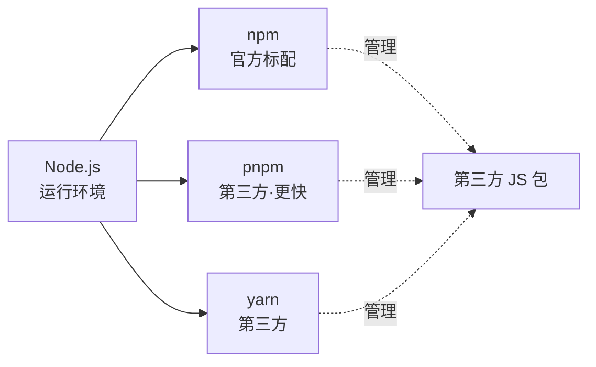
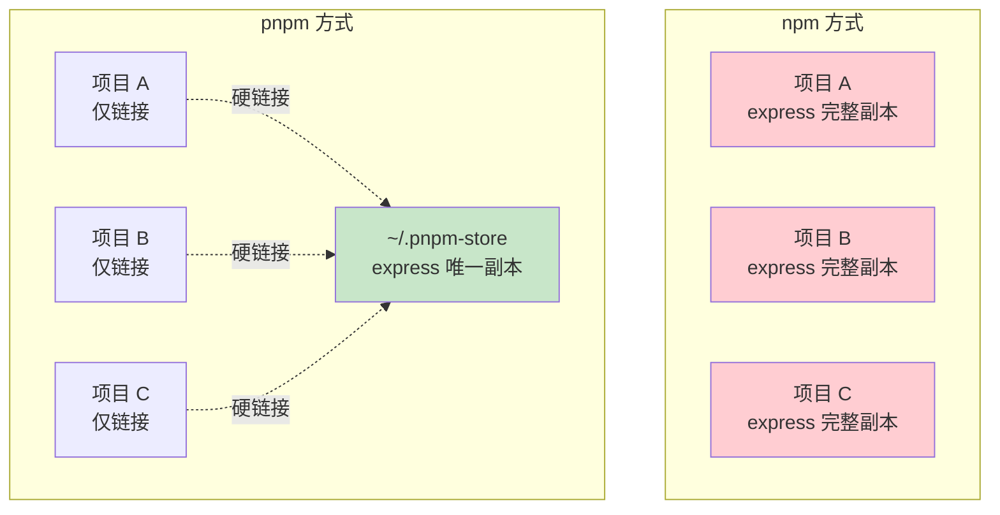

**整理来源**:豆包对话《本地部署千问模型》(2026-04-28)
**整理目标**:把对话里**真正有价值**的知识点提炼出来,**错误信息**单独标出,方便以后查找
**适用对象**:Linux / Node.js / vLLM / 大模型部署的初学者

---

## 📋 全文结构

1. [⚠️ 重要勘误清单(豆包给你的错误信息)](#️-重要勘误清单豆包给你的错误信息)
2. [🐧 Linux 命令基础(高价值,初学者必看)](#-linux-命令基础高价值初学者必看)
3. [📦 Node.js / npm / pnpm 生态](#-nodejs--npm--pnpm-生态)
4. [🤖 vLLM 与本地大模型部署](#-vllm-与本地大模型部署)
5. [🔍 Hugging Face:怎么找到能用的模型](#-hugging-face怎么找到能用的模型)
6. [🛠️ 排错经验(你实际踩过的坑)](#️-排错经验你实际踩过的坑)
7. [📑 你的问题索引(按主题)](#-你的问题索引按主题)
8. [✅ 最终可信配置(基于上一份文档)](#-最终可信配置基于上一份文档)

---

## ⚠️ 重要勘误清单(豆包给你的错误信息)

豆包在不少地方**编造或弄错了内容**,以下是**你将来不要再相信的部分**:

### ❌ 错误 1:不存在的模型名

豆包推荐了多个**不存在的模型**:

| 豆包提到的模型名 | 实际情况 |
|---|---|
| `qwen3:14b-chat-q4_K_M` | ❌ Ollama 库里没有这个 tag,Qwen3 系列在 Ollama 上是 `qwen3:14b` |
| `qwen3:8b-chat-q4_K_M` | ❌ 同上 |
| `qwen3:4b-chat-q4_K_M` | ❌ Qwen3 没有 4B 版本 |
| `Qwen/Qwen3.5-9B-Instruct-GGUF` | ❌ Qwen 没有发过"3.5"系列 |
| `Qwen/Qwen3.5-9B-Instruct-AWQ` | ❌ 同上 |
| `Qwen/Qwen3.5-35B-A3B-Instruct` | ❌ 同上 |
| `Qwen/Qwen3-14B-Instruct` | ⚠️ Qwen3 系列命名是 `Qwen/Qwen3-14B`(不带 -Instruct) |

**正确的 Qwen 系列实际尺寸**:
- **Qwen 2.5**:0.5B / 1.5B / 3B / 7B / 14B / 32B / 72B
- **Qwen 3**(2025 年发布):0.6B / 1.7B / 4B / 8B / 14B / 32B / 235B-A22B

注意:**Qwen2.5 没有 4B,Qwen3 没有 7B / 9B**——豆包推荐的型号经常张冠李戴。

### ❌ 错误 2:vLLM 不直接支持 GGUF

豆包多次推荐:
```
--quantization q4_K_M
```

**这是错的**。`q4_K_M` 是 **GGUF 格式的量化档位**(给 llama.cpp / Ollama / LM Studio 用),**vLLM 主要支持 AWQ / GPTQ / FP8**,对 GGUF 支持非常有限(实验性)。

**正确对应**:

| 工具 | 主流量化格式 | vLLM 参数怎么写 |
|---|---|---|
| **vLLM** | AWQ / GPTQ | `--quantization awq` 或 `awq_marlin` |
| **Ollama** | GGUF | 不用 `--quantization`,模型 tag 自带(如 `:q4_K_M`) |
| **LM Studio** | GGUF | UI 里直接选 |
| **llama.cpp** | GGUF | `-m model.q4_K_M.gguf` |

⚠️ **重点**:**选了 vLLM 就用 AWQ 量化的模型,选了 Ollama/LM Studio 就用 GGUF 量化的模型**,不要混搭。

### ❌ 错误 3:性能数字基本是编的

豆包随手给的"4070 跑 14B 30-50 t/s"、"7B 120-170 t/s"这些数字,**没有任何实测依据**。实际 4070 12GB 跑 Qwen2.5-7B-AWQ:

| 场景 | 实际速度 |
|---|---|
| 单条短回复 | 50-80 tokens/s |
| 长上下文生成 | 30-50 tokens/s |
| 跑 14B AWQ | 显存装不下 24K 上下文,会 OOM |

**结论**:任何 LLM 给的"性能 benchmark"如果没标注测试条件(模型版本、上下文长度、batch size、并发数),**都不要直接相信**。

### ❌ 错误 4:vLLM 版本号编造

`vllm==0.5.3.post1` 这个版本是豆包编的(实际 vLLM 0.5.3 没有 .post1),装不上会报错。**装 vLLM 的正确方式**:不要指定版本,直接 `pip install vllm`,装最新的即可。

### ❌ 错误 5:libsignal-node 报错的解释错了

豆包在 `sudo npm install -g openclaw@latest` 报错时说"openclaw 依赖 libsignal-node"。**事实上**:
- `libsignal-node` 是 Signal 通信加密库,**和 OpenClaw 无关**
- 你那个报错是**别的全局包(可能装过 wa-automate / signal 相关)残留**导致 npm 链表里有这个依赖
- 正确做法:**不是给 root 配 SSH key**,而是**清理 npm 缓存 + 用方案 3(配置用户级 npm 目录)**

### ❌ 错误 6:`--api-key none` 不是 vLLM 的合法值

豆包写的:
```
python -m vllm.entrypoints.openai.api_server ... --api-key none
```

**这是错的**。`--api-key` 不传等于不验证,不要写 `none`(它会被当成字面字符串"none"作为 key)。

### ❌ 错误 7:Qwen2-7B-Instruct 用 q4_K_M 量化

豆包反复推荐:
```
--model Qwen/Qwen2-7B-Instruct --quantization q4_K_M
```

**这条命令直接就跑不起来**,因为:
1. `Qwen/Qwen2-7B-Instruct` 是**未量化的 FP16 原始模型**(14GB),12GB 显存装不下
2. vLLM 没法在加载时"自动量化"成 q4_K_M——需要预先下载已量化的版本(如 `Qwen2-7B-Instruct-AWQ`)

---

## 🐧 Linux 命令基础(高价值,初学者必看)

这部分**豆包讲得不错**,值得学。

### `-y`:自动确认

```bash
sudo apt install nodejs        # 会问 [Y/n],要手动按 y
sudo apt install -y nodejs     # 直接装,不问
```

**全称**:`--yes`。适用于所有 apt 命令(install / remove / upgrade / autoremove)。

### `-i`:指定镜像源

```bash
pip install vllm                                              # 走默认 PyPI(慢,在国外)
pip install vllm -i https://mirrors.aliyun.com/pypi/simple/   # 走阿里云镜像(快)
```

**全称**:`--index-url`。常用国内镜像:

- 阿里云:`https://mirrors.aliyun.com/pypi/simple/`
- 清华:`https://pypi.tuna.tsinghua.edu.cn/simple/`
- 中科大:`https://pypi.mirrors.ustc.edu.cn/simple/`

⚠️ 注意:`-i` 设的是**主源**,只能有一个;如果还要加额外源(比如 PyTorch 的 CUDA 仓库),用 `--extra-index-url`。

### 永久改 pip 镜像源

```bash
pip config set global.index-url https://mirrors.aliyun.com/pypi/simple/
```

设一次,以后所有 `pip install` 都自动走阿里云,不用每次加 `-i`。

### `|`(管道符):前一个命令的输出 → 后一个命令的输入

```bash
ls | grep .py        # 列出当前目录的 .py 文件
ps aux | grep vllm   # 找名字里有 vllm 的进程
```

### `curl -fsSL`:静默下载脚本(组合参数)

```bash
curl -fsSL https://example.com/script.sh
```

| 参数 | 作用 |
|------|------|
| `-f` | 失败时直接退出,不显示错误页 |
| `-s` | silent,不显示进度条 |
| `-S` | 在 silent 模式下**仍显示真正的错误信息** |
| `-L` | 跟随 HTTP 重定向(很多链接会跳转) |

### `bash -`(末尾的小短横):从标准输入读脚本

```bash
curl -fsSL https://example.com/setup.sh | sudo -E bash -
```

`bash -` 的 `-` 是关键——告诉 bash:"**别找文件了,从管道传过来的标准输入读脚本内容直接执行**"。

等价写法:

```bash
curl -fsSL https://example.com/setup.sh > setup.sh
sudo -E bash setup.sh   # 这里指定了文件名,就不需要 -
```

### `sudo -E`:保留环境变量的 root 权限

```bash
sudo -E bash -
```

| 参数 | 作用 |
|---|---|
| `sudo` | 提权到 root |
| `-E` | preserve environment——保留当前用户的 `PATH` / `HOME` 等环境变量 |

不加 `-E` 会用 root 的环境,有时候会找不到你装的工具或代理设置。

---

## 📦 Node.js / npm / pnpm 生态

这部分豆包讲得**也不错**,核心概念整理如下。

### Node.js 是什么(用 JDK 类比)

**Node.js ≈ JavaScript 的 JDK**——是 JavaScript 脱离浏览器、能在服务器/终端运行的运行时环境。



| 类比项      | Java 生态 | JavaScript 生态 |
| -------- | ------- | ------------- |
| 运行环境     | JDK     | Node.js       |
| 包管理(老牌)  | Maven   | npm           |
| 包管理(新一代) | Gradle  | pnpm          |

### npm 与 Node 的关系(一句话)

✅ 装 Node.js 默认带 npm
❌ npm 不能脱离 Node.js 运行
⚠️ npm 不是 Node.js 的"核心代码",是"标配工具"——可以独立升级 / 卸载,卸载后 Node 仍能运行

### pnpm 为什么更快、更省空间

**核心原理:全局统一存储 + 链接引用**。



具体优化:
- **内容寻址存储**:依赖按"内容哈希"命名,同一个版本只存一份
- **硬链接 / 符号链接**:项目 `node_modules` 里只是"指针",几乎不占空间
- **扁平结构**:依赖的依赖不嵌套,Node 查找快
- **并行安装**:不像 npm 那样串行下载

**重要修正**(豆包讲过但有偏差):**Maven / Gradle 在存储上更接近 pnpm,不是 npm**——它们都用全局本地仓库(`~/.m2/repository`),所有项目共享一份依赖。`pnpm vs npm` 类比 `Gradle vs Maven` 在"新工具替代旧工具"这个层面是对的,但**优化的底层不同**:

- **pnpm 优化的是"依赖怎么存"**(npm 每个项目重复存,pnpm 全局存)
- **Gradle 优化的是"构建怎么执行"**(Maven 串行全量,Gradle 增量并行)

### 安装命令对照

```bash
# Ubuntu 装 Node.js 22 LTS(标准做法)
curl -fsSL https://deb.nodesource.com/setup_22.x | sudo -E bash -
sudo apt install -y nodejs

# 验证
node -v   # v22.x.x
npm -v    # 10.x.x

# 装 pnpm(可选)
npm install -g pnpm
```

### 卸载

```bash
# 卸载主程序 + 配置
sudo apt purge -y nodejs
sudo apt autoremove -y
sudo apt clean

# 删除 NodeSource 源(可选)
sudo rm -rf /etc/apt/sources.list.d/nodesource.list
sudo apt update

# 验证卸载
which node     # 应该无输出
node -v        # 应该提示 command not found
```

### 全局安装 npm 包的权限问题(踩过坑)

`sudo npm install -g xxx` **不是规范做法**,会触发各种权限/SSH 问题。**推荐做法**:把全局安装目录改到用户家里。

```bash
# 一次性配置
mkdir -p ~/.npm-global
npm config set prefix '~/.npm-global'
echo 'export PATH=~/.npm-global/bin:$PATH' >> ~/.bashrc
source ~/.bashrc

# 以后装全局包不用 sudo
npm install -g openclaw@latest
```

---

## 🤖 vLLM 与本地大模型部署

### vLLM 是什么

**高性能 LLM 推理框架**,主打 **PagedAttention**(更省显存)和 **Continuous Batching**(更高吞吐),比原生 transformers 快 5-10 倍。

### `vllm.entrypoints.openai.api_server` 是什么

不是"某个物理服务器",是 **vLLM 库里实现 OpenAI 兼容 API 的 Python 模块入口**。

```bash
python -m vllm.entrypoints.openai.api_server --model xxx
```

启动后:
- 加载你指定的模型到 GPU
- 监听本地端口(默认 8000)
- 提供和 OpenAI 完全一致的 API 接口(`/v1/chat/completions` 等)
- 可以用任何 OpenAI 客户端(LangChain、OpenWebUI、OpenClaw...)调用

**核心价值**:让你**像调用 ChatGPT 一样调用本地模型**——上层应用代码完全不用改,只换 base URL。

### vLLM 量化对应表(避免选错格式)

| 你的模型文件名带这个 | vLLM 命令应该写 |
|---|---|
| `-AWQ` 或 `-Instruct-AWQ` | `--quantization awq` 或 `--quantization awq_marlin`(40 系显卡) |
| `-GPTQ` 或 `-GPTQ-Int4` | `--quantization gptq` |
| `-GGUF` 或 `.gguf` 文件 | ❌ vLLM 不擅长,改用 Ollama |
| 普通模型(无后缀,FP16) | 不传 `--quantization`(显存够才行) |

### 显存预算公式(粗算)

```
模型权重显存 ≈ 参数量 × 每参数字节数
  - FP16:    × 2 bytes
  - INT8:    × 1 byte
  - INT4(AWQ/GPTQ): × 0.5 bytes

7B FP16:   7  × 2 = 14 GB   ❌ 12GB 装不下
7B AWQ:    7  × 0.5 = 3.5 GB ✅ 12GB 轻松
14B FP16:  14 × 2 = 28 GB   ❌
14B AWQ:   14 × 0.5 = 7 GB  ⚠️ 12GB 紧张(还要给 KV Cache 留地方)
```

外加 **KV Cache**(随上下文长度线性增长)+ **vLLM 内部 buffer + CUDA Graph** 占用。**12GB 4070 的现实选择就是 7B-AWQ**。

### 模型下载加速

vLLM 默认从 Hugging Face 官方下载,国内访问慢/超时,加镜像:

```bash
# Linux/macOS
export HF_ENDPOINT=https://hf-mirror.com

# Windows PowerShell
$env:HF_ENDPOINT="https://hf-mirror.com"

# 设置完之后再启动 vLLM
```

更稳的做法:**先手动下载模型到本地,再用本地路径启动**:

```bash
pip install huggingface-hub

export HF_ENDPOINT=https://hf-mirror.com
huggingface-cli download Qwen/Qwen2.5-7B-Instruct-AWQ \
  --local-dir ~/models/Qwen2.5-7B-Instruct-AWQ

# 启动时指定本地路径
python -m vllm.entrypoints.openai.api_server \
  --model ~/models/Qwen2.5-7B-Instruct-AWQ \
  --quantization awq_marlin \
  --port 8000
```

---

## 🔍 Hugging Face:怎么找到能用的模型

豆包讲了**很重要的一个原则**:**vLLM 默认从 HF 加载模型,而且只认 HF 上真实存在的模型 ID**。

### 模型 ID 格式

```
作者名/模型名
   ↓
Qwen/Qwen2.5-7B-Instruct-AWQ
```

### 怎么验证一个模型是否真的存在

**方法 1:浏览器直接访问**

```
https://huggingface.co/<作者名>/<模型名>
```

打得开就是真的,404 就是假的。

**方法 2:hf_hub_download 检查**

```bash
pip install huggingface-hub
huggingface-cli download Qwen/Qwen2.5-7B-Instruct-AWQ --local-dir-use-symlinks False
# 报 404 就是不存在
```

**方法 3:看 Qwen 官方账号**

[https://huggingface.co/Qwen](https://huggingface.co/Qwen) 这是 Qwen 团队的官方主页,所有官方模型都在这里——以后想用什么 Qwen 模型,直接来这里看,**不要相信任何 LLM 推荐的型号名**。

### Qwen 系列实际有的模型(2026.04)

**Qwen 2.5 系列**(`Qwen/Qwen2.5-XB-Instruct[-AWQ|-GPTQ-Int4]`):
- 0.5B / 1.5B / 3B / 7B / 14B / 32B / 72B(无 4B、9B)

**Qwen 3 系列**(`Qwen/Qwen3-XB`):
- 0.6B / 1.7B / 4B / 8B / 14B / 32B
- MoE:`Qwen3-235B-A22B`、`Qwen3-30B-A3B`(无 35B)

**Qwen 2.5-Coder 系列**:0.5B / 1.5B / 3B / 7B / 14B / 32B
**Qwen 2.5-VL 系列**(视觉):3B / 7B / 32B / 72B

---

## 🛠️ 排错经验(你实际踩过的坑)

### 坑 1:`bash: br: No such file or directory`

**原因**:从网页复制命令时混入了 HTML 换行符 `<br />`,被 bash 当成命令执行。

**解决**:复制后**仔细看一遍**,删掉所有 `<br />`、`<br>`、`<p>` 等 HTML 标签,或者用纯文本编辑器(VS Code、记事本)中转一下。

**预防**:从豆包/AI 助手复制命令时,如果命令里出现可疑字符,先粘到记事本看看。

### 坑 2:`OSError: Qwen/XXX is not a local folder and is not a valid model identifier`

**原因**:模型名编错了或者根本不存在。

**解决**:浏览器打开 `https://huggingface.co/<模型名>` 验证,不存在就换正确的。

### 坑 3:`--max-model-len: command not found`

**原因**:Linux 命令换行符 `\` 后面跟了 HTML 换行符或多余空格,导致 shell 把参数当成独立命令。

**解决**:Linux 下命令换行末尾必须是 `\` + 真正的换行(LF),前后不能有空格。或者全部合成一行写。

### 坑 4:`npm install -g openclaw` 报 SSH permission denied

**原因**:`sudo` 切到 root 用户,但 root 没配 GitHub SSH key。

**最佳解决**(规范做法):**别用 sudo**,改成用户级全局目录(参见前面 Node.js 部分)。

**临时方案**:让 git 自动用 HTTPS 替代 SSH:

```bash
git config --global url."https://github.com/".insteadOf ssh://git@github.com/
git config --global url."https://github.com/".insteadOf git@github.com:
```

### 坑 5:OpenClaw `Verification failed: fetch failed`

**原因**:OpenClaw 验证连接时,vLLM 服务**没启动** 或 **端口对不上**。

**正确顺序**:
1. 先启动 vLLM 服务 → 确认 `curl http://127.0.0.1:8000/v1/models` 能返回 JSON
2. 再跑 `openclaw onboard`,base URL 填上面 curl 测过的地址
3. API key 填随便一个非空字符串(比如 `sk-local`),不要留空也不要填 `none`
4. Model ID 必须和 vLLM `--model` 参数**完全一致**(包括大小写、`Qwen/` 前缀)

### 坑 6:CUDA out of memory

**原因**:配置参数让 vLLM 试图分配的显存超过实际可用。

**回退顺序**(从轻到重):
1. `--gpu-memory-utilization` 从 0.9 降到 0.85,再到 0.80
2. `--max-model-len` 减半(32K → 16K → 8K)
3. 加 `--enforce-eager`(禁用 CUDA Graph,省 ~2GB,但首字延迟变高)
4. 换更小的模型 / 量化更狠的模型

---

## 📑 你的问题索引(按主题)

| # | 你问的 | 主题 |
|---|---|---|
| 1 | 4070 12G 部署千问选哪个? | 模型选型 |
| 2 | 给我具体型号 | 模型选型 |
| 3 | torch whl 文件名什么意思,为什么慢? | 安装基础 |
| 4 | pip install vllm 怎么解决慢 | 安装基础 |
| 5 | `-i` 是什么意思 | Linux 命令 |
| 6 | vLLM 启动命令会不会也下载慢 | 模型下载 |
| 7 | 9B Q4 怎么写命令? | vLLM 参数 |
| 8 | 模型不存在的报错怎么办? | 报错排查 |
| 9 | `vllm.entrypoints.openai.api_server` 具体是哪个 server? | vLLM 概念 |
| 10 | 怎么知道去 HuggingFace 找模型? | 模型查找 |
| 11 | 35B / 9B AWQ 能不能跑? | 显存预算 |
| 12 | Ubuntu 怎么判断装没装 Node.js? | Linux 命令 |
| 13 | `-y` 是什么意思 | Linux 命令 |
| 14 | `curl -fsSL ... | sudo -E bash -` 是什么 | Linux 命令 |
| 15 | 怎么删 Node.js | Linux 命令 |
| 16 | 复制命令报 `bash: br: No such file` | 报错排查 |
| 17 | 末尾的 `-` 是什么 | Linux 命令 |
| 18 | node 和 npm 什么关系 | Node 生态 |
| 19 | npm 是 Node 的一部分? | Node 生态 |
| 20 | pnpm 是什么? | Node 生态 |
| 21 | pnpm 能单独装? | Node 生态 |
| 22 | Node 类似 JDK? | Node 生态 |
| 23 | pnpm 为啥更快更省空间? | Node 生态 |
| 24 | pnpm vs npm 类似 Gradle vs Maven? | Node 生态 |
| 25 | Maven/Gradle 存储上类似 npm? | Node 生态 |
| 26 | npm install openclaw 报 SSH permission | 报错排查 |
| 27 | `sudo npm install -g` 是什么 | npm 命令 |
| 28 | 和 git 有什么关系? | npm 内部机制 |
| 29 | ed25519 是什么 | SSH 加密算法 |
| 30 | OpenClaw `Verification failed` | OpenClaw 配置 |

### 哪些你问得特别好(值得重温)

- **#9** "`vllm.entrypoints.openai.api_server` 具体是哪个 server?" —— 这个问题问到点上了,理解了它你就理解了整个本地部署架构
- **#10** "怎么知道去 HF 找?" —— 问出了规则,以后选型都受用
- **#22** "Node 类似 JDK?" —— 类比能力强,这种思路对学新东西非常有效
- **#24-25** Maven / Gradle / npm / pnpm 的对比 —— 在不同生态间找共通模式,是高阶学习者的能力

### 哪些你被豆包带歪了

- **#1, #2, #6, #7**:豆包推荐了不存在的模型,你照着跑都失败了,反复折腾
- **#11**:豆包说"4070 能跑 14B"误导,实际很勉强
- **#26 → #28**:libsignal-node 那个报错,豆包的解释方向就错了——它不是 OpenClaw 的依赖

---

## ✅ 最终可信配置(基于上一份文档)

详见你之前我整理的两个文档:
- `OpenClaw部署-极简版.md`
- `OpenClaw部署-完整图解版.md`

核心命令一句话总结(**4070 12GB + Qwen2.5-7B-AWQ + WSL2** 验证可用):

```bash
source ~/vllm-env/bin/activate

python -m vllm.entrypoints.openai.api_server \
  --model Qwen/Qwen2.5-7B-Instruct-AWQ \
  --quantization awq_marlin \
  --gpu-memory-utilization 0.85 \
  --max-model-len 24576 \
  --enable-auto-tool-choice \
  --tool-call-parser hermes \
  --dtype float16 \
  --host 127.0.0.1 \
  --port 8000
```

---

## 📝 学习心得(给你自己的提醒)

1. **任何 LLM 给的模型名,先去 HuggingFace 验证一下再用**——这是最容易踩的坑
2. **任何 LLM 给的"性能数字"都不要直接信**——要么自己测,要么找官方 benchmark
3. **`-y` `-i` `|` `bash -` 这些 Linux 基础符号,值得花一小时学透**——以后看任何教程都不会卡
4. **`sudo` 是双刃剑**——能少用就少用,尤其是装全局 npm 包时
5. **遇到报错,优先看报错信息的"最后一行"和"路径"**——比让 LLM 猜原因靠谱得多
6. **类比是强大的学习工具**(Node ≈ JDK,pnpm ≈ Gradle)——但要警惕类比的边界,豆包就在 pnpm/Gradle 类比上误导过你
7. **找 Linux/编程相关问题答案,优先级**:**官方文档 > Stack Overflow / GitHub Issue > 中文博客 > AI 助手**
8. **AI 助手适合做"概念解释"和"思路启发",不适合做"事实查询"**——这次豆包对话就是反面教材

---

**本文档** = 你 + 豆包对话的精华提炼版,**已剔除错误、保留干货、按主题分类**,以后忘了任何一块都能快速回查。
