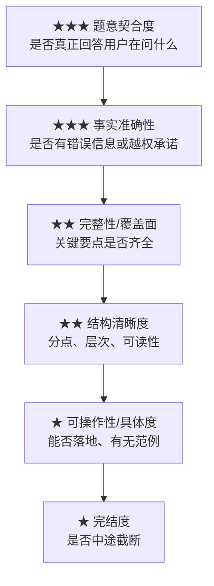
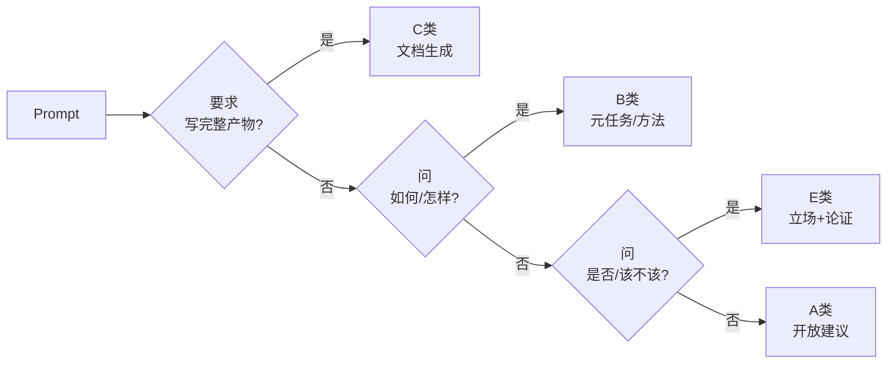
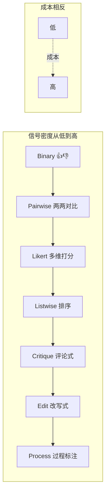
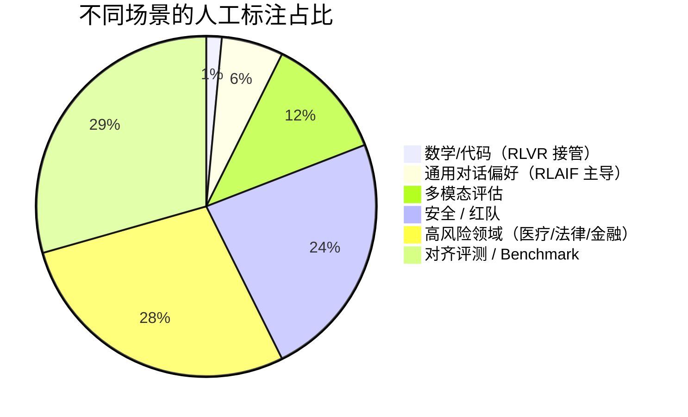
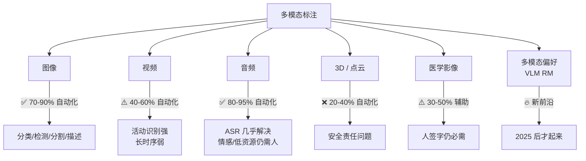
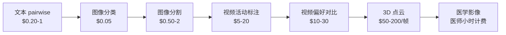
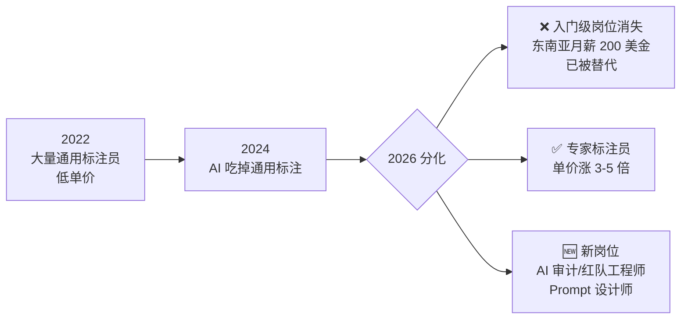
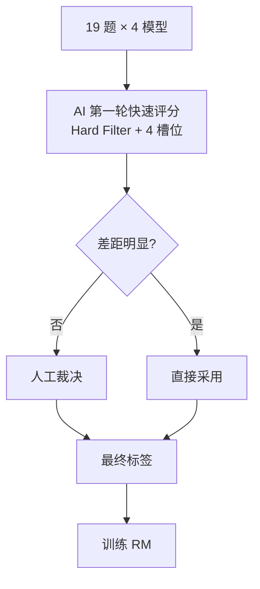

# 奖励模型（Reward Model）标注项目方法论文档

> 本文档基于一次真实标注项目（19 个 prompt × 4 个模型回答 × pairwise 排序）的复盘整理，涵盖 AI 评分逻辑、人工标注协议、行业现状、多模态对比与就业趋势。

---

## 一、项目背景

我们拿到的初始数据形态：

| 字段 | 含义 |
|------|------|
| `question` | 用户 prompt |
| `gpt3` / `wenxin` / `minmax` / `luca` | 4 个模型对该 prompt 的回答 |
| `排序位` | 待填字段：每条回答的相对排名 |

**任务目标**：为每个 prompt 下的 4 个回答给出排序（1=最好，4=最差），用于训练奖励模型（RM）。

---

## 二、AI 快速评分的标注规则（本次实操使用）

### 2.1 五维度优先级（自上而下压制）



**底层原则**：题意契合 / 准确性任一不过关 → 直接降权，不进入后续比拼。

### 2.2 题型识别决策树

不同题型权重不同，先识别再评判：



### 2.3 评分举例（以前 3 题为代表）

| 题号 | 类型 | 关键判定 | 排序结果 |
|------|------|---------|---------|
| Q1 活动票务 | A 建议类 | minmax 覆盖最广（含票价/实名制） | minmax > gpt3 > wenxin > luca |
| Q2 团队建设 | A 建议类 | wenxin 广度+方法论最全 | wenxin > gpt3 > minmax > luca |
| Q3 是否加社团 | E 立场类 | gpt3 未表态+被截断，触发 Hard Filter | wenxin > luca > gpt3 > minmax |

> 完整 19 题排序详见原项目 CSV。

---

## 三、给人工使用的标注规则（Pairwise 协议）

### 3.1 两层结构总览

```mermaid
flowchart TD
    Start[拿到一对回答 A vs B] --> HF{Hard Filter<br/>5 条硬规则}
    HF -->|任一触发| Negative[直接判负]
    HF -->|全部通过| TT[识别题型<br/>A/B/C/E]
    TT --> Slot[4 槽位对比检查]
    Slot --> Vote[5 档投票<br/>含 tie]
    Vote --> Reason{选了"略好"?}
    Reason -->|是| WriteReason[强制写一句理由]
    Reason -->|否| Submit[提交]
    WriteReason --> Submit
```

### 3.2 第一层：Hard Filter（5 条，全题型通用）

| # | 规则 | 触发示例 |
|---|------|---------|
| H1 | **答非所问** | 用户问"如何请教"，回答直接写了一封求助信 |
| H2 | **回答被截断** | 末尾突然停在半句话 |
| H3 | **事实错误 / 幻觉** | 编造法条、虚构 API |
| H4 | **不必要拒答 / 越权承诺** | "我可以帮你联系嘉宾"（AI 实际做不到） |
| H5 | **完全空洞** | 仅复述问题、纯客套话、< 50 字无实质 |

### 3.3 第二层：4 槽位对比表（题型决定槽位含义）

| 槽位 | A 建议类 | B 元任务类 | C 文档类 | E 立场类 |
|------|---------|----------|---------|---------|
| **覆盖** | 维度广度 | 步骤完整 | 条款齐全 | 论据数量 |
| **深度** | 是否展开 | 讲清 why | 条款具体 | 论据具体 |
| **可用性** ⭐ | 能否采用 | 能否照做 | **能否直接复制** | 能否帮决策 |
| **风险/边界** | 提风险 | 指出坑 | 含律师警告 | 有反例兜底 |

**投票规则**（4 槽位计票，可用性权重 ×1.5）：

| 计票结果 | 选项 |
|---------|------|
| 3+ : 0 | A 明显更好 |
| 2 : 1 | A 略好 |
| 1.5 : 1.5（含 tie） | 相当 |
| 1 : 2 | B 略好 |
| 0 : 3+ | B 明显更好 |

### 3.4 标注员速查卡

```
═══════════════════════════════════════════
       PAIRWISE 标注速查卡 v1.0
═══════════════════════════════════════════

第一步：HARD FILTER（任一触发 → 直接判负）
  □ H1 答非所问  □ H2 截断  □ H3 幻觉
  □ H4 越权/拒答  □ H5 空洞

第二步：题型识别
  写完整XX     → C
  问如何/步骤  → B
  问是否/该不该 → E
  其他建议     → A

第三步：4 槽位对比
        A类      B类      C类      E类
  覆盖  广度     步骤全   条款全   论据多
  深度  展开     讲why    可填具体 论据具体
  可用* 能采用   能照做   可直接用 能下决定
  边界  风险     坑       律师警告 反例
  ( * = 权重 ×1.5 )

第四步：5 档投票 + "略好"必写一句理由
═══════════════════════════════════════════
```

---

## 四、工程案例参考（按时间线）

### 4.1 经典案例（2022–2023，奠基范式）

| 项目 | 关键设计 | 启发 |
|------|---------|------|
| **OpenAI InstructGPT** | 9 类任务子 rubric + 三层优先级压制 | 最早完整的"硬过滤+类型分支" |
| **DeepMind Sparrow** | 23 条显式硬规则各自独立分类器 | 硬规则极致化 |
| **Anthropic HH-RLHF** | helpfulness 和 harmlessness 两套独立 RM | 维度独立标注 |
| **Meta LLaMA 2** | 双 RM 加权 + 4 档差距 pairwise | 工业版"硬软分离" |
| **LMSYS Chatbot Arena** | 后端按 9+ 类别独立 Elo | 类型分支后端化 |
| **OpenAssistant** | 多维 Likert（quality/creativity/toxicity） | 开源标杆 |

### 4.2 最新案例（2024–2026，范式跃迁）

| 项目 | 关键转向 | 标注变化 |
|------|---------|---------|
| **DeepSeek-R1**（2025.01） | RLVR：可验证任务全规则化 | 数学/代码 0% 人工偏好 |
| **OpenAI o1/o3** | Process Reward Model (PRM) | 推理每一步打 ✅/❌ |
| **NVIDIA HelpSteer2/3** | 多属性 Likert（5 维 0-4 分） | 回归绝对打分 |
| **Salesforce ArmoRM** | 19 个独立目标 + MoE gating | "类型分支"进入模型架构层 |
| **Generative RM**（JudgeLM 等） | LLM 输出 CoT + 评分 | 标注含解释 |
| **Self-Rewarding LM** | 模型自评迭代 | 人工只做 seed |
| **AI2 Tülu 3** | SFT→DPO→RLVR 全开源 pipeline | post-training 流程透明化 |
| **AI2 RewardBench** | 公开 RM 能力评测基准 | 项目必跑指标 |

---

## 五、主流标注形式总览



| 形式 | 一句话 | 当前热度 | 谁来标 |
|------|------|---------|-------|
| Binary 👍/👎 | 看完点赞或踩 | 🔥 用户行为收集 | 终端用户 |
| **Pairwise** | A vs B 哪个好 | 🔥🔥 仍主流 | 人 + AI 都行 |
| **Likert / 多维打分** | 单条回答多维评分 | 🔥🔥🔥 上升中 | 偏 AI judge |
| Listwise 排序 | 多个候选排序 | 🔥 局部使用 | 主要靠人 |
| Best-of-N | N 选 1 | 🔥 SFT 数据筛选 | AI 为主 |
| Edit 改写 | 标注员重写回答 | 🔥 高质量 SFT | 必须人，单价最高 |
| **Critique 评论式** | 写一段评价 | 🔥🔥 GenRM 训练 | AI 量产 + 人校验 |
| **Process 过程标注** | 推理每步打标 | 🔥🔥🔥 推理模型核心 | 人为主，AI 辅助 |
| **Rule-based (RLVR)** | 代码自动判 | 🔥🔥🔥 推理任务首选 | 完全自动 |
| Constitutional | 对照原则检查 | 🔥 RLAIF 基础 | AI 为主 |
| Red-team | 主动找漏洞 | 🔥🔥 安全必备 | 必须人 |

---

## 六、AI 标 vs 人工标的现状（文本场景）



| 场景 | 主力 | 人工占比 | 说明 |
|------|------|---------|------|
| 数学 / 代码 / 逻辑 | 🤖 规则验证 | < 5% | DeepSeek-R1、o1 全自动 |
| 通用对话偏好 | 🤖 AI judge + 🧑 校验 | 10–30% | Llama 3.1+、Claude 3.5 走 RLAIF |
| 多模态（图/视频） | 🤖 多模态 judge 兴起 | 30–50% | GPT-4V 当 judge 已够用 |
| 安全 / 红队 | 🧑 人为主 | 70–90% | 攻击需要创造力，AI 难自攻 |
| 医疗 / 法律 / 金融 | 🧑 领域专家 | 90%+ | 责任主体问题 |
| 对齐评测 | 🧑 必须是人 | 100% | AI 评 AI 有循环偏见 |
| 边缘 / 难题 | 🧑 资深标注员 | 100% | 这些是真正值钱的数据 |

### 总趋势 3 句话

1. **2022 全人工 → 2024 AI 量产+人工把关 → 2026 AI 主导+人工标边缘**
2. **可验证任务已基本去人化**——这是最大变革
3. **不可验证任务（创意/伦理/复杂推理）人类仍是黄金标准**——但比例从 100% 降到 30%

---

## 七、多模态标注的 AI 替代格局

文本之外的标注，AI 替代速度呈"指数分化"——按模态差异极大。

### 7.1 总体格局



### 7.2 分模态详细对照

| 模态 | 典型任务 | AI 水平（2026） | 人类仍主导的场景 | 单价（人 vs AI） |
|------|---------|---------------|---------------|---------------|
| **图像分类** | 闭集分类 | 🟢 超人类 | 新增类、罕见物 | $0.05 vs $0.005 |
| **图像分割** | General segmentation | 🟢 接近人类（SAM 2） | 医学、卫星、特殊纹理 | $0.50 vs $0.05 |
| **图像描述** | Captioning | 🟢 接近人类（GPT-4V 级） | 文化语境、技术细节 | $0.20 vs $0.02 |
| **目标检测** | 常见物体 | 🟢 超人类 | 长尾类、严重遮挡 | $0.30 vs $0.03 |
| **图像偏好（VLM RM）** | 哪张图更好 | 🟡 接近人类 | 美学 / 创意判断 | $1.00 vs $0.10 |
| **视频活动识别** | 日常 / 体育 | 🟡 人类水平 | 手术、安防、战术分析 | $5–20 vs $0.50 |
| **视频时序分割** | 事件边界 | 🟠 中等 | 长片、叙事结构 | $20–50 vs $2 |
| **视频描述** | 复杂场景 | 🟠 部分（Gemini 1.5 强） | 情节理解、镜头语言 | $30+ vs $3 |
| **语音 ASR** | 英文/中文/主流语言 | 🟢 超人类（Whisper 系） | 低资源语言、混语 | $0.10/min vs $0.01 |
| **语音情感** | 基础情绪 | 🟡 接近人类 | 反讽、文化差异 | $0.50 vs $0.05 |
| **音乐标注** | 风格 / 情绪 | 🟠 中等 | 专业乐评、版权细节 | $2 vs $0.5 |
| **3D / LiDAR 标注** | 自动驾驶 | 🟠 AI 辅助为主 | 安全验证、长尾场景 | $50–200/帧 vs $5（需人复核） |
| **医学影像** | 常见读片 | 🟡 AI 辅助 | 最终诊断签字、罕见病 | 医师 $80–200/h，AI 几乎免费 |
| **OCR / 文档理解** | 印刷体 | 🟢 超人类 | 古籍、手写、复杂表格 | $0.05/页 vs $0.001 |
| **手写识别** | 现代规整 | 🟡 接近人类 | 历史档案、医生处方 | $1/页 vs $0.05 |

🟢 = AI 已基本接管 / 🟡 = AI 接近人类、需人校验 / 🟠 = AI 显著落后 / ❌ = 还得靠人

### 7.3 关键观察

**替代速度排序（快 → 慢）**：

```
ASR > 图像分类 > OCR > 图像分割/描述 > 视频活动 > 
图像偏好 > 视频描述 > 3D 点云 > 医学影像 > 红队/安全
```

**AI 替代得最快的三类任务**：

| 特征 | 为什么 AI 快 |
|------|-----------|
| **可客观验证**（OCR、ASR 有 ground truth） | 错对一目了然，迭代快 |
| **海量预训练数据存在**（图像、英文音频） | 模型见过的够多 |
| **闭集任务**（固定类别） | 不需要开放推理 |

**人类仍稳守的三类任务**：

| 特征 | 为什么人还在 |
|------|-----------|
| **责任主体强绑定**（医学、自驾、法律） | AI 错了没人能告 |
| **创造性 / 审美判断**（图像偏好、视频剪辑） | 没有"标准答案" |
| **长尾 / 罕见场景**（手术视频、特殊路况） | AI 没见过的东西仍是盲区 |

### 7.4 多模态偏好标注（VLM/视频模型 RM）—— 新前沿

2025 年才起来的赛道，相当于"文本 RM"在图像/视频上的版本：

| 项目 | 用途 | 形态 |
|------|------|------|
| **VL-RewardBench** | 评测 VLM 的偏好打分能力 | benchmark |
| **LLaVA-RLHF** / **MM-RLHF** | 多模态对话偏好对齐 | pairwise |
| **VideoBench / VideoChatGPT 评测** | 视频理解 RM | pairwise + Likert |
| **图像生成 RM**（HPS, PickScore, ImageReward） | 给文生图打分 | 多维 Likert |
| **视频生成 RM**（Sora 内部、可灵/海螺内部） | 给文生视频打分 | 主要还是人 |

**当前格局**：
- 图像 RM 已进入 AI judge 阶段（GPT-4V / Claude 3.5 Vision 当 judge 凑合用）
- 视频 RM **几乎全靠人**（视频信息密度太大，AI judge 看不准）
- 文生视频领域，人工标注员单价**远高于文本**（因为要看完整视频）

### 7.5 单价对比（2026 年市场参考）



**核心规律**：标注单价 ≈ 信息密度 × 责任风险 × 专业门槛。

### 7.6 多模态项目的协议设计要点

| 模态 | 协议设计要点 |
|------|------------|
| **图像 RM** | 可以大量用 AI judge（GPT-4V / Claude Vision）做初筛 |
| **视频 RM** | **暂时无法 AI 自动化**，建议 Likert 多维打分（运动质量/时序一致/物理合理） |
| **音频 RM** | 用人 + AI 混合，AI 做客观维度（清晰度），人做主观（自然度） |
| **3D / 自驾** | 必须人主导 + AI 加速，绝不能让 AI 单独决定 |
| **医学** | AI 只做 pre-screening，最终标签必须有医师签字 |

---

## 八、行业就业趋势



### 8.1 当前就业格局观察

| 岗位 | 状态 | 真实薪资水平 |
|------|------|------------|
| 红队 / 对抗安全 | 🔥 强需求 | 北美 $120–250k，国内 50–80 万 |
| 医疗 RM 标注（持证医师） | 🔥 紧缺 | $80–200/h |
| 法律 RM 标注（持牌律师） | 🔥 紧缺 | 律师小时费 |
| 资深标注员 → AI Trainer | 🔥 升级机会 | 年薪翻倍 |
| 视频活动标注员 | 🟢 稳定 | $15–30/h |
| 3D / 自驾标注员 | 🔥 紧缺 | $25–50/h |
| 通用文本标注员 | ❌ 加速消失 | — |
| 中间层（本科+3-5 年经验） | ⚠️ 最危险 | 上够不着专家、下被 AI 替代 |

### 8.2 一个反直觉的观察

> **人类没有被赶进保留地，是被赶到了价值链顶端。**
>
> - 以前：100 个人标 100 万条数据
> - 现在：1 个专家审核 AI 标的 100 万条 + 处理 1 万条边缘案例
>
> 总价值反而上升了，且这 1 个人的工资比之前 100 个人加起来还高。

### 8.3 转岗建议

**模态越复杂，AI 替代率越低，单价反而越高**——如果想转去做高单价的 AI 训练数据，**跳过文本/图像，直接进视频 / 3D / 医学**。

| 路径 | 推荐度 | 说明 |
|------|------|------|
| 普通文本标注 → 视频/3D 标注 | ⭐⭐⭐⭐ | 单价 3-5 倍，需补音视频/空间感知技能 |
| 普通文本标注 → 红队/安全 | ⭐⭐⭐⭐⭐ | 单价最高，需培养"反向思维" |
| 通用标注 → 领域专家路线 | ⭐⭐⭐ | 需读 5-10 年医学/法学，门槛高 |
| 标注员 → AI Trainer/Prompt 设计 | ⭐⭐⭐⭐ | 经验可迁移，门槛适中 |
| 留在原赛道 | ❌ | 文本通用标注已基本被 AI 接管 |

### 8.4 真实的社会问题

- 入门级岗位消失 = 进入 AI 行业的台阶被抽掉
- 专家岗位需要持证 / 高学历 = 门槛被推到"先读 10 年医学/法学"
- 中间层最危险 = 上不去也下不来

**判断"什么是好标注"这件事本身——也就是设计标注协议——属于"保留地"中价值最高的部分**，短期内仍由人主导。

---

## 九、对本项目的最终建议

### 9.1 数据使用流程



### 9.2 落地建议清单

```
✅ 用 AI（GPT-4o / Claude 等）做：
   - 第一轮 pairwise 快速评分（Hard Filter + rubric）
   - 题型自动分类
   - 截断 / 答非所问 / 幻觉的硬过滤

✅ 用人做：
   - AI 不确定（差距小）的对子裁决
   - 创意 / 写作类题目（如本项目 Q3、Q4）的最终质检
   - 抽样 10–20% 做整体一致性校验

❌ 不要做：
   - 全部 19×6=114 对都让人标（成本不值）
   - 全部交给 AI（缺乏人类偏好真信号）

📊 预计成本：相比纯人工节省 60–70%，质量持平。
```

### 9.3 数据质量元指标

| 指标 | 目标值 | 用途 |
|------|-------|------|
| Inter-annotator κ | ≥ 0.6 | 整体可信度 |
| 金标命中率 | ≥ 80% | 隐藏测试题 |
| Tie 比例 | 5%–15% | 过高=偷懒 |
| 位置偏见（A 选率） | 45–55% | 防左右偏好 |
| 平均用时 | 25–90 秒 / 对 | 防机械点击与疲劳 |

---

## 十、推荐进一步阅读

| 资料 | 内容 | 性价比 |
|------|------|-------|
| LLaMA 2 论文 §3.2 | 工业级 RM 训练协议 | ⭐⭐⭐⭐⭐ |
| InstructGPT 附录 D | 标注员 instruction 范本 | ⭐⭐⭐⭐⭐ |
| HelpSteer2 数据集 README | 多维 Likert 实操 | ⭐⭐⭐⭐ |
| Tülu 3 技术报告 | 现代完整 post-training pipeline | ⭐⭐⭐⭐ |
| RewardBench Leaderboard | 当下 RM 能力对比 | ⭐⭐⭐ |
| LMSYS Chatbot Arena | 真实人类投票数据 | ⭐⭐⭐ |
| VL-RewardBench | 多模态 RM 评测 | ⭐⭐⭐ |
| PickScore / ImageReward | 图像生成 RM 实操 | ⭐⭐⭐ |

---

## 十一、一句话总结

> **现代 RM 标注没有"一把尺子量到底"的通用公式，但有"Hard Filter + 类型分支"的通用协议。文本场景 AI 已主导、视频与高责任场景人类仍稳守、就业市场正在向价值链顶端剧烈分化——既是危机，也是机会。**

---

*文档版本：v1.1（含多模态扩展）| 整理自一次完整的 RM 标注项目复盘*
